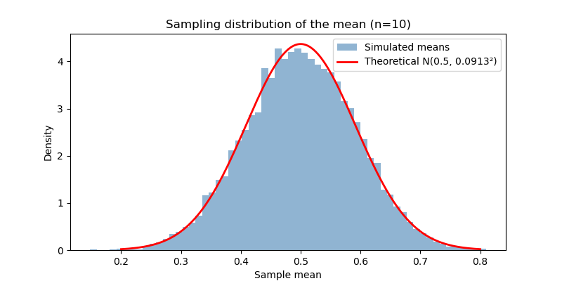
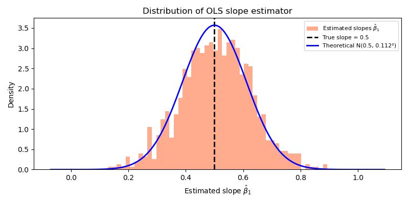
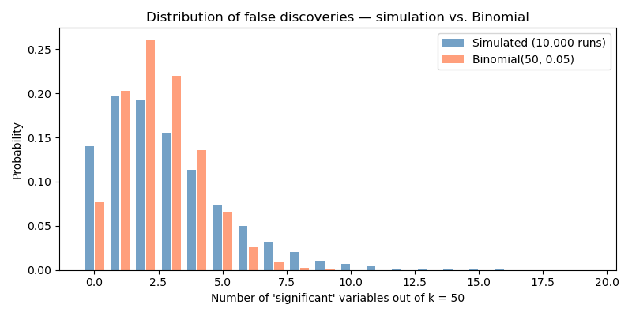
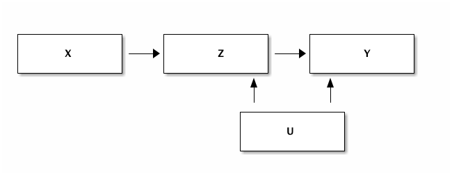
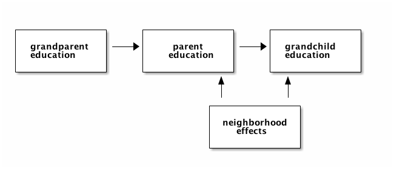
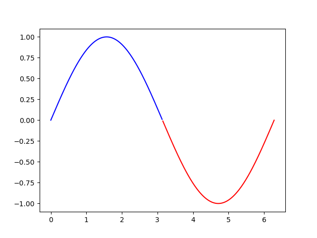

#+SETUPFILE: https://fniessen.github.io/org-html-themes/org/setup/html-theme-readtheorg.setup
#+TITLE: Lectures Datascience for Economics
#+AUTHOR: Jan Boone
#+DATE: August 2026
#+PROPERTY: header-args  :session lectures :async t  :results raw drawer
#+PANDOC_OPTIONS: template:~/.local/share/pandoc/templates/eisvogel
#+PANDOC_VARIABLES: titlepage=true
#+PANDOC_OPTIONS: resource-path:.:figures
#+PANDOC_OPTIONS: highlight-style:tango
#+PANDOC_OPTIONS: pdf-engine:xelatex
#+PANDOC_OPTIONS: include-in-header:header.tex
#+PANDOC_VARIABLES: titlepage=true


#+auto_tangle: nil

#+LANGUAGE: en
#+INFOJS_OPT: view:showall toc:t ltoc:t mouse:underline path:http://orgmode.org/org-info.js
#+LATEX_HEADER: \renewcommand{\floatpagefraction}{.8}
#+latex_header: \input{author.tex}
#+latex_header: \setcounter{tocdepth}{1}
#+latex_header: \hypersetup{urlcolor=blue}
#+latex_header: \usepackage{hyperref}
#+latex_engraved_theme: t
#+EXPORT_SELECT_TAGS: export
#+EXPORT_EXCLUDE_TAGS: noexport
#+OPTIONS: toc:nil timestamp:nil num:nil ':t \n:nil @:t ::t |:t ^:{} _:{} *:t TeX:t LaTeX:t
#+OPTIONS: H:6 html-style:nil

#+HTML_HEAD: <link rel="stylesheet" href="./css/Latex.css">
#+HTML_HEAD: <link rel="stylesheet" href="https://latex.now.sh/prism/prism.css">
#+HTML_HEAD: <script src="https://cdn.jsdelivr.net/npm/prismjs/prism.min.js"></script>

#+HTML_HEAD: <style>
#+HTML_HEAD: pre.src code {
#+HTML_HEAD:   background: transparent !important;
#+HTML_HEAD:   border: none !important;
#+HTML_HEAD:   box-shadow: none !important;
#+HTML_HEAD:   padding: 0 !important;
#+HTML_HEAD: }
#+HTML_HEAD: pre.src-python code {
#+HTML_HEAD:   font-size: 1.1em !important;
#+HTML_HEAD: }
#+HTML_HEAD: </style>


#+HTML_HEAD: <meta name="viewport" content="width=device-width, initial-scale=1.0" />
#+HTML_HEAD: <style>
#+HTML_HEAD: body { font-family: Arial, sans-serif; margin: 0; background-color: #f5f7fa; line-height: 1.7; }
#+HTML_HEAD: header { background-color: #1f3c88; color: white; padding: 25px; text-align: center; }
#+HTML_HEAD: main { max-width: 950px; margin: 40px auto; padding: 30px; background: white; border-radius: 10px; box-shadow: 0 3px 12px rgba(0,0,0,0.1); }
#+HTML_HEAD: h1 { margin-top: 0; margin-bottom: 15px; }
#+HTML_HEAD: h2 { margin-top: 35px; margin-bottom: 10px; }
#+HTML_HEAD: h3 { margin-top: 25px; }
#+HTML_HEAD: iframe { width: 100%; height: 900px; border: none; border-radius: 8px; margin-top: 15px; margin-bottom: 15px; }
#+HTML_HEAD: pre { padding: 14px; border-radius: 6px; background: #f7f7f7; overflow-x: auto; }
#+HTML_HEAD: code { font-family: Consolas, Monaco, monospace; }
#+HTML_HEAD: table { font-size: 0.95em; border-collapse: collapse; }
#+HTML_HEAD: thead th { background:#1f3c88 !important; color:white !important; padding:8px; border:1px solid #ddd; }
#+HTML_HEAD: tbody td { padding:8px; border:1px solid #ddd; }
#+HTML_HEAD: figure, img { display: block; margin: 25px auto; max-width: 100%; }
#+HTML_HEAD: .fallback { margin-top: 15px; text-align: center; }
#+HTML_HEAD: .fallback a { color: #1f3c88; text-decoration: none; font-weight: bold; }
#+HTML_HEAD: .fallback a:hover { text-decoration: underline; }
#+HTML_HEAD: .section { margin-bottom: 40px; }
#+HTML_HEAD: div[style*="border-left:4px solid #1f3c88"] { border-radius:6px; padding:14px; }
#+HTML_HEAD: div[style*="border-left:4px solid #2c7a7b"] { border-radius:6px; padding:14px; }
#+HTML_HEAD: </style>

#+BEGIN_EXPORT html
<main>
#+END_EXPORT

* Preamble
:PROPERTIES:
:UNNUMBERED: t
:END:

There are two versions of this document:
- the interactive [[https://janboone.github.io/Datascience-for-economics-lectures/][html version]] which contains the interactive marimo apps
- and the static [[https://janboone.github.io/Datascience-for-economics-lectures/index.pdf][pdf version]] which does not contain interactive apps but shows links to these apps

The html version uses the [[https://github.com/fniessen/org-html-themes][ReadTheOrg]] theme and the pdf version the [[https://github.com/Wandmalfarbe/pandoc-latex-template][Eisvogel latex template]].

* Marimo

In the lectures we use [[https://marimo.io/][marimo notebooks]]. If you follow these lectures as a Tilburg University student, marimo is available at [[https://jupyterlab.uvt.nl/][jupyterlab server.]]

Information on how to install marimo on your own computer can be found [[https://docs.marimo.io/getting_started/installation/][here]]. You can also use [[https://molab.marimo.io/notebooks][molab]].

#+BEGIN_EXPORT latex
\newpage
#+END_EXPORT

* Introduction
:PROPERTIES:
:UNNUMBERED: t
:END:

The goal of these lectures is to build intuition for statistical and machine-learning concepts through simulation. Rather than deriving results analytically, we generate data ourselves, repeat an experiment thousands of times, and read the answer directly from the resulting distribution. This approach — sometimes called *statistical hacking* — serves two purposes: you always know exactly where your data comes from, and you sharpen your Python skills along the way.

Each lecture starts from a concrete economic or statistical question, introduces the Python tools needed to answer it through simulation, and then explains the code in detail. Interactive marimo apps let you experiment with the key parameters and see the effects immediately.

The lectures build on each other. We begin with foundational ideas in statistics (distributions of estimators, bootstrapping, OLS) and move toward machine-learning techniques such as regularisation, neural networks, and treatment-effect estimation.

#+BEGIN_EXPORT html
<div style="border-left:4px solid #444;padding:10px;margin:20px 0;background:#f7f7f7;">
<strong>How to work with these lectures</strong>
<ul>
<li>Read the economic and statistical explanation to understand the intuition.</li>
<li>With the app try to understand the statistical/datascience concepts.</li>
<li>Experiment with the parameters in the interactive apps to predict/see how the results change.</li>
<li>Before looking at the code, try to figure out yourself how the app can be programmed in Python.</li>
<li>Open your own <code>marimo</code> notebook and type Python code yourself rather than copying (all of) it.</li>
<li>Use the review questions to check whether you understand both the intuition and the implementation.</li>
<li>If you get stuck, try debugging yourself first, then consult documentation, classmates, or an LLM.</li>
</ul>
</div>
#+END_EXPORT

#+CAPTION: Roadmap of the course: linking statistical concepts and Python tools
#+NAME: tab:course-roadmap
#+BEGIN_EXPORT html
<div style="overflow-x:auto; margin:20px 0;">
<table style="border-collapse:collapse; width:100%;">
<thead>
<tr style="background:#1f3c88;color:white;">
<th style="padding:8px;border:1px solid #ddd;">Lecture</th>
<th style="padding:8px;border:1px solid #ddd;">Topic</th>
<th style="padding:8px;border:1px solid #ddd;">Statistics / Econometrics</th>
<th style="padding:8px;border:1px solid #ddd;">Python</th>
</tr>
</thead>
<tbody>
<tr><td style="padding:8px;border:1px solid #ddd;">1</td><td style="padding:8px;border:1px solid #ddd;">Distributions and bootstrapping</td><td style="padding:8px;border:1px solid #ddd;">Sampling distributions, CLT, hypothesis testing, OLS</td><td style="padding:8px;border:1px solid #ddd;">numpy simulations, matplotlib, scipy.optimize</td></tr>
</tbody>
</table>
</div>
#+END_EXPORT

--------------

#+BEGIN_EXPORT latex
\newpage
\tableofcontents
\newpage
#+END_EXPORT

* Lecture 1: Statistical Hacking — Distributions and Bootstrapping
:PROPERTIES:
:HTML_CONTAINER_CLASS: section
:CUSTOM_ID: lecture-hacking
:END:

*Skills you learn in this lecture:* simulating sampling distributions, visualising histograms, implementing bootstrapping and OLS from scratch using Python and numpy.

** Learning Objectives

After completing this lecture you should be able to:
- explain why simulating a distribution is a useful alternative to analytical statistical theory
- reproduce the Central Limit Theorem in Python by simulating sample means
- describe what the sampling distribution of an OLS slope looks like and what determines its spread
- implement a bootstrap permutation test to compare two group means without distributional assumptions
- define the loss function for OLS in Python and minimise it numerically
- explain the difference between ridge and lasso penalisation and implement both as modifications to the OLS loss

** Introduction

In your statistics and econometrics courses you have seen analytical results: the sample mean follows an approximately normal distribution by the Central Limit Theorem; the OLS slope has a t-distribution under certain assumptions. These results are elegant but limited. Modern machine-learning models are so complex that no such closed-form distributions exist for their estimated parameters. So how do you assess uncertainty?

The answer is *simulation*. You write the statistical problem in Python, run it thousands of times, and read the distribution from the resulting histogram. This lecture introduces this way of thinking through three closely linked ideas:

1. *Distributions of estimators* — how much does the sample mean or OLS slope vary from sample to sample?
2. *Bootstrapping* — how can you test a hypothesis when you have only one sample and no knowledge of the underlying model?
3. *OLS from scratch* — how does the optimisation problem behind OLS work, and how do ridge and lasso extend it?

Because you generate all the data yourself, you always know the true answer and can check whether the simulation recovers it. That is what makes this approach so useful for building intuition.

The statistical results in this lecture are probably (hopefully) not new to you. What we want to show to you is the new way (simulation or "hacking") in which to understand these results. Later on in the lectures there are topics where we do not have analytical results; then simulation is the only option to gain intuition.

If you like this approach to statistics, you can read a [[https://greenteapress.com/wp/think-stats-2e/][free book]] [cite:@downey-2014-think-stats] or watch YouTube lectures from [[https://www.youtube.com/watch?v=VR52vSbHBAk][Allen Downey]] and [[https://www.youtube.com/watch?v=Iq9DzN6mvYA][Jake VanderPlas]].

** Apps

This lecture has two interactive apps. The first shows how the sampling distribution of the mean and the OLS slope change as you adjust the sample size and noise level. The second demonstrates bootstrap hypothesis testing: you control the effect size and watch whether the test detects it.

*** Distribution of an estimator
:PROPERTIES:
:HTML_CONTAINER_CLASS: section
:END:

In your statistics classes you have probably done hypothesis testing on a sample mean. Then there was "something" with a normal distribution and "another thing" with $\sqrt{n}$ where $n$ was the sample size. Depending on the math content of your course, you have seen these results proved (or not). Here we will explain what these results are and what the intuition is by programming/simulating them. To illustrate, we calculate the mean of $n$ draws out of a uniform distribution; then we do this, say, 10,000 times. Thus we have 10,000 means and we can show the histogram of these means. What does this histogram look like; put differently, what is the distribution of these means? What is the standard deviation of these 10,000 means?

The clear advantage of an analytic proof is that it shows that the result is (always) true. Simulations cannot prove anything. But simulations can help your intuition and sometimes more than a formal proof. Because we actually simulate the concepts, you can literally look at them. For many students the distribution of a mean is a rather abstract concept. We plot this distribution with simulations making it more concrete. The standard error is then the standard deviation of this distribution. Similarly, the distribution of a slope in an OLS regression may sound vague, but when we simulated the different samples and estimate the slope 10,000 times we can plot these 10,000 slopes.


The app below has two parts. In the first part you choose a sample size $n$ and a number of simulations $N$. Each simulation draws a sample of size $n$ from the uniform distribution on $[0,1]$ and records the sample mean. The histogram of the $N$ means shows the sampling distribution of the estimator (the mean); the red curve is the theoretical normal distribution from the Central Limit Theorem. When are these two distributions close and when do they seem different?

In the second part you choose a true slope $\beta_1$, a noise level $\sigma$, and sample size dimensions; i.e. the sample size $n$ of the data and the number of repetitions $N$ of our simulation. The app then runs $N$ OLS regressions and plots both the histogram of $N$ estimated slopes and a fan of 50 fitted regression lines. This illustrates that uncertainty about the slope translates directly into uncertainty about where the regression line lies — and that the uncertainty is largest far from the mean of $x$.

#+BEGIN_EXPORT latex
\url{https://janboone.github.io/datascience-marimo/lecture1\_distributions.html}
#+END_EXPORT

#+BEGIN_EXPORT html
<div style="text-align:center;margin:20px 0;">
  <a href="https://janboone.github.io/datascience-marimo/lecture1_distributions.html"
     target="_blank"
     style="background:#1f3c88;color:white;padding:12px 24px;border-radius:6px;text-decoration:none;font-weight:bold;font-size:1em;">
    ▶ Open app: Distribution of an Estimator
  </a>
</div>
#+END_EXPORT

*** Bootstrap hypothesis test
:PROPERTIES:
:HTML_CONTAINER_CLASS: section
:END:

Above we assume that we know the relevant theoretical (underlying) distributions and draw samples from it. But what if you have a real world dataset and no information on the distribution from which this data is drawn? How can the $n$ sample with $N$ repetitions work then? We illustrate this with data from two groups $A$ and $B$ and we want to test whether the population means of the two groups are the same. That is, the null hypothesis is: $\mu_A = \mu_B$.

Suppose we observe data from two groups $A$ and $B$ and want to know whether their (population) means are the same. In the app, group $B$ is generated as $B = A \times \delta$ where $\delta \leq 1$, so a smaller $\delta$ means a larger difference between the means of the $A$ and $B$ groups. When $\delta = 1$ there is no difference; the null hypothesis is true.

The left panel shows the raw samples and their means. The right panel shows the bootstrap null distribution: the distribution of mean differences you would see if both groups were actually drawn from the same population. The observed difference is marked in red; the shaded tails are the fraction that exceed it in magnitude — that fraction is the p-value.

Drag $\delta$ from $0.80$ toward $1.00$ to watch the p-value rise above $0.05$ as the effect becomes too small to detect with the given sample size.

#+BEGIN_EXPORT latex
\url{https://janboone.github.io/datascience-marimo/lecture1\_bootstrap.html}
#+END_EXPORT

#+BEGIN_EXPORT html
<div style="text-align:center;margin:20px 0;">
  <a href="https://janboone.github.io/datascience-marimo/lecture1_bootstrap.html"
     target="_blank"
     style="background:#1f3c88;color:white;padding:12px 24px;border-radius:6px;text-decoration:none;font-weight:bold;font-size:1em;">
    ▶ Open app: Bootstrap Hypothesis Test
  </a>
</div>
#+END_EXPORT

** Python Code Explanation

In this section we explain the Python code for the apps above. Open a =marimo= notebook alongside this document and type the code yourself; do not just copy and paste. Getting errors and fixing them is the fastest way to learn.

We focus here on modelling the statistical intuitions not on the interactive elements in the =marimo= notebooks.

*** Simulating sampling distributions

**** Import libraries and set parameters

We use =numpy= for numerical computation and =matplotlib= for plotting. 

#+begin_src python
import numpy as np
import matplotlib.pyplot as plt

sample_size = 10        # n observations per sample
N_simulations = 10_000   # N repetitions
#+end_src


**** Generate the data

The key idea: instead of drawing one sample, we draw =N_simulations= samples at once by creating a 2D array (matrix). Each row is one sample (of $n$ draws); each column is one observation within that sample.

#+begin_src python
samples = np.random.uniform(0, 1, (N_simulations, sample_size))
means = samples.mean(axis=1)
#+end_src


~np.random.uniform(low, high, size)~ draws uniformly distributed random numbers. The argument ~(N_simulations, sample_size)~ gives a matrix with =N_simulations= rows and =sample_size= columns.

~.mean(axis=1)~ takes the mean /across columns/ (axis 1), so we get one mean per row; one per simulation. Compare this to ~.mean(axis=0)~ which would average across rows.

**** Plot the histogram

Setting ~density=True~ normalizes the histogram so that the total area equals 1, which makes it comparable to a probability density function. The ~alpha~ parameter controls transparency (0 = invisible, 1 = opaque).

For a sample drawn from Uniform[0,1], the population mean is $\mu = 0.5$ and the population variance is $\sigma^2 = 1/12$. The standard error of the sample mean is therefore $\text{SE} = 1/\sqrt{12n}$. By the Central Limit Theorem, the sampling distribution of the mean is approximately $\mathcal{N}(0.5,\, \text{SE}^2)$ for large $n$.

#+begin_src python :results graphics file output :file ./figures/sampling_distribution_mean.png
fig, ax = plt.subplots(figsize=(8, 4))
ax.hist(means, bins=60, density=True, alpha=0.6, color="steelblue", label="Simulated means")
ax.set_xlabel("Sample mean")
ax.set_ylabel("Density")
ax.set_title(f"Sampling distribution of the mean (n={sample_size})")
se = 1.0 / np.sqrt(12 * sample_size)
x = np.linspace(0.2, 0.8, 300)
pdf = (1.0 / (se * np.sqrt(2 * np.pi))) * np.exp(-0.5 * ((x - 0.5) / se) ** 2)
ax.plot(x, pdf, "r-", lw=2, label=f"Theoretical N(0.5, {se:.4f}²)")
ax.legend()
#+end_src

#+RESULTS:


We compute the normal PDF manually using the formula $f(x) = \frac{1}{\sigma\sqrt{2\pi}} e^{-\frac{(x-\mu)^2}{2\sigma^2}}$. Overlaying it on the histogram checks whether the Normal approximation is good for the chosen ~sample_size~.

-----

*** Distribution of the OLS slope

To simulate the distribution of an OLS slope, we need to generate $n$ draws of (x, y) pairs, fit a regression to this sample, record the slope, and repeat this $N$ times.

**** Generate data with broadcasting

#+begin_src python
N_simulations = 1000
n_sample_size = 20
true_slope = 0.5
true_intercept = 1.0
noise = 0.5

x = np.random.normal(0, 1, (N_simulations, n_sample_size))
eps = np.random.normal(0, noise, (N_simulations, n_sample_size))
y = true_intercept + true_slope * x + eps
#+end_src

Here ~true_slope * x~ multiplies every element of the matrix ~x~ by the scalar ~true_slope~. This is called *broadcasting*: =numpy= automatically extends scalar operations to match the shape of the array. In a later lecture we come back to broadcasting in =numpy= because it is very powerful feature.

**** Compute OLS slops

The OLS slope formula for [[https://en.wikipedia.org/wiki/Ordinary_least_squares#Simple_linear_regression_model][a simple regression]] is $\hat\beta_1 = \frac{\sum(x_i - \bar x)(y_i - \bar y)}{\sum(x_i - \bar x)^2}$. We can compute this for all simulations at once:

#+begin_src python
x_c = x - x.mean(axis=1, keepdims=True)
y_c = y - y.mean(axis=1, keepdims=True)

slopes_hat = (x_c * y_c).sum(axis=1) / (x_c ** 2).sum(axis=1)
#+end_src

The argument ~keepdims=True~ ensures the mean has shape ~(N_simulations, 1)~ instead of ~(N_simulations,)~, so that subtracting it from the ~(N_simulations, sample_size)~ matrix ~x~ broadcasts correctly.

We plot the distribution of estimated slopes (histogram) and the theoretical distribution. If you do not know the theoretical distribution of OLS slopes; do not worry: we use simulations in these lectures, not theoretical results. If you do know the distribution of OLS slopes: why do we plot a normal distribution and not a Student $t$ distribution?

#+begin_src python :results graphics file output :file ./figures/sampling_distribution_OLS_slopes.png
# Histogram of estimated slopes
plt.hist(slopes_hat, bins=50, density=True, alpha=0.65, color="coral",
             label="Estimated slopes $\hat \\beta_1$")
plt.axvline(true_slope, color="k", lw=2, linestyle="--",
                label=f"True slope = {true_slope:.1f}")
x_hist_range = np.linspace(slopes_hat.min() - 0.2, slopes_hat.max() + 0.2, 300)
slope_se = noise / np.sqrt(n_sample_size)
normal_slope_pdf = (
    (1.0 / (slope_se * np.sqrt(2 * np.pi)))
    * np.exp(-0.5 * ((x_hist_range - true_slope) / slope_se) ** 2)
)

plt.plot(x_hist_range, normal_slope_pdf, "b-", lw=2,
             label=f"Theoretical N({true_slope:.1f}, {slope_se:.3f}²)")

plt.xlabel("Estimated slope $\hat \\beta_1$")
plt.ylabel("Density")
plt.title("Distribution of OLS slope estimator")
plt.legend(fontsize=8)
plt.tight_layout()
#+end_src

#+RESULTS:


-----

*** Bootstrapping

**** Generate two groups

We generate the $A$ sample from a normal distribution. The $B$ sample is $\delta \in \langle 0,1]$ from the $A$ sample. Hence we know that $\mu_B \leq \mu_A$ (with probability 1.0). Note that we generate these $A$ and $B$ samples once. Above we generated these samples $N$ times; but here we generate the repetitions in a different way.

#+begin_src python :results output
sample_size = 50
delta = 0.95         # B = A * delta; delta < 1 means B is lower than A
A = np.random.normal(10, 1, sample_size)
B = A * delta
observed_difference = A.mean() - B.mean()
print(f"The observed difference equals {observed_difference:.2f}")
#+end_src

#+RESULTS:
:results:
The observed difference equals 0.51
:end:

**** Combine the samples

Under the null hypothesis ($H_0$: both groups come from the same distribution); in other words, the group labels are arbitrary. We combine the two samples:

#+begin_src python
AB = np.concatenate([A, B])
#+end_src


**** Run the permutation test

We randomly relabel the combined sample =N_boot= times and record the difference in means each time. Using ~np.random.choice~ we generate a matrix with labels for the permutation. To see what this function does, check out ~np.random.choice(5,size=(15,10),replace=True)~. Also try ~replace=False~ and see what happens.

For each of the $N$ repetitions (which are in rows, ~axis = 0~), we calculate the difference in means between the labelled $A$ and labelled $B$ samples.

#+begin_src python
N_boot = 10000
rng = np.random.default_rng()

perm_indices = np.random.choice(sample_size,size=(N_boot,2*sample_size),replace=True)

boot_diff = (AB[perm_indices[:, :sample_size]].mean(axis=1)
             - AB[perm_indices[:, sample_size:]].mean(axis=1))
#+end_src


~AB[perm_indices[:, :sample_size]]~ uses *fancy indexing*: for each of the =N_boot= rows we select =sample_size= elements of =AB= according to the permuted indices. In a later lecture we come back to fancy indexing.

**** Compute the p-value

#+begin_src python :results output
p_value = np.mean((boot_diff) >= (observed_difference))
print(f"p-value: {p_value:.4f}")
#+end_src

#+RESULTS:
:results:
p-value: 0.0063
:end:

~(boot_diff) >= (observed_difference)~ produces a boolean array; taking its mean gives the fraction of bootstrap differences that are at least as extreme as the observed one. That fraction is the (one-sided) p-value.

-----

*** OLS from scratch: the optimization approach

The final topic of this lecture (with statistical concepts you have probably seen before) is OLS. Above we use the analytical expression for the slope of a simple regression (i.e. only one independent variable): $\hat\beta_1 = \frac{\sum(x_i - \bar x)(y_i - \bar y)}{\sum(x_i - \bar x)^2}$. The same result can be obtained by minimizing the mean squared error loss function directly. This is useful because the loss function can later be extended with penalty terms to give ridge or lasso.

**** Generate data

#+begin_src python
from scipy import optimize

sample_size = 500
slope1 = -3.0
slope2 = 2.0
constant = 1.0
noise = 1.5
x1 = np.random.normal(0, 1, sample_size)
x2 = np.random.normal(0, 1, sample_size)
y = constant + slope1 * x1 + slope2 * x2 + noise * np.random.normal(0, 1, sample_size)
#+end_src


**** Define the OLS loss

The OLS estimator minimizes the mean squared error:

$$
L(w) = \frac{1}{n} \sum_{i=1}^n \bigl(w_0 + w_1 x_{1i} + w_2 x_{2i} - y_i\bigr)^2
$$

#+begin_src python
def loss_ols(w):
    predictions = w[0] + w[1] * x1 + w[2] * x2
    return np.mean((predictions - y) ** 2)
#+end_src


**** Minimize the loss

#+begin_src python :results output
result = optimize.minimize(loss_ols, x0=[0.0, 0.0, 0.0])
print("Estimated coefficients:", result.x)
#+end_src

#+RESULTS:
:results:
Estimated coefficients: [ 1.00394757 -2.96011743  2.05995201]
:end:

~optimize.minimize~ starts from the initial guess ~x0~ and finds the values of ~w~ that minimize ~loss_ols~. You should recover values close to ~constant=1~, ~slope1=-3~, and ~slope2=2~.

**** Ridge and lasso penalties

Ridge and lasso add a penalty on the coefficients to the loss function. This discourages the model from assigning large coefficients to variables that have little predictive power; a problem that becomes serious when you have many variables.

/Ridge/ uses a squared penalty:

#+begin_src python
lam = 1.0

def loss_ridge(w):
    predictions = w[0] + w[1] * x1 + w[2] * x2
    mse = np.mean((predictions - y) ** 2)
    penalty = lam * np.sum(w[1:] ** 2)   # do not penalise the intercept
    return mse + penalty
#+end_src

/Lasso/ uses an absolute-value penalty:

#+begin_src python
def loss_lasso(w):
    predictions = w[0] + w[1] * x1 + w[2] * x2
    mse = np.mean((predictions - y) ** 2)
    penalty = lam * np.sum(np.abs(w[1:]))
    return mse + penalty
#+end_src

The key difference: lasso can shrink coefficients exactly to zero (performing variable selection), while ridge only shrinks them toward zero. Experiment with different values of ~lam~ to see the effect. We will come back to ridge and lasso regression in the next lecture.

** Summary

In this lecture we introduced statistical simulation as a practical complement to analytical theory. We illustrated the Central Limit Theorem by plotting sampling distributions of the mean, and showed that OLS slope estimates also have a distribution that widens with noise and narrows with sample size.

We then implemented bootstrap hypothesis testing: by repeatedly reshuffling a combined sample under the null hypothesis, we obtained a p-value without any distributional assumption. Finally, we implemented OLS as a numerical optimization problem and extended it to ridge and lasso by adding penalty terms to the loss function.

#+BEGIN_EXPORT html
<div style="border-left:4px solid #1f3c88;padding:10px;margin:15px 0;background:#f5f7fa;">
<strong>Key statistical takeaway</strong><br>
When theory gives no closed-form answer -- which is the norm in machine learning -- simulation fills the gap. Generating your own data and running an experiment thousands of times is a reliable way to build intuition about uncertainty, bias, and the effects of model choices.
</div>
#+END_EXPORT

#+BEGIN_EXPORT html
<div style="border-left:4px solid #2c7a7b;padding:10px;margin:15px 0;background:#eef6f6;">
<strong>Key Python takeaway</strong><br>
Vectorised <code>numpy</code> operations replace explicit Python loops and are orders of magnitude faster. The idioms introduced here -- 2D random arrays, <code>axis</code> reductions, broadcasting, and fancy indexing -- reappear throughout the rest of the course.
</div>
#+END_EXPORT

*Looking ahead:* In the next lecture we consider the issue of variable selection and causal interpretation of coefficients.

** Review Questions

Test your understanding. For each question, write the code in your own =marimo= notebook.

-----

**** TODO review questions:
- plot std of mean(x) against $\sigma/\sqrt(n)$
- test signif. of slope with bootstrapping; how can we bootstrap under null hypoth. that slope equals 0
- plot the separate ols lines from the first app

*** Question 1: Distribution of the sample standard deviation

Above we looked at the distribution of the sample /mean/. The sample /standard deviation/ $s$ also has a distribution.

a. Using the same setup as in section [[*Simulating sampling distributions][Simulating sampling distributions]], simulate the distribution of $s$ across =N_simulations= samples. Plot its histogram.
b. What is the probability that $s < 0.28$? Compute this from the simulated distribution.
c. How does the shape of the distribution of $s$ change as you increase =sample_size=? Is it symmetric?

*** Hint
#+BEGIN_EXPORT html
<details>
<summary><strong>click here</strong></summary>
#+END_EXPORT
- Replace ~means = samples.mean(axis=1)~ with ~stds = samples.std(axis=1, ddof=1)~. The argument ~ddof=1~ gives the unbiased estimator.
- ~np.mean(stds < 0.28)~ gives the fraction of simulated standard deviations below 0.28.
#+BEGIN_EXPORT html
</details>
#+END_EXPORT

-----

*** Question 2: OLS with correlated predictors

In the data-generating process above, ~x1~ and ~x2~ are independent. Now generate correlated predictors:

#+begin_src python
x1 = np.random.normal(0, 1, sample_size)
x2 = 0.8 * x1 + np.sqrt(1 - 0.8**2) * np.random.normal(0, 1, sample_size)
y = constant + slope1 * x1 + 3 * np.random.normal(0, 1, sample_size)
#+end_src

a. Minimise the OLS loss with this correlated ~x2~. How do the estimated coefficients change?
b. Simulate the distribution of the estimated slope on ~x1~ for 1000 repetitions. How does correlation between ~x1~ and ~x2~ affect the spread of this distribution?

-----

*** Question 3: Ridge regression and variable selection

Use the setup from [[*OLS from scratch: the optimisation approach][OLS from scratch: the optimisation approach]] but now generate five predictors, of which only two have a non-zero true coefficient:

#+begin_src python
n = 200
X = np.random.normal(0, 1, (n, 5))   # five predictors
true_w = np.array([1.0, -3.0, 0.0, 0.0, 0.0])
y = X @ true_w + np.random.normal(0, 1, n)
#+end_src

a. Minimise the OLS loss. Do the estimated coefficients for the irrelevant predictors come out exactly zero?
b. Minimise the ridge loss with $\lambda = 1$. How does the result differ?
c. Minimise the lasso loss with $\lambda = 0.1$. Are any coefficients exactly zero?

*** Hint
#+BEGIN_EXPORT html
<details>
<summary><strong>click here</strong></summary>
#+END_EXPORT
- The loss function now takes a vector ~w~ of length 5 and computes ~X @ w~ for the predictions.
- For lasso the gradient of ~|w|~ is undefined at zero, so ~scipy.optimize.minimize~ may not converge cleanly. Try the method ~'L-BFGS-B'~ which handles bounds and subgradients better.
#+BEGIN_EXPORT html
</details>
#+END_EXPORT

-----

*** Question 4: One-sided vs two-sided bootstrap test

The bootstrap test we implemented is *two-sided*: we ask whether $|D_\text{boot}| \geq |D_\text{obs}|$. In some situations we have a directional hypothesis — for instance, we expect $A > B$.

a. Adapt the p-value computation to compute a *one-sided* p-value that tests whether the mean of $A$ is specifically /larger/ than the mean of $B$.
b. For a fixed $\delta = 0.95$ and $n = 50$, run the test 200 times and record the one-sided p-value each time. What fraction of tests reject at the 5% level? Is this what you expect?

-----

*** Question 5: Bootstrap confidence interval

Instead of a hypothesis test, you can also use the bootstrap to construct a confidence interval for the difference in means.

a. From the 10,000 bootstrap differences you computed, extract the 2.5th and 97.5th percentiles. This gives a 95% bootstrap confidence interval for the difference.
b. Does this interval contain zero when $\delta = 1$? What about when $\delta = 0.90$?

*** Hint
#+BEGIN_EXPORT html
<details>
<summary><strong>click here</strong></summary>
#+END_EXPORT
- ~np.percentile(boot_diff, [2.5, 97.5])~ gives the two endpoints of the interval.
- This is the *percentile* bootstrap CI. It is conceptually simple but there are more accurate variants (BCa, studentised) that you can explore if interested.
#+BEGIN_EXPORT html
</details>
#+END_EXPORT

-----------
#+BEGIN_EXPORT latex
\newpage
#+END_EXPORT

* Lecture 2: Variable selection and causality
:PROPERTIES:
:HTML_CONTAINER_CLASS: section
:CUSTOM_ID: lecture-causality
:END:

*Skills you learn in this lecture:* recognizing that significance is not a variable selection criterion, reading and reasoning with directed acyclic graphs (DAGs), simulating fork, pipe, and collider structures in Python to see how controlling for variables changes OLS estimates.


** Learning Objectives

After completing this lecture you should be able to:
- explain why significance is not a valid criterion for selecting variables
- define a directed acyclic graph (DAG) and use it to describe a causal structure
- distinguish fork, pipe, and collider structures and state which variables should (not) be controlled for in each case
- simulate fork, pipe, and collider data in Python using =numpy=
- compute OLS coefficients for simple and multiple regressions from scratch and interpret how they change when a control variable is added or removed

** Introduction

In your statistics and econometrics courses you have learned that OLS measures correlations. A regression coefficient tells you how $Y$ changes with changing values for $X$, but it does not say whether there is a causal relationship. In economics, causal questions matter enormously: if you advise the government to adopt policy $X$ because it will raise $Y$, you need to be sure that $X$ actually /causes/ $Y$, not just that the two are correlated.

Two common but mistaken shortcuts that researchers use when they move from correlations to causal claims are the following.

First, some people select control variables based on statistical significance: add a variable, check whether it is significant, keep it if yes. The xkcd cartoon in Figure ref:fig:significance_xkcd illustrates the absurdity of this approach. If you test 20 unrelated variables at the 5% level, you expect one to appear significant purely by chance. The first app in this lecture lets you explore this [[https://en.wikipedia.org/wiki/Multiple_comparisons_problem][multiple testing problem]] directly.

#+caption: Significance cannot be used for variable selection (in case you need [[https://www.explainxkcd.com/wiki/index.php/882:_Significant][an explanation]]).
#+attr_latex: scale=0.3
#+name: fig:significance_xkcd
[[https://imgs.xkcd.com/comics/significant.png]]

Second, and more subtly, even if you have the right variable in mind as a control, adding it to a regression can either fix a problem or make it dramatically worse; depending on the causal structure. A third variable $Z$ can play three fundamentally different roles:

- the *fork* — $Z$ causes both $X$ and $Y$; failing to control for $Z$ creates a spurious correlation between $X$ and $Y$
  - a simple example is the correlation between the consumption of ice cream and the number of people drowned on a given day; can you guess what $Z$ is here?
- the *pipe* — $Z$ mediates the causal effect of $X$ on $Y$; controlling for $Z$ blocks the causal path you are trying to measure
  - an economic example: you want to know the effect of education on income; should you control for (un)employment?
- the *collider* — both $X$ and $Y$ cause $Z$; controlling for $Z$ induces a spurious correlation between $X$ and $Y$ where none existed
  - suppose running $X$ and cycling $Y$ skills are uncorrelated in the student population; let $Z$ denote membership of the university's elite [[https://en.wikipedia.org/wiki/Duathlon][duathlon]] team. What is the correlation between $X$ and $Y$ conditional on $Z$? Hint: consider a team member with low $X$.
  - as the collider is the least intuitive of the three, below we analyze two more examples; one with simulated and one with real data.

Each of these three structures is represented by a directed acyclic graph (DAG): a diagram with variable names as nodes and arrows showing the direction of causation. The second app lets you switch between the three DAG types and see how the OLS coefficient of $X$ changes when you add $Z$ to the regression.

** Apps

This lecture has two interactive apps. The first demonstrates the multiple testing problem. The second shows the fork, pipe, and collider structures and lets you observe how adding a control variable $Z$ to the regression changes the estimated effect of $X$ on $Y$.

*** Significance and variable selection
:PROPERTIES:
:HTML_CONTAINER_CLASS: section
:END:

All $k$ variables in this app are generated independently of $Y$ — none has a true effect. Nevertheless, some will appear significant at the chosen $\alpha$ level just by chance. The histogram shows the distribution of t-statistics across all $k$ regressions; the red lines mark the critical values. The bar chart on the right compares the expected number of false discoveries ($\alpha \times k$) with the number actually observed. Increase $k$ to 100 or 200 to see how many spurious findings accumulate.

#+BEGIN_EXPORT latex
\url{https://janboone.github.io/datascience-marimo/lecture2\_significance.html}
#+END_EXPORT

#+BEGIN_EXPORT html
<div style="text-align:center;margin:20px 0;">
  <a href="https://janboone.github.io/datascience-marimo/lecture2_significance.html"
     target="_blank"
     style="background:#1f3c88;color:white;padding:12px 24px;border-radius:6px;text-decoration:none;font-weight:bold;font-size:1em;">
    ▶ Open app: Significance and Variable Selection
  </a>
</div>
#+END_EXPORT

*** Fork, pipe, and collider
:PROPERTIES:
:HTML_CONTAINER_CLASS: section
:END:

Select a DAG type from the dropdown and watch the bar chart on the right. The two bars show the OLS coefficient of $X$ from a bivariate regression ($Y \sim X$) and from a multiple regression that also includes $Z$ ($Y \sim X + Z$). The t-statistics are shown in the chart title. The callout below the chart gives the interpretation: for the fork, controlling for $Z$ is the right thing to do; for the pipe and the collider, it is not.

Increase the effect strength $\gamma$ to make the bias more visible, or reduce the sample size to see how estimation uncertainty interacts with the bias.

#+BEGIN_EXPORT latex
\url{https://janboone.github.io/datascience-marimo/lecture2\_causality.html}
#+END_EXPORT

#+BEGIN_EXPORT html
<div style="text-align:center;margin:20px 0;">
  <a href="https://janboone.github.io/datascience-marimo/lecture2_causality.html"
     target="_blank"
     style="background:#1f3c88;color:white;padding:12px 24px;border-radius:6px;text-decoration:none;font-weight:bold;font-size:1em;">
    ▶ Open app: Fork, Pipe, and Collider
  </a>
</div>
#+END_EXPORT

** Python Code Explanation

In this section we explain the key ideas behind the two apps. Open a =marimo= notebook alongside this document and type the code yourself.

We focus on the statistical logic — how to simulate each causal structure and how to compute OLS coefficients from scratch. The interactive elements (sliders etc.) in the apps are added on top of this code.

*** Multiple testing

**** Simulate many "null variables"

We generate $k$ variables that have no effect on $Y$ and run a multiple regression of $Y$ on all $k$ variables. The matrix $\mathbf{X}$ has shape $(n,\, k+1)$: $n$ observations in our (simulated) sample, a column of ones for the intercept and one column per variable.

#+begin_src python
import numpy as np

n, k = 100, 50    
Y = np.random.normal(0, 1, n)
X = np.random.normal(0, 1, (n, k))
#+end_src


**** Compute t-statistics for the multiple regression

OLS gives $\hat\beta = (\mathbf{X}^\top \mathbf{X})^{-1} \mathbf{X}^\top Y$ and the covariance matrix of $\hat\beta$ is $\hat\sigma^2 (\mathbf{X}^\top \mathbf{X})^{-1}$ where $\hat\sigma^2 = \text{RSS}/(n - k - 1)$ and $RSS$ denotes Residual Sum of Squares.

For ease of reference we provide the shape of the vector/matrix in a comment on the same line. In a later lecture we come back to matrix operations like multiplication =@=, transform =T=, =solve= and =inv=.

#+begin_src python
Xmat = np.column_stack([np.ones(n), X])              # (n, k+1)
beta = np.linalg.solve(Xmat.T @ Xmat, Xmat.T @ Y)    # (k+1,)
resid = Y - Xmat @ beta                              # (n,)
sigma2 = np.sum(resid ** 2) / (n - k - 1)            # df = n - k - 1
cov_beta = sigma2 * np.linalg.inv(Xmat.T @ Xmat)     # (k+1, k+1)
se = np.sqrt(np.diag(cov_beta))                      # (k+1,) standard errors
t_stats = beta[1:] / se[1:]                          # (k,); slopes only
#+end_src


The vector ~t_stats~ holds one t-statistic per variable, each testing $H_0: \beta_j = 0$. Under the null, each $t_j \sim t_{n-k-1}$; for $n = 100$ and $k = 50$ the critical value at 5% is approximated by 1.96.

#+begin_src python :results output
n_significant = np.sum(np.abs(t_stats) > 1.96)
print(f"{n_significant} out of {k} variables are 'significant' at 5%")
print(f"Expected: {0.05 * k:.1f}")
#+end_src

#+RESULTS:
: 4 out of 50 variables are 'significant' at 5%
: Expected: 2.5

Every significant result here is a false discovery — by construction.

**** Distribution of false discoveries across repetitions

One run gives one draw from the distribution of false discoveries. To see the full distribution we repeat the simulation $N = 10{,}000$ times and record the number of significant variables for each draw.

#+begin_src python
N = 10_000
counts = np.empty(N, dtype=int)

for i in range(N):
    Yi    = np.random.normal(0, 1, n)
    Xi    = np.random.normal(0, 1, (n, k))
    Xmat_i  = np.column_stack([np.ones(n), Xi])
    beta_i  = np.linalg.solve(Xmat_i.T @ Xmat_i, Xmat_i.T @ Yi)
    resid_i = Yi - Xmat_i @ beta_i
    s2_i    = np.sum(resid_i ** 2) / (n - k - 1)
    se_i    = np.sqrt(np.diag(s2_i * np.linalg.inv(Xmat_i.T @ Xmat_i)))[1:]
    counts[i] = int(np.sum(np.abs(beta_i[1:] / se_i) > 1.96))
#+end_src

#+RESULTS:
: None

Because each t-test is approximately independent and rejects with probability $\alpha = 5\%$ under the null, the count of significant variables follows a $\text{Binomial}(k,\, \alpha)$ distribution with mean $k\alpha$ and variance $k\alpha(1-\alpha)$.

#+begin_src python :results graphics file output :file ./figures/distribution_signif_variables.png
from scipy.stats import binom
import matplotlib.pyplot as plt

alpha = 0.05
xs = np.arange(counts.max() + 2)

sim_probs   = np.array([(counts == x).mean() for x in xs])
binom_probs = np.array([binom.pmf(x,k,alpha) for x in xs])

fig, ax = plt.subplots(figsize=(8, 4))
ax.bar(xs - 0.2, sim_probs,   width=0.35, alpha=0.75,
       color="steelblue", label=f"Simulated ({N:,} runs)")
ax.bar(xs + 0.2, binom_probs, width=0.35, alpha=0.75,
       color="coral",     label=f"Binomial({k}, {alpha})")
ax.set_xlabel(f"Number of 'significant' variables out of k = {k}")
ax.set_ylabel("Probability")
ax.set_title("Distribution of false discoveries — simulation vs. Binomial")
ax.legend()
plt.tight_layout()
#+end_src

#+RESULTS:


-----

*** Simulating fork, pipe, and collider

For all three structures it is convenient to define a helper function that computes OLS coefficients for a simple or multiple regression using =numpy= linear algebra. As above, the matrix $\mathbf{X}$ starts with a column of ones (the intercept) and the predictor columns. The estimated coefficients are given by $\hat\beta = (\mathbf{X}^\top \mathbf{X})^{-1} \mathbf{X}^\top Y$.

#+begin_src python
def ols(Y, *Xs):
    """Return OLS coefficient vector [intercept, beta_1, ...]."""
    Xmat = np.column_stack([np.ones(len(Y))] + list(Xs))
    return np.linalg.solve(Xmat.T @ Xmat, Xmat.T @ Y)
#+end_src


**** The fork

$Z$ causes both $X$ and $Y$; there is no direct effect from $X$ to $Y$.

As mentioned in the app: if there is an effect between two variables, we assume the effect equals $\gamma$. Here we set $\gamma = 1$.

#+begin_src python :results output
n = 1000
gamma = 1.0
Z = np.random.normal(0, 1, n)
X = gamma * Z + np.random.normal(0, 1, n)    # Z causes X
Y = gamma * Z + np.random.normal(0, 1, n)    # Z causes Y

coef_without_z = ols(Y, X)          # Y ~ X: biased
coef_with_z    = ols(Y, X, Z)       # Y ~ X + Z: correct

print(f"Y ~ X:     coef of X = {coef_without_z[1]:.3f}")
print(f"Y ~ X + Z: coef of X = {coef_with_z[1]:.3f}")
#+end_src

#+RESULTS:
: Y ~ X:     coef of X = 0.454
: Y ~ X + Z: coef of X = -0.020

The bivariate regression picks up the spurious correlation created by $Z$. Adding $Z$ removes it.

**** The pipe

$X$ causes $Z$ which causes $Y$; the causal effect of $X$ on $Y$ is fully mediated by $Z$.

#+begin_src python :results output
X = np.random.normal(0, 1, n)
Z = gamma * X + np.random.normal(0, 1, n)    # X causes Z
Y = gamma * Z + np.random.normal(0, 1, n)    # Z causes Y

coef_without_z = ols(Y, X)     # correct
coef_with_z    = ols(Y, X, Z)  # incorrect

print(f"Y ~ X:     coef of X = {coef_without_z[1]:.3f}  (true total effect ~ {gamma**2:.2f})")
print(f"Y ~ X + Z: coef of X = {coef_with_z[1]:.3f}  (mechanism is blocked)")
#+end_src

#+RESULTS:
: Y ~ X:     coef of X = 1.091  (true total effect ~ 1.00)
: Y ~ X + Z: coef of X = 0.069  (mechanism is blocked)

An economic example: the effect of schooling on income is partly mediated through employment: schooling helps you to find employment. Controlling for employment makes schooling look less relevant, but the real effect exists; it works through employment.

**** The collider

$X$ and $Y$ are independent. Both cause $Z$. Conditioning on $Z$ induces a spurious negative correlation between $X$ and $Y$.

#+begin_src python :results output
X = np.random.normal(0, 1, n)
Y = np.random.normal(0, 1, n)               
Z = gamma * X + gamma * Y + np.random.normal(0, 1, n) 

coef_without_z = ols(Y, X)     # correct
coef_with_z    = ols(Y, X, Z)  # wrong

print(f"Y ~ X:     coef of X = {coef_without_z[1]:.3f}  (correct, near zero)")
print(f"Y ~ X + Z: coef of X = {coef_with_z[1]:.3f}  (spurious negative!)")
#+end_src

#+RESULTS:
: Y ~ X:     coef of X = 0.018  (correct, near zero)
: Y ~ X + Z: coef of X = -0.484  (spurious negative!)

The intuition: if we hold $Z = \gamma X + \gamma Y$ fixed, then a higher $X$ must be offset by a lower $Y$ to keep $Z$ constant. So within any slice of $Z$, $X$ and $Y$ are negatively correlated which is a pure artifact of conditioning.

Finally, we consider the collider in two situations where there is correlation between $X$ and $Y$: first with simulated and then with real data.

**** collider bias with simulated data

Many people have the intuition that adding a control variable to a regression (especially when it turns out to be significant) is a good idea. However, this intuition is wrong if it is applied without thinking. The pipe and collider above are examples where this reasoning is incorrect. Here we consider a collider in a more elaborate example.

We use here the education example by [cite/text/c:@mcelreath-2020-statis-rethin] to illustrate this point (see [[https://www.youtube.com/watch?v=l_7yIUqWBmE][Richard McElreath 's lecture 6]]).
Consider the educational achievements of three generations in one
family: the grandparent, the parent and the (grand)child. We are
interested in the effect of the grandparent's education on the
educational achievement of the grandchild.

Let's denote the child's educational achievement by \(Y\) (the variable
we are interested in) and the grandparent's education \(X\). We want to
understand the effect of \(X\) on \(Y\). Clearly there is the following
path: more educated grandparent leads to more educated parent (\(Z\))
which, in turn, leads to more educated grandchild. The thing we are
interested in is whether there is a direct effect from the grandparent
on the child, /controlling/ for the parent's education.

#+caption: A collider in a more complicated context.


We know that the parent's education has a positive effect on the child's
achievement. A more educated parent will tend to stimulate their
children more, can help with homework etc. In the data that we generate
below, we assume that \(Z = X + ...\) and \(Y = Z + ...\). That is, we
assume that the parent's education feeds one-to-one into the child's
education.

Is it the case that on top of this effect there is a separate
grandparent effect? E.g. because the grandparent is babysitting and a
more educated grandparent reads Hamlet with the 5 year old grandchild.
That is fun and can boost the child's educational achievement.

Another important component of education is the neighbourhood where the
child grows up. We denote this variable \(U\). In the code we assume
that the parent and child grow up in the same neighbourhood (have the
same \(U\) effect). \(U\) is drawn from a standard normal distribution
and the effect on education is given through a multiplication by the
factor =alpha=.

In addition to this, we assume that there is a random component as well
which differs between parent and child.

#+caption: The education example from [cite/text/c:@mcelreath-2020-statis-rethin].


The code below, generates this data and a dataframe =df_collider= that
stores this data.

Look carefully at the code: is there a direct effect from the
grandparent to the grandchild's educational achievement?

We create the dataframe =df_collider= which contains the observable variables $X,Y,Z$ and the unobserved neighbourhood effect $U$.


#+begin_src python :results output
import pandas as pd
import statsmodels.formula.api as smf
sample_size = 5000
alpha = 0.5
X = np.random.normal(size=sample_size)
U = np.random.normal(size=sample_size)
Z = X + alpha*U+0.4*np.random.normal(size=sample_size)
Y = Z + alpha*U+0.4*np.random.normal(size=sample_size)

df_collider = pd.DataFrame({'X':X, 'Y':Y, 'Z':Z, 'U':U})
print(df_collider.head())
#+end_src

#+RESULTS:
:           X         Y         Z         U
: 0  0.004069 -2.603567 -1.244448 -2.173826
: 1  0.383663 -0.350389  0.125116 -0.755560
: 2 -1.539065 -0.910385 -1.668699  0.770156
: 3  0.129300  0.430064  0.863400 -0.128971
: 4  1.076587  2.027661  1.898336  1.184124

Now we run the regression of $Y$ on $X$ controlling for $Z$.

#+begin_src python :results output
results = smf.ols('Y ~ X + Z', data=df_collider).fit()
print(results.summary())

#+end_src

#+RESULTS:
#+begin_example
                            OLS Regression Results                            
==============================================================================
Dep. Variable:                      Y   R-squared:                       0.889
Model:                            OLS   Adj. R-squared:                  0.889
Method:                 Least Squares   F-statistic:                 2.011e+04
Date:                Tue, 29 Sep 2026   Prob (F-statistic):               0.00
Time:                        13:20:24   Log-Likelihood:                -3727.7
No. Observations:                5000   AIC:                             7461.
Df Residuals:                    4997   BIC:                             7481.
Df Model:                           2                                         
Covariance Type:            nonrobust                                         
==============================================================================
                 coef    std err          t      P>|t|      [0.025      0.975]
------------------------------------------------------------------------------
Intercept      0.0107      0.007      1.487      0.137      -0.003       0.025
X             -0.6131      0.013    -45.863      0.000      -0.639      -0.587
Z              1.6152      0.011    142.881      0.000       1.593       1.637
==============================================================================
Omnibus:                        0.695   Durbin-Watson:                   1.936
Prob(Omnibus):                  0.706   Jarque-Bera (JB):                0.737
Skew:                          -0.010   Prob(JB):                        0.692
Kurtosis:                       2.944   Cond. No.                         3.52
==============================================================================

Notes:
[1] Standard Errors assume that the covariance matrix of the errors is correctly specified.
#+end_example

It turns out that grandparent education $X$ has a negative effect on the grandchild's educational achievement $Y$. How is that possible?

To illustrate what is happening, we use an interactive plot made
with [[https://altair-viz.github.io/][altair]].

To condition on =Z= (as we do in a multiple regression), we can drag vertically an interval for $Z$ in the bottom histogram. This selection of \(Z\) turns blue in the scatter plot above and you can drag the selection up and down (conditioning on different values of \(Z\)).

Move this selection up and down and see what happens. In particular:
- for a selection of =Z= in the bottom histogram, what is the relation between =X= and =Y= in the scatter plot?
- for this selection, how does =U= vary in the figure? That is, for a given selection of \(Z\) what is the size of the circles? What is the interpretation? For given $Z$, as grandparent education $X$ is low, what is the size of the $U$ circles?


#+begin_src python
import altair as alt

interval = alt.selection_interval(encodings=['y'])

fig = (
    alt.Chart(df_collider)
    .mark_point()
    .encode(
        x='X',
        y='Y',
        color=alt.condition(
            interval,
            alt.value('steelblue'),
            alt.value('lightgreen')
        ),
        size='U'
    )
    .add_params(interval)
)

hist = (
    alt.Chart(df_collider)
    .mark_bar()
    .encode(
        x='count()',
        y=alt.Y('Z', bin=True),
        color=alt.condition(
            interval,
            alt.value('steelblue'),
            alt.value('lightgrey')
        )
    )
    .add_params(interval)
)

chart_collider = fig & hist
chart_collider.save('./figures/ChartCollider.html')
#+end_src


#+begin_export html
<iframe src="./figures/ChartCollider.html" width="800" height="600"></iframe>
#+end_export


**** collider bias with real data

[cite/text/c:@downey-2023-probab-overt-it chapter 7] discusses a great example of collider bias suggesting (incorrectly) that mothers who smoke during pregnancy have a "protective effect" on their babies if these happen to have low birth weight.
- you can watch his presentation: [[https://www.youtube.com/watch?v=8rUm46mk0Yo&t=964s][probably overthinking low birthweight paradox]]
- or look at the notebook: https://allendowney.github.io/ProbablyOverthinkingIt/birthweight.html
- the website of the book: https://greenteapress.com/wp/probably-overthinking-it/

If you want to run this code on the Tilburg university server, you can access the data with:

#+begin_src python :display output
from zipfile import ZipFile
zip_file = ZipFile('./data/lbw_data.csv.zip')
df = pd.read_csv(zip_file.open('lbw_data.csv'))
df.head()
#+end_src

#+RESULTS:
:    Unnamed: 0  tobacco  birthweight   mort    lbw           bin
: 0           0      2.0       3505.0  False  False  (3500, 3750]
: 1           1      2.0       2940.0  False  False  (2750, 3000]
: 2           2      2.0       2693.0  False  False  (2500, 2750]
: 3           3      1.0       2778.0  False  False  (2750, 3000]
: 4           4      2.0       3175.0  False  False  (3000, 3250]

Then follow Allen Downey's presentation/notebook/book chapter.


** Summary

This lecture introduced two practical pitfalls in variable selection and causal interpretation.

The multiple testing problem shows that significance is not a reliable guide to variable selection: if you test many variables, some will appear significant by chance, with an expected false-discovery rate of exactly significance level $\alpha$.

The fork, pipe, and collider show that whether to control for a third variable $Z$ depends entirely on the causal structure. Controlling for a fork variable is correct. Controlling for a pipe mediator or a collider is incorrect; it either blocks a causal path or introduces a spurious correlation that was not there before.

#+BEGIN_EXPORT html
<div style="border-left:4px solid #1f3c88;padding:10px;margin:15px 0;background:#f5f7fa;">
<strong>Key statistical takeaway</strong><br>
Significance of a coefficient does not mean the variable belongs in your model. Variable selection should be guided by your causal model (the DAG), not by p-values.
</div>
#+END_EXPORT

#+BEGIN_EXPORT html
<div style="border-left:4px solid #2c7a7b;padding:10px;margin:15px 0;background:#eef6f6;">
<strong>Key Python takeaway</strong><br>
<code>np.linalg.solve(X.T @ X, X.T @ y)</code> computes the OLS coefficient vector in one line for any number of predictors. The same matrix operations that worked for simple regression scale directly to multiple regression.
</div>
#+END_EXPORT

/Looking ahead:/ In the next lecture we cover a number of "technical" Python topics that we need for later lectures on datascience methods.

** Review Questions

Test your understanding. For each question, write the code in your own =marimo= notebook.

-----

*** Question 1: False discovery rate

Repeat the multiple testing simulation but now generate $k$ variables where exactly half have a true slope of 0.5 (and half are null).

a. What fraction of the true-effect variables do you correctly detect (power)?
b. Among the "significant" results, what fraction are false discoveries?
c. How does the false-discovery fraction change as you increase $k$ while keeping the number of true signals fixed?

-----

*** Question 2: Fork with partial effect

In the fork simulation above, $X$ has no direct effect on $Y$. Now add a direct effect:

#+begin_src python
Y = 0.5 * X + gamma * Z + np.random.normal(0, 1, n)
#+end_src

a. What coefficient do you expect for $X$ in the regression $Y \sim X$ (without controlling for $Z$)?
b. What coefficient do you expect for $X$ in the regression $Y \sim X + Z$?
c. Run both regressions and check whether the simulated coefficients match your expectations.

-----

*** TODO Question 3: Costly data acquisition

Suppose you work at a ministry and you and your team need to figure out what the effect is of a policy $x$ on an outcome $y$. You can gather data on this relation between $x$ and $y$ but the problem is that the data acquisition is rather expensive. Hence, your colleagues suggest that you gather data sequentially (over time) until you find that the coefficient of $x$ (on $y$) is significant.

Hopefully, in your statistics/econometrics classes you learned that this is a very bad idea. If not, I tell you: this is a bad idea.

Use data simulation to convince your colleagues that collecting data in this way is a bad idea.

**** answer :noexport:

Here we show that a workflow where one gathers data up till the point where the effect is significant is a very bad idea!

First think what would convince your colleages:
- situation where we know that $x$ has no effect on $y$ but with this data gathering process we will find a significant effect for sure:

#+begin_src jupyter-python :file ./figures/pvalues.png
import statsmodels.api as sm
import numpy as np
import matplotlib.pyplot as plt
N = 1000
x = np.random.normal(0,1,size=N)
y = np.random.normal(0,1,size=N)
x = sm.add_constant(x)
p_values = []

for n in range(10,N):
   model = sm.OLS(y[:n], x[:n,:n]).fit()
   p_values.append(model.pvalues[1])
   
plt.scatter(range(10,N),p_values,label='regression outcome')
plt.plot([0,990],[0.05,0.05],label='5% p-value',c='r')
plt.xlabel('number of observations')
plt.ylabel('p-value')
plt.legend();

#+end_src


-----

*** TODO Question 4: Treatment effects


One of the complications when using IV to find causal effects is that treatment effects can differ between subgroups and that these subgroups react differently to the treatment/instrument. Our discussion here is based on Chapter 4 of Angrist and Pischke (2009).

We will consider this in the context of unemployed who are offered a training program. To understand the effects, we will again generate our own data such that we know exactly what all the relevant effects are. The question is then, how do we get these effects from the data.

As before, the learning goals of this section are two fold: (i) learn how to program your own data generating process in python and (ii) understand the statistical issue under considerarion: heterogenous treatment effects.

The government introduces a training program for unemployed. The treatment variable $D_i$ denotes whether (1) or not (0) individual $i$ received training. The instrument $Z_i$ that we use is whether (1) or not (0) $i$ is invited to join the training. 

We have three groups of unemployed:

- compliers join the training if and only if they are invited to do so: $D_i = 1 (0)$ iff $Z_i = 1 (0)$;
- always-takers join the training whether or not they are invited to do so: $D_i =1$ irrespective of $Z_i$;
- never-takers never join the training: $D_i = 0$ irrespective of $Z_i$.

Note that in this training context, the always-takers are a bit "odd": how can you join a training program where you are not supposed to be. The never-takers make more sense in this context: some people may not attend the training even though they were invited to do so. We will not worry about this; the point is that we can conceptually distinguish these groups.

We are interested in the effect of the training program on earnings. We denote by $\beta$ the expected earnings without training. The expected earnings with training is denoted by $\beta+\tau$. Hence, $\tau$ denotes the treatment effects.

Let $j \in \{c,a,n \}$ denote whether an individual is a complier, always-taker or never-taker. We assume that $\beta_j$ and $\tau_j$ vary with $j$.

In particular we assume that the earnings effect for someone in group $j$ is drawn from a normal distribution with mean $\mu = \beta_j$ and standard deviation $\sigma =1$ in case of no training and the effect of training is drawn from a normal distribution with mean $\mu = \tau_j$ and standard deviation $\sigma =1$.

Below we will consider different configurations for $\beta_j, \tau_j$ and see how they affect the estimated effects.

**Exercise** Read the code below and explain what it does. E.g. can you explain how earnings depend on whether someone was invited for the training program?


```python
def accept_complier(invited):
    return invited

def accept_always(invited):
    return np.ones_like(invited)

def accept_never(invited):
    return np.zeros_like(invited)

N_simulations = 10000
fraction_training = 0.2 # 20% of agents are invited to the training
types = ['complier','always_taker', 'never_taker']
β = {'complier': 1, 'always_taker': 2, 'never_taker': 1}
τ = {'complier': 3, 'always_taker': 4, 'never_taker': 1}
n = {'complier': 0.5, 'always_taker': 0.25, 'never_taker': 0.25}
accept = {'complier': accept_complier, 'always_taker': accept_always, 'never_taker': accept_never}
earnings_without = {}
training_effect = {}
earnings = {}
invited = {}
trained = {}
df = pd.DataFrame()
def data_simulation(β = β, τ=τ, n = n):
    for j in types:
        earnings_without[j] = np.random.normal(loc = β[j], scale = 1.0, size = int(n[j]*N_simulations))
        training_effect[j] = np.random.normal(loc = τ[j], scale = 1.0, size = int(n[j]*N_simulations))
        invited[j] = np.random.binomial(1,fraction_training,size = int(n[j]*N_simulations))
        trained[j] = accept[j](invited[j])
        earnings[j] = earnings_without[j]+ trained[j]*training_effect[j]
    column_invited = np.concatenate([invited[j] for j in types],axis=0)
    column_trained = np.concatenate([trained[j] for j in types],axis=0)
    column_earnings = np.concatenate([earnings[j] for j in types],axis=0)
    df = pd.DataFrame({'invited':column_invited, 'trained':column_trained,'earnings':column_earnings})
    return df
 
df = data_simulation()
df.head()
```

We have a dataset now with indicators for who was invited to a training and who attended a training.

We would like to learn the effect of training on earnings.

**Question** Which of the parameters above could we hope to recover? $\tau_c,\tau_a,\tau_n$?

**Question** Hence, if we do some calculations with the data, which number do we want to see?

**Question** Compare the average earnings of people with training with the average earnings of people without training. Is this the number that you expected? Why (not)?


**Exercise** Where does this number come from?

**Question** Perhaps we should use the instrument whether someone is invited or not: compare average earnings of people with and without an invitation to the training.

**Question** Does it help if we compare:
- people with training and an invitation to training *with*
- people without training and no invitation to training


We have seen now that we have no hope of recovering the relevant training effect in the set-up above. So the question is: when can we recover the relevant parameters? That is, what assumptions are needed?

To see how you can analyze this with the set-up above, let's program two obvious cases where this works.

**Question** Explain for each case *why* it works.


```python
n = {'complier': 1.0, 'always_taker': 0.0, 'never_taker': 0.0}
df_compliers_only = data_simulation(n=n)
np.mean(df_compliers_only[df_compliers_only.trained==1].earnings)-np.mean(df_compliers_only[df_compliers_only.trained==0].earnings)
```


```python
β = {'complier': 1, 'always_taker': 1, 'never_taker': 1}
τ = {'complier': 3, 'always_taker': 3, 'never_taker': 3}
df_homog = data_simulation(β=β,τ=τ)
np.mean(df_homog[df_homog.trained==1].earnings)-np.mean(df_homog[df_homog.trained==0].earnings)
```

For a less obvious case where we can retrieve relevant parameters, we will use Angrist and Pischke (2009: chapter 4). In particular, we will verify Theorem 4.4.2.

We work with one sided noncompliance. That is, we allow for never-takers but not for always-takers. 

According to Theorem 4.4.2 the effect of treatment on the treated can be found as:

$$
\frac{E(Y_i|Z_i=1)-E(Y_i|Z_i=0)}{Prob(D_i=1|Z_i=1)}
$$

We first create the dataframe.


```python
n = {'complier': 0.5, 'always_taker': 0.0, 'never_taker': 0.5}
df_one_sided = data_simulation(n=n)

```

**Question** Calculate $Prob(D_i = 1|Z_i =1)$ and denote this `correction_term`.


**Question** Calculate $\frac{E(Y_i|Z_i=1)-E(Y_i|Z_i=0)}{Prob(D_i=1|Z_i=1)}$.


**Question** Which parameter have we recovered?


## Probability of treatment

Consider a situation which is simpler than the one above in the sense that there are no always-takers, nor never-takers.

However, now the instrument ("invited") $Z$ causes the probability of training to increase from 0.2 to 0.6. 30% of people get invited.

**Exercise** Copy/paste python code from the analysis above to generate a dataframe using that $Z_i=1$ implies that the probability of treatment increases from 0.2 to 0.6

**Exercise** Suppose we can observe whether someone received training or not. Use this to calculate the effect of training on earnings.


Suppose we cannot observe whether someone actually did the training or not (e.g. whether or not someone invested effort in the training). We only know ("from a previous study") that explicitly inviting someone for the training ("nudge") increases the probability that they invest training effort from 0.2 to 0.6.

**Exercise** Use the dataframe above to verify what the effect of the nudge is. Call this the `correction_term`. What value should the correction term have?


Angrist and Pischke (2009: chapter 4) Theorem 4.4.1 (LATE Theorem; local average treatment effect) claims that (under some assumptions), we can calculate the effect of training on earnings as:

$$
\frac{E(Y_i|Z_i=1)-E(Y_i|Z_i=0)}{E(D_i|Z_i=1)-E(D_i|Z_i=0)}
$$

**Exercise** Use this expression to calculate the effect of training on earnings.


Now we are going to use an IV estimation to find the same result. Run the following two regressions.


```python
results_first_stage = smf.ols('trained ~ invited', data=df_prob).fit()
results_second_stage = smf.ols('earnings ~ invited', data=df_prob).fit()
```

**Exercise** Use these regressions to calculate the effect of training on earning.


*** Hint
#+BEGIN_EXPORT html
<details>
<summary><strong>click here</strong></summary>
#+END_EXPORT
- ~np.cov(W, Y)[0, 1]~ gives the sample covariance between $W$ and $Y$.
- For the first stage in 2SLS: use the ~ols~ function from the Python Code Explanation section. The fitted values are ~X_hat = b[0] + b[1] * W~.
- The 2SLS estimator equals the IV estimator when there is exactly one instrument; they differ with multiple instruments.
#+BEGIN_EXPORT html
</details>
#+END_EXPORT

-----------
#+BEGIN_EXPORT latex
\newpage
#+END_EXPORT
* Lecture 3: Tensors, broadcasting, indexing, matrix operations
:PROPERTIES:
:HTML_CONTAINER_CLASS: section
:CUSTOM_ID: lecture-tensors
:END:

*Skills you learn in this lecture:* working with multi-dimensional arrays (tensors), selecting data with slicing and fancy indexing, combining arrays with broadcasting, performing matrix algebra, and understanding gradient descent — the algorithm behind neural network training.

** Learning Objectives

After completing this lecture you should be able to:
- use =.shape=, =.ndim=, and =.reshape= to inspect and transform =numpy= arrays of any dimension
- select subsets of arrays using slicing notation and boolean (fancy) indexing
- apply broadcasting rules to combine arrays of different shapes without explicit loops
- perform matrix operations with =numpy=: product =@=, transpose =.T=, inverse and rank via =numpy.linalg=
- implement gradient descent from scratch and explain how the learning rate controls convergence to the OLS solution

** Introduction

In Lectures 1 and 2 we worked with one- and two-dimensional arrays: vectors of observations and matrices with rows as observations and columns as variables. Real-world data often has a more complicated structure than that. An image is a 2D grid of pixel intensities; a dataset of images adds a third dimension for the image index. A panel of incomes across countries, ages and time periods can be viewed as a 3D array. Machine learning frameworks handle this kind of data through /tensors/; =numpy= arrays generalized to any number of dimensions.

Three technical tools make tensor computations easy to handle; once you master them. /Slicing/ and /indexing/ let you extract subsets of a tensor in a single expression without loops. /Broadcasting/ lets you combine arrays of different shapes by automatically stretching the smaller array to match the larger one; this replaces many nested loops with a single vectorized expression. /Matrix operations/ are the language of linear algebra: the matrix product =@=, the transpose =.T=, and the inverse via =numpy.linalg= underpin OLS, regularized regression, and covariance matrices.

The second half of the lecture introduces /gradient descent/, the optimization algorithm inside TensorFlow, PyTorch, and every modern neural network library. We implement it from scratch for a simple linear regression: rather than solving the normal equations analytically, we minimize the mean squared error by iteratively nudging the slope and intercept in the direction that reduces the loss. The interactive app lets you watch this process in real time and experiment with the learning rate.

** Apps

This lecture has two interactive apps. The first lets you enter two $3 \times 3$ matrices and observe matrix operations: addition, subtraction, multiplication, transposition, and inverse. The second app runs gradient descent for a small linear regression and shows both the loss surface and the convergence path.

*** Interactive matrix operations
:PROPERTIES:
:HTML_CONTAINER_CLASS: section
:END:

Enter values for two $3 \times 3$ matrices $A$ and $B$. The app instantly displays their sum, difference, matrix products $AB$ and $BA$ (where these two matrix products are usually not the same), the transpose $A^\top$, the determinant and rank of $A$, and the inverse $A^{-1}$ -- provided $A$ has full rank. Try setting one row of $A$ to a linear combination of another row to see the inverse become undefined.

#+BEGIN_EXPORT latex
\url{https://janboone.github.io/datascience-marimo/lecture3\_matrices.html}
#+END_EXPORT

#+BEGIN_EXPORT html
<div style="text-align:center;margin:20px 0;">
  <a href="https://janboone.github.io/datascience-marimo/lecture3_matrices.html"
     target="_blank"
     style="background:#1f3c88;color:white;padding:12px 24px;border-radius:6px;text-decoration:none;font-weight:bold;font-size:1em;">
    ▶ Open app: Interactive Matrix Operations
  </a>
</div>
#+END_EXPORT

*** Gradient descent for linear regression
:PROPERTIES:
:HTML_CONTAINER_CLASS: section
:END:

The app generates 60 observations from a known linear relationship and asks gradient descent (starting at slope $= 0$, intercept $= 0$) to recover the best-fit line. The left panel shows the mean squared error $L(m, b)$ as a contour plot (representing a bowl in 3D) with the gradient-descent path overlaid. The OLS estimate sits at the bottom of the bowl (lowest point). The right panel tracks the loss at each iteration.

Use the sliders to vary the learning rate $\eta$ and the number of steps. With small $\eta$ the algorithm converges slowly; push $\eta$ too high and the updates overshoot and the algorithm diverges.

#+BEGIN_EXPORT latex
\url{https://janboone.github.io/datascience-marimo/lecture3\_gradient\_descent.html}
#+END_EXPORT

#+BEGIN_EXPORT html
<div style="text-align:center;margin:20px 0;">
  <a href="https://janboone.github.io/datascience-marimo/lecture3_gradient_descent.html"
     target="_blank"
     style="background:#1f3c88;color:white;padding:12px 24px;border-radius:6px;text-decoration:none;font-weight:bold;font-size:1em;">
    ▶ Open app: Gradient Descent for Linear Regression
  </a>
</div>
#+END_EXPORT

** Python Code Explanation

Open a =marimo= notebook alongside this document and type the code yourself. We build up from basic tensor manipulation to gradient descent.

*** Tensors and shape

A /tensor/ is a =numpy= array with one or more dimensions. Every array has a =.shape= attribute --a tuple giving its size along each axis-- and =.ndim= for the number of dimensions.

#+begin_src python :results output
import numpy as np

x = np.random.normal(0, 1, 100)       # 1-D tensor: 100 numbers
print(x.shape, x.ndim)               

M = np.random.normal(0, 1, (4, 5))   # 2-D tensor (a matrix)
print(M.shape, M.ndim)                

T = np.random.normal(0, 1, (3, 28, 28))   # 3-D: 3 images of 28×28 pixels
print(T.shape, T.ndim)                 
#+end_src

#+RESULTS:
: (100,) 1
: (4, 5) 2
: (3, 28, 28) 3

Use =.reshape= to reorganize the elements without changing their values, as long as the total count stays the same.

#+begin_src python :results output
x2 = x.reshape(10, 10)     
x3 = x.reshape(4, 5, 5)   
print(x2.shape)            
print(x3.shape)            
#+end_src

#+RESULTS:
: (10, 10)
: (4, 5, 5)

=np.newaxis= inserts a dimension of size 1; useful for broadcasting. The slicing notation =x[:5]= means: take the 5 first elements of =x= along axis zero.

#+begin_src python :results output
col = x[:5, np.newaxis]      
row = x[:5][np.newaxis, :]  
print(col.shape, row.shape)
#+end_src

#+RESULTS:
: (5, 1) (1, 5)

Instead of =np.newaxis= you can also use =None= like =x[:5, None]=.

*** Slicing and indexing

Slicing uses the notation =start:stop:step= for each dimension, separated by commas. =:= means "all elements". The notation =::2= then means "every other element".

#+begin_src python
x = np.arange(1, 101).reshape(10, 10)   # 10×10 matrix, values 1 to 100

x[0, :]           # first row, all columns
x[:, 4]           # fifth column (index starts at 0)
x[:2, :2]         # top-left 2×2 block
x[0, 5:]          # second half of the first row
x[0, 5::2]        # every other element from that half
x[1::2, 1::2]     # every other row and column, starting from index 1
#+end_src


The last command yields:

: array([[ 12,  14,  16,  18,  20],
:        [ 32,  34,  36,  38,  40],
:        [ 52,  54,  56,  58,  60],
:        [ 72,  74,  76,  78,  80],
:        [ 92,  94,  96,  98, 100]])

/Fancy indexing/ selects elements using a boolean array.

#+begin_src python
x[x > 50]                       # values exceeding 50, as a 1-D array
x[(x >= 30) & (x <= 40)]        # & for "and", | for "or"
#+end_src

The last command gives:
: array([30, 31, 32, 33, 34, 35, 36, 37, 38, 39, 40])

Boolean masks from one array can select from another of the same shape. The classic use: colour scatter-plot points by sign.


#+begin_src python :results graphics file output :file ./figures/colored_sin.png
t = np.linspace(0, 2 * np.pi, 300)
y = np.sin(t)
import matplotlib.pyplot as plt
plt.plot(t[y >= 0], y[y >= 0], "b")   # positive part: blue
plt.plot(t[y < 0],  y[y < 0],  "r")   # negative part: red
#+end_src

#+RESULTS:


*** Broadcasting

Broadcasting lets =numpy= combine arrays of different shapes by stretching dimensions of size 1 to match the other array. The broadcasting rule: check from the rightmost dimension leftward whether:

1. Dimensions of equal size: fine.
2. One dimension equals 1: fine
3. Neither of the above: error.

A practical example from panel econometrics: individual fixed effects $I_i$ and time effects $T_t$, giving predictions $y_{it} = I_i + T_t$.

#+begin_src python :results output
I = np.arange(0, 100, 10)    # 10 individual effects, shape (10,)
T = np.arange(3)              # 3 time effects, shape (3,)

y = I[:, np.newaxis] + T[np.newaxis, :]   # (10,1) + (1,3) → (10,3)
print(y.shape)                # (10, 3)
print(y[9, 1])                # 91 = 90 + 1  ✓
#+end_src

#+RESULTS:
: (10, 3)
: 91

No nested loop over $i$ and $t$ — a single expression covers all 30 combinations.

Practice broadcasting yourself by defining two tensors:

#+begin_src python
x = np.random.normal(0,1,size=100)
y = np.random.normal(0,1,size=100)
#+end_src

and then asking which of the following can be added? First, think about it.
Then check by running the code in a cell (see whether or not you get an error).

- =x+y=
- =x.reshape(10,10)+y=
- =x.reshape(10,10)+y.reshape(4,5,5)=
- =x.reshape(10,10)+y.reshape(10,10,1)=
- =x.reshape(10,10)+y.reshape(1,10,10)=
- =x.reshape(10,10)+y.reshape(5,10,2)=
- =x.reshape(10,10)+y.reshape(100,1,1)=

For more information on broadcasting check this [[https://numpy.org/doc/stable/user/basics.broadcasting.html][numpy documentation]].


*** Matrix operations

The key matrix operations in =numpy= with $k$ by $l$ matrix $A$ and $m$ by $n$ matrix $B$:

| Expression | Meaning |
|---|---|
| =A @ B= | matrix product (must be the case that $l=m$) |
| =A * B= | element-wise product (shapes must broadcast) |
| =A.T= | transpose |
| =np.linalg.solve(A, b)= | solve $Ax = b$ ($A$ must be a square matrix: $k=l$) |
| =np.linalg.inv(A)= | matrix inverse $A^{-1}$, must be square |
| =np.linalg.det(A)= | determinant |
| =np.linalg.matrix_rank(A)= | rank |
| =np.diag(v)= | diagonal matrix from vector, or extract diagonal |

Matrix product =@= differs from element-wise multiplication =*=. By doing the calculations by hand, check the following:

#+begin_src python :results output
A = np.array([[1, 2], [3, 4]])
B = np.array([[0, 1], [1, 0]])

print(A * B)
print("---------")
print(A @ B)   
#+end_src

#+RESULTS:
: [[0 2]
:  [3 0]]
: ---------
: [[2 1]
:  [4 3]]

Before we try to calculate $A^{-1}$, let's check whether $A$ has full rank:

#+begin_src python :results output
print(np.linalg.det(A))
print(np.linalg.matrix_rank(A))
print(np.linalg.inv(A))
#+end_src

#+RESULTS:
: -2.0000000000000004
: 2
: [[-2.   1. ]
:  [ 1.5 -0.5]]

As $\det(A) \neq 0$, $A$ has full rank; and, indeed, the rank of $A$ equals 2 (which is max. rank for a 2 by 2 matrix). Hence, we can calculate the inverse of $A$.

We can check whether the inverse is correct:

#+begin_src python
np.linalg.inv(A) @ A
#+end_src

#+RESULTS:
: array([[1.00000000e+00, 0.00000000e+00],
:        [1.11022302e-16, 1.00000000e+00]])


As we saw in the previous lecture, we can write OLS in matrix form as $\hat\beta = (X^\top X)^{-1} X^\top y$ and covariance matrix $\hat\sigma^2(X^\top X)^{-1}$.

We first simulate our own data: $n$ observations and 4 $x$ variables. We then define $y$; what are the slope variable and what is the intercept?

#+begin_src python :results output
n, k = 200, 4
X    = np.random.normal(0, 1, (n, k))
y    = X @ np.array([1, 0.5, -0.5, 0.3]) + np.random.normal(0, 1, n)
#+end_src


We define the matrix $X$ with observations, derive our estimated coefficients $\hat \beta$, calculate the residuals which we need for the standard errors:

#+begin_src python :results output
Xmat     = np.column_stack([np.ones(n), X])
beta_hat = np.linalg.solve(Xmat.T @ Xmat, Xmat.T @ y)
resid    = y - Xmat @ beta_hat
sigma2   = np.sum(resid ** 2) / (n - k - 1)
se       = np.sqrt(np.diag(sigma2 * np.linalg.inv(Xmat.T @ Xmat)))
print("estimates:  ", beta_hat.round(3))
print("std errors: ", se.round(3))
#+end_src

#+RESULTS:
: estimates:   [-0.059  1.043  0.487 -0.388  0.353]
: std errors:  [0.073 0.067 0.073 0.07  0.08 ]

A square $n \times n$ matrix $A= X^\top X$ is invertible if and only if det$(A) \neq 0$ or equivalently rank$(A) = n$. In statistics, a near-zero determinant indicates /multicollinearity/: one predictor is a linear combination of the others.

*** Gradient descent from scratch
:PROPERTIES:
:header-args: :session assignment_NN :python ~/my_env/tf_env/bin/python3  :async t  
:END:

The OLS formula $\hat\beta = (X^\top X)^{-1} X^\top y$ minimizes the MSE analytically. For models with no closed-form solution (like a neural network) we use /gradient descent/: start somewhere and step downhill.

For simple linear regression $\hat y = mx + b$ the MSE loss is

$$L(m, b) = \frac{1}{n}\sum_i (y_i - m x_i - b)^2$$

The gradients are

$$\frac{\partial L}{\partial m} = \frac{2}{n}\sum_i (m x_i + b - y_i)\,x_i, \qquad \frac{\partial L}{\partial b} = \frac{2}{n}\sum_i (m x_i + b - y_i)$$

Update rule with learning rate $\eta$: $m \leftarrow m - \eta\,\partial L/\partial m$ and similarly for $b$. Here we set a seed (42) to make sure that your results will be the same as the ones below. We start our gradient descent at $(m,b) = (0,0)$ and use learning rate $\eta = 0.3$. Note that we use the derivatives of $L$ derived above in our updating of $m$ and $b$.

#+begin_src python :results output
import numpy as np
import tensorflow as tf

rng = np.random.default_rng(42)
n   = 60
x   = np.sort(rng.uniform(0, 2, n))
y   = 0.5 * x + 0.3 + rng.normal(0, 0.2, n)

# OLS:
Xmat  = np.column_stack([np.ones(n), x])
b_hat = np.linalg.solve(Xmat.T @ Xmat, Xmat.T @ y)
print(f"OLS: intercept = {b_hat[0]:.4f}, slope = {b_hat[1]:.4f}")

# Gradient descent starting from (m, b) = (0, 0):
lr, m, b = 0.3, 0.0, 0.0
for step in range(200):
    resid = (m * x + b) - y
    m -= lr * 2 * np.mean(resid * x)
    b -= lr * 2 * np.mean(resid)

print(f"GD:  intercept = {b:.4f}, slope = {m:.4f}")
#+end_src

#+RESULTS:
: OLS: intercept = 0.2868, slope = 0.4728
: GD:  intercept = 0.2868, slope = 0.4728

In TensorFlow the same loop is written with =tf.Variable=, =tf.GradientTape= (which computes gradients automatically), and =assign_sub= (which does the subtraction update in-place). We will see this syntax when we build neural networks. For now, consider the following example which is copied from [[https://www.youtube.com/watch?v=Yyv-ng0_OTU&t=506s][this SciPy 2019 Tutorial]].

We define the tensorflow variables =m,b= and give them a starting value. Tensorflow now knows that =m,b= are variables that will be varied (trained) later on.

#+begin_src python
m = tf.Variable(0.)
b = tf.Variable(0.)
#+end_src


We can look at the variables, but they are not “easy to look at” as they contain more information than just the value. If we are only interested in the value, we can use the =numpy()= method on the variable.

#+begin_src python :results output
print(m)
print(m.numpy())
#+end_src

#+RESULTS:
: <tf.Variable 'Variable:0' shape=() dtype=float32, numpy=0.0>
: 0.0

We define a function that predicts =y= for given =x=. Note that =tf= “knows” that =m,b= are variables because of the way we defined these variables above. Hence, they are not explicitly mentioned in the function definition as variables.

#+begin_src python
def predict(x):
    y = m * x + b
    return y
#+end_src

We define our loss function: sum of squared differences between =y_pred= and =y_true=.

#+begin_src python
def squared_error(y_pred, y_true):
    return tf.reduce_mean(tf.square(y_pred - y_true)) 
#+end_src


To see what =reduce_mean= does, consider the following example. If the tensor =vector= has more than 1 dimension, you can specify the axis along which the reduction needs to take place.

#+begin_src python :results output
vector = tf.constant([[1., 2., 3., 4.]])
print(tf.reduce_mean(vector).numpy())
#+end_src

#+RESULTS:
: 2.5

As above, we use gradient descent to gradually improve our guess for =m= and =b=.

#+begin_src python :results output
learning_rate = 0.3
steps = 200

for i in range(steps):
  
    with tf.GradientTape() as tape:
        predictions = predict(x)
        loss = squared_error(predictions, y)
    
    gradients = tape.gradient(loss, [m, b])
  
    m.assign_sub(gradients[0] * learning_rate)
    b.assign_sub(gradients[1] * learning_rate)
  
    if i % 20 == 0:    
        print("Step %d, Loss %f" % (i, loss.numpy()))
#+end_src

#+RESULTS:
#+begin_example
Step 0, Loss 0.698773
Step 20, Loss 0.022170
Step 40, Loss 0.022144
Step 60, Loss 0.022143
Step 80, Loss 0.022143
Step 100, Loss 0.022143
Step 120, Loss 0.022143
Step 140, Loss 0.022143
Step 160, Loss 0.022143
Step 180, Loss 0.022143
#+end_example

Two things in the code above are new: =GradientTape= and =assign_sub=. We will discuss these briefly. More information on =GradientTape= can be found [[https://www.tensorflow.org/versions/r2.0/api_docs/python/tf/GradientTape][here]]. The idea is that tensorflow calculates the gradient for us; we do not take the derivative of $L$ w.r.t. $m,b$ ourselves (as we did in the =numpy= code above).

As a simple example to get an idea of what it does, we work with the function \(z^2\). =gradient= calculates the derivative (it does so analytically) and fills in the value, in this case 3.0. Hence, the derivative equals \(2*z = 6.0\) at \(z=3.0\).

#+begin_src python
z = tf.Variable(3.0)
def my_function():
    return z**2

with tf.GradientTape() as tape:
    value = my_function()
tape.gradient(value, [z])

#+end_src

#+RESULTS:
| <tf.Tensor: | shape= | nil | dtype=float32 | numpy=6.0> |


Finally, =assign_sub= subtracts the value from the variable. It is the equivalent of $z -= 1.0$:

#+begin_src python
z = tf.Variable(3.0)
z.assign_sub(1.0)
#+end_src

#+RESULTS:
: <tf.Variable 'UnreadVariable' shape=() dtype=float32, numpy=2.0>


** Summary

This lecture introduced the technical Python toolkit needed for machine learning.

/Tensors/ are =numpy= arrays with any number of dimensions; =.shape= reveals their structure, and =.reshape= reorganizes elements without copying data. /Slicing/ and /fancy indexing/ extract any subset in a single expression. /Broadcasting/ eliminates loops when combining arrays of different shapes.

/Matrix algebra/ underpins OLS and much of statistics: =@= for matrix products, =.T= for transposition, =np.linalg.solve= and =np.linalg.inv= for solving systems. A matrix is invertible if and only if it has full rank (det $\neq$ 0); near-zero determinants signal multicollinearity.

/Gradient descent/ minimizes a loss function iteratively. The learning rate $\eta$ controls the trade-off between speed and stability: too small means slow convergence; too large means divergence. This is the same algorithm used by =TensorFlow= and =PyTorch= to train neural networks.

#+BEGIN_EXPORT html
<div style="border-left:4px solid #1f3c88;padding:10px;margin:15px 0;background:#f5f7fa;">
<strong>Key statistical takeaway</strong><br>
OLS is the analytical solution to the same minimization problem that gradient descent solves numerically. Understanding gradient descent makes generalization easier: add (hidden) layers, change the loss function, and you have a neural network trained the same way.
</div>
#+END_EXPORT

#+BEGIN_EXPORT html
<div style="border-left:4px solid #2c7a7b;padding:10px;margin:15px 0;background:#eef6f6;">
<strong>Key Python takeaway</strong><br>
<code>A @ B</code>, <code>A.T</code>, <code>np.linalg.solve</code>, broadcasting with <code>np.newaxis</code>, and boolean fancy indexing are the building blocks of efficient array code. If you find yourself writing a nested loop over array elements, ask first whether broadcasting can replace it.
</div>
#+END_EXPORT

/Looking ahead:/ In the next lecture we study overfitting and underfitting and see why splitting data into train and test sets is essential whenever the model is flexible enough to memorize the training data.

** Review Questions

Test your understanding. For each question, write the code in your own =marimo= notebook.

-----

*** Question 1: Slicing and fancy indexing on panel data

Suppose you have simulated a small panel dataset: 500 observations on 8 variables. Variable 0 is a binary indicator (0/1), variable 3 is income, and variable 7 is an outcome of interest.

#+begin_src python
import numpy as np

rng = np.random.default_rng(0)
data = rng.normal(0, 1, (500, 8))
data[:, 0] = (rng.uniform(0, 1, 500) > 0.5).astype(float)   # binary
#+end_src

Using only slicing and fancy indexing (no loops):

a. Extract variables 3 and 7 for the first 100 observations.
b. Select all rows where variable 0 equals 1 (the "treated" group).
c. Among the treated group, compute the mean of variable 7 and compare it to the mean of variable 7 in the untreated group.
d. Select all rows where variable 3 (income) is above its 75th percentile. Hint: =np.percentile=.

-----

*** Question 2: Sampling distributions without loops

In Lecture 1 we plotted the sampling distribution of the mean by drawing many samples. Use broadcasting to simulate =R = 10_000= draws of the sample mean for /each/ of the sample sizes $n \in \{10, 50, 100, 500\}$ simultaneously — with no Python loop over either =R= or =n=.

a. Generate a matrix of shape =(R, n_max)= of i.i.d. draws from $\mathcal{N}(0,1)$ where =n_max = 500=. Then use slicing to obtain the sample mean for each $n$ and each repetition.
   Hint: for sample size $n$, the sample mean of repetition $r$ is =data[r, :n].mean()=. Can you compute all of these without a loop?
b. For each $n$, plot the histogram of the =R= sample means and verify that the spread decreases as $n$ grows.
c. Verify numerically that the standard deviation of the sample mean is approximately $1/\sqrt{n}$.

-----

*** Question 3: Multicollinearity and the matrix inverse

Start with the OLS example from the Python Code Explanation section (=n=200=, =k=4= predictors). Then add a fifth predictor that is /exactly/ the sum of predictors 1 and 2.

#+begin_src python
X_extra = np.column_stack([X, X[:, 0] + X[:, 1]])   # 5th column is linear combo
Xmat_extra = np.column_stack([np.ones(n), X_extra])
#+end_src

a. Compute =np.linalg.det(Xmat_extra.T @ Xmat_extra)= and =np.linalg.matrix_rank(Xmat_extra)=. What do you observe?
b. Try to call =np.linalg.solve(Xmat_extra.T @ Xmat_extra, Xmat_extra.T @ y)=. What happens?
c. Add a tiny amount of noise to the fifth column: =X_extra[:, 4] += 1e-6 * rng.normal(size=n)=. Recompute the determinant and solve. Does OLS now run? What do the estimated coefficients look like?

This illustrates why near-multicollinearity is dangerous even when =solve= does not error: the estimates become unstable.

-----

*** Question 4: Batched OLS with =np.matmul=

In this question you run $N$ OLS regressions simultaneously — one per dataset — using numpy tensor operations on the last two dimensions, with no Python loop.

Generate $N = 500$ datasets, each with $n = 100$ observations and $k = 3$ predictors (plus intercept). The true slope vector for all datasets is $\beta = (1,\; 0.5,\; -0.5,\; 0.3)^\top$ (intercept first).

#+begin_src python
N, n, k = 500, 100, 3
rng = np.random.default_rng(7)
X_all = rng.normal(0, 1, (N, n, k))   # shape (N, n, k)
y_all = X_all @ np.array([0.5, -0.5, 0.3]) + 1.0 + rng.normal(0, 1, (N, n))
#+end_src

a. Add an intercept column to =X_all= so that it has shape =(N, n, k+1)=. Hint: =np.ones((N, n, 1))= and =np.concatenate=.
b. Compute =XTX= of shape =(N, k+1, k+1)= using =np.matmul= (or =@=) on the last two dimensions. Remember that "X transpose times X" requires transposing the /last two/ dimensions of =X_all=. Use =np.swapaxes(X_all, -1, -2)= to do this without rearranging the batch dimension.
c. Similarly compute =XTy= of shape =(N, k+1)= or =(N, k+1, 1)=.
d. Solve all $N$ systems $(\mathbf{X}^\top \mathbf{X})\hat\beta = \mathbf{X}^\top y$ in one call using =np.linalg.solve=. The result =beta_hat= should have shape =(N, k+1)=. Verify that =beta_hat.mean(axis=0)= is close to the true coefficients.

**** Hint: how to prompt an LLM

If you get stuck on parts (b)–(d), use the following prompt (adapted to what you have already tried):

#+begin_quote
I have a numpy tensor =X_all= of shape =(N, n, p)= (N datasets, n observations each, p predictors) and a tensor =y_all= of shape =(N, n)=. I want to compute the OLS coefficient vector $\hat\beta = (X^\top X)^{-1} X^\top y$ for all N datasets simultaneously using =np.matmul= or =@=, without any Python loop. The result should have shape =(N, p)=. How do I transpose only the last two dimensions of =X_all=, form =X'X= and =X'y=, and then solve the N linear systems at once?
#+end_quote

After you get a working solution, check that it gives the same answer as a loop:

#+begin_src python
beta_loop = np.array([
    np.linalg.solve(X_all[i].T @ X_all[i], X_all[i].T @ y_all[i])
    for i in range(N)
])
print(np.allclose(beta_hat, beta_loop))   # should print True
#+end_src

-----

* Lexture 4: Overfitting and underfitting
:PROPERTIES:
:CUSTOM_ID: lecture-overfitting-and-underfitting
:END:
Adding more explanatory variables to a regression cannot make the fit
worse. This is easy to see: if it would become worse, you would set the
coefficient on the added variables to 0. That would give the same fit as
before.

A bit more formally, OLS solves the following minimization problem: \[
\min_{\beta} \sum_{i=1}^N (y_i - \hat y_i(\beta))^2
\] where the prediction \(\hat y_i\) is a function of the parameter
values \(\beta\) that we choose. Having a larger vector \(\beta\) (more
explanatory variables) cannot increase this objective function

There are two problems when one does machine learning (or any other form
of statistical analysis): * underfitting and * overfitting.

Underfitting is the situation where a variable is important to explain
\(y\) but you do not include it in the regression. As most people have a
tendency to include as many variables as possible, this is usually not a
problem. Unless, of course, you do not have data on an important
variable, but then you cannot really solve this problem.

Overfitting is the situation where you include variables in your
regression that are actually not relevant. The reason why this happens
is that including these variables improves the fit of the model (see
above and an example below). But the problem is that you are picking up
correlations that are particular to the sample; not a (general) feature
of the data generating process.

There are a number of ways to deal with this. One is the lasso and ridge
regressions we discussed above. Another is the use of an information
criterion like
[[https://en.wikipedia.org/wiki/Akaike_information_criterion][AIC]] and
its generalizations. The idea of AIC is to include a penalty in the
expression for the fit for the number of parameters.

But if you have lots of data (which is the case if you work with “big
data”), there is a simple way to deal with this: split your data into a
train and test set. You estimate the model with the train set (you
“train the model”). And then check the fit with the test set. If you
pick up particular correlations in the train set, your predictions in
the test set become worse.

Let's first look at an example. We generate data with a quadratic
relation between \(x\) and \(y\). Then we generate more variables:
\(x^3, x^4, ..., x^9\).

Including all these extra variables in training the model, improves the
fit. The sum of squared residuals decreases with the number of
explanatory variables in the train set. However, this is not true in the
test set.

First, we generate the data:

#+begin_src python
N_observations = 30
train_size = 15
x = tf.random.normal([N_observations],seed=26)
y = x+2*x**2+2*tf.random.normal([N_observations],seed=50)
df = pd.DataFrame({'y':y,'x':x})
df['constant'] = 1
df['x2'] = df.x**2
df['x3'] = df.x**3
df['x4'] = df.x**4
df['x5'] = df.x**5
df['x6'] = df.x**6
df['x7'] = df.x**7
df['x8'] = df.x**8
df['x9'] = df.x**9
df_train = df[:train_size]
df_test = df[train_size:]
#+end_src

We split the dataset (dataframe) into a train and test set (using
slicing).

Then we estimate a series of regressions, starting with \(y\) explained
by a constant and variable \(x\) and adding a term \(x^n\) for
\(n=2,...,9\). Hence, we estimate 9 regressions.

#+begin_src python
regression = 'y ~ x'
vector_results = [smf.ols(regression, data=df_train).fit()]
for column in df.columns[3:]:
    regression = regression+' + '+column
    print(regression)
    vector_results.append(smf.ols(regression, data=df_train).fit())
#+end_src

When we plot mean squared error, =mse= (we will calculate this ourselves
below), we see --as claimed above-- that the fit improves with each
variable \(x^n\) that we add to the regression. Hence, this gives the
impression that adding all 9 terms is a good idea.

However, we generated the data ourselves and we know that there are no
terms \(x^9\) in the data generating process.

#+begin_src python
plt.plot([tf.keras.losses.mse(df_train['y'],model.predict(df_train)).numpy() for model in vector_results])
#+end_src

Next we use the 9 models that we estimated above to predict the outcomes
in the test set. For each model we plot the mean sqaured error in the
test set (dots).

In the first graph we also plot the means squared error of the train set
(blue line) with the code:
=np.sum((df_train['y']-model.predict(df_train))**2)/len(df_train['y'])=

#+begin_src python
    
plt.plot([np.sum((df_train['y']-model.predict(df_train))**2)/len(df_train['y']) for model in vector_results])
plt.scatter(range(9),[tf.keras.losses.mse(df_test['y'],model.predict(df_test)).numpy() for model in vector_results])
#+end_src

The fit of the final model is so bad, that we cannot see the pattern in
the 8 other models. Hence, for the next plot we delete the 9th model.

#+begin_src python
plt.scatter(range(8),[tf.keras.losses.mse(df_test['y'],model.predict(df_test)).numpy() for model in vector_results[:8]])
#+end_src

As you can see, the fit does not monotonically improve with the size of
the model. This due to the model picking up patterns that are present in
the train sample but which do not generalize to the test sample.

To understand why this happens, let's plot the train and test data
points together with the prediction of the final model.

#+begin_src python
range_x = np.arange(min(x),max(x),0.1)
df_plot = pd.DataFrame({'x':range_x})
df_plot['constant'] = 1
df_plot['x2'] = df_plot.x**2
df_plot['x3'] = df_plot.x**3
df_plot['x4'] = df_plot.x**4
df_plot['x5'] = df_plot.x**5
df_plot['x6'] = df_plot.x**6
df_plot['x7'] = df_plot.x**7
df_plot['x8'] = df_plot.x**8
df_plot['x9'] = df_plot.x**9
plt.scatter(df_train['x'],df_train['y'],label='train data')
plt.plot(range_x,vector_results[-1].predict(df_plot),label='prediction')
plt.scatter(df_test['x'],df_test['y'],label='test data')
plt.legend()
#+end_src

Since the prediction is “way off” for low values of \(x\), let's zoom in
on the prediction (use a more narrow =range_x=).

Now it becomes clearer what the estimation in the train set is trying to
achieve. But it is also clear that this does not generalize to the test
data (orange points).

This is exactly what overfitting does.

#+begin_src python
range_x = np.arange(-1.25,1.7,0.1)
df_plot = pd.DataFrame({'x':range_x})
df_plot['constant'] = 1
df_plot['x2'] = df_plot.x**2
df_plot['x3'] = df_plot.x**3
df_plot['x4'] = df_plot.x**4
df_plot['x5'] = df_plot.x**5
df_plot['x6'] = df_plot.x**6
df_plot['x7'] = df_plot.x**7
df_plot['x8'] = df_plot.x**8
df_plot['x9'] = df_plot.x**9
plt.scatter(df_train['x'],df_train['y'],label='train data')
plt.plot(range_x,vector_results[-1].predict(df_plot),label='prediction')
plt.scatter(df_test['x'],df_test['y'],label='test data')
plt.legend()
#+end_src

*Question* Make the plots of data and prediction for models 5, 6 and 7.
Adjust =range_x= such that you can see “what is going on”.

Using a train and test set helps to alleviate over- and underfitting
problems. But the test set should only be used once. If you repeatedly
use the train and test set to see which model is best, you make the same
mistake as above but “on a higher level”: you may find patterns in the
train set that generalize only to the test set but not to the data
generating process.

So how can you select your best model if you cannot use the test set for
this? The answer is: we split the dataset in three parts: a train,
validate and test set. That is, we use the train set to fit the model.
Then we repeatedly use the validation set to see what the best model is.
Then our final model, we test only once on the test set.

This splitting of the data into three different (sub)sets is the royal
road to testing the predictions of your model. Below --for ease of
exposition-- we will not always to this. We tend to illustrate problems
using a train and test set. We are not trying to optimize a given model
by finetuning each parameter. For such finetuning, three subsets of data
are recommended.

Suppose you have a train and test set and your trained model does really
well on the test set. How do you know that this is not by chance,
e.g. due to the way you have split the data into the train and test set?
One way to check is to do the analyses for a number of ways in which you
can split the data into train and test sets and for each these cases
consider the loss on the test set. If this is rather constant across the
different ways in which you split the data, you do not need to worry. If
this vary wildly between data partitions, something “odd” may be going
on.

One way of generating these different data partititions is k-fold
cross-validation. See the
[[https://en.wikipedia.org/wiki/Cross-validation_(statistics)][wikipedia page on cross-validation]]
for details.


- overfitting: you pick up structure that is particular to the sample but does not generalize to the population
- underfitting: the sample contains relevant information about the population but your model is too simple to pick this up

#+begin_src jupyter-python
N_observations = 30
train_size = 15
x = np.random.normal(0,1,size=N_observations)
y = x**2 + np.random.normal(0,1,size=N_observations)
x_train = x[:train_size]
x_test = x[train_size:]
y_train = y[:train_size]
y_test = y[train_size:]

#+end_src

#+RESULTS:

#+begin_src jupyter-python :file ./figures/test_train_example.png
plt.scatter(x_train,y_train,label='train')
plt.scatter(x_test,y_test,label='test')
plt.legend();
#+end_src

#+RESULTS:
[[file:./figures/test_train_example.png]]


#+begin_src jupyter-python
z = np.polyfit(x_train, y_train, 2)
p = np.poly1d(z)
range_x = np.arange(np.min(x),np.max(x),0.05)
#+end_src

#+RESULTS:


#+begin_src jupyter-python :file ./figures/fitted_polynomial.png
plt.scatter(x_train,y_train,label='train')
plt.scatter(x_test,y_test,label='test')
plt.plot(range_x,p(range_x))
plt.legend();
#+end_src

#+RESULTS:
[[file:./figures/fitted_polynomial.png]]

- overfitting

#+begin_src jupyter-python :file ./figures/overfit_polynomial.png
z1 = np.polyfit(x_train, y_train, 4)
p1 = np.poly1d(z1)
plt.scatter(x_train,y_train,label='train')
plt.scatter(x_test,y_test,label='test')
plt.plot(range_x,p1(range_x))
plt.legend();
#+end_src

#+RESULTS:
[[file:./figures/overfit_polynomial.png]]

- underfitting


#+begin_src jupyter-python :file ./figures/underfit_polynomial.png
z0 = np.polyfit(x_train, y_train, 0)
p0 = np.poly1d(z0)
plt.scatter(x_train,y_train,label='train')
plt.scatter(x_test,y_test,label='test')
plt.plot(range_x,p0(range_x))
plt.legend();
#+end_src

#+RESULTS:
[[file:./figures/underfit_polynomial.png]]


**** TODO ridge and lasso
- back to lecture 2: we can use ridge and lasso as (mechanical) variable selection
- reduce overfitting
- hyper-parameter tuning: too high a penalty and we underfit: delete variables that  actually have an effect


* Lecture 5: Neural network
:PROPERTIES:
:CUSTOM_ID: lecture-neural-network
:END:


To get a first sense of how a neural network works, we look at two
simple python programs that implement these algorithms. For this, we use
the website from the book
[[http://homepages.ecs.vuw.ac.nz/~marslast/MLbook.html][machine learning: an algorithmic perspective]].

Below you find the code for the files
[[http://homepages.ecs.vuw.ac.nz/~marslast/Code/Ch3/pcn_logic_eg.py][pcn_logic_eg.py]]
and
[[http://homepages.ecs.vuw.ac.nz/~marslast/Code/Ch4/mlp.py][mlp.py]];
which we adapted for python 3 by adjusting the print statements (should
be =print()= in python 3).

By looking at the underlying code we get an idea how neural networks
work. Then we create a neural network using tensorflow 2.0.

The tensorflow syntax is very similar to [[https://keras.io/][Keras]].
There is a
[[https://www.datacamp.com/courses/deep-learning-in-python][datacamp course]]
on deep learning with Keras and
[[https://www.datacamp.com/courses/introduction-to-tensorflow-in-python][a course on tensorflow 2.0]].


- define the relu and softmax functions and plot these functions

#+begin_src jupyter-python :file ./figures/relu_softmax.png
def relu(x):
    return np.clip(x,0,np.inf)
def softmax(x):
    return [np.exp(x[i])/np.sum(np.exp(x)) for i in range(len(x))]

range_x = np.arange(10)-5
fig, ax = plt.subplots(1,2,figsize=(12,5))
ax[0].plot(range_x,relu(range_x))
ax[1].plot(range_x,softmax(range_x),'ro')
ax[0].set_title('relu')
ax[1].set_title('softmax');
#+end_src

#+RESULTS:
[[file:./figures/relu_softmax.png]]


#+begin_src jupyter-python
np.sum(softmax(range_x))
#+end_src

#+RESULTS:
: 1.0


*** why relu?

#+begin_src jupyter-python :file ./figures/relu_approximation.png
import numpy as np
import matplotlib.pyplot as plt

# ----------------------------
# Target: cubic polynomial
# ----------------------------
def f(x):
    return x**3 + x**2 - x - 1

def relu(z):
    return np.maximum(0.0, z)

# ----------------------------
# Build design matrix for fixed knots and slopes
# Model: y_hat = c0 + sum_{j=1..k} a_j * relu(s_j * (x - t_j))
# ----------------------------
def design_matrix(x, knots, slopes):
    Phi = [np.ones_like(x)]
    for t, s in zip(knots, slopes):
        Phi.append(relu(s * (x - t)))
    return np.column_stack(Phi)

def fit_amplitudes(x, y, knots, slopes):
    Phi = design_matrix(x, knots, slopes)
    beta, *_ = np.linalg.lstsq(Phi, y, rcond=None)
    yhat = Phi @ beta
    mse = np.mean((y - yhat) ** 2)
    return beta, yhat, mse

# ----------------------------
# Stagewise: add one knot at a time, search slope for the new knot
# ----------------------------
def stagewise_fixed_knots_opt_slopes(x, y, knots, slope_grid):
    chosen_slopes = []
    history = []

    for k in range(1, len(knots) + 1):
        t_new = knots[k - 1]

        best = None
        for s_new in slope_grid:
            trial_slopes = chosen_slopes + [s_new]
            beta, yhat, mse = fit_amplitudes(x, y, knots[:k], trial_slopes)

            if (best is None) or (mse < best["mse"]):
                best = {"s_new": s_new, "beta": beta, "yhat": yhat, "mse": mse}

        chosen_slopes.append(best["s_new"])
        history.append({
            "k": k,
            "knots": knots[:k].copy(),
            "slopes": chosen_slopes.copy(),
            "beta": best["beta"],
            "yhat": best["yhat"],
            "mse": best["mse"],
        })

    return history

# ----------------------------
# Demo + plotting (2x3 subfigures)
# ----------------------------
# data
x_min, x_max = -2.0, 1.5
x = np.linspace(x_min, x_max, 500)
y = f(x)

# fixed knots (6)
knots = np.linspace(x_min, x_max, 6)

# small slope grid (keep it simple; widen if needed)
slope_grid = np.array([-8, -4, -2, -1, -0.5, 0.5, 1, 2, 4, 8], dtype=float)

hist = stagewise_fixed_knots_opt_slopes(x, y, knots, slope_grid)

# plot progression: 6 panels via subfigures(2,3)
fig = plt.figure(figsize=(12, 7), constrained_layout=True)
subfigs = fig.subfigures(2, 3)

for i, stage in enumerate(hist):
    r, c = divmod(i, 3)
    sf = subfigs[r, c]
    ax = sf.subplots(1, 1)

    ax.plot(x, y, label="target")
    ax.plot(x, stage["yhat"], label="ReLU approx")

    # show knots used so far
    for t in stage["knots"]:
        ax.axvline(t, linewidth=0.8, alpha=0.3)

    ax.set_title(f"Stage {stage['k']} (MSE={stage['mse']:.2e})")
    ax.set_xlim(x_min, x_max)

    if i == 0:
        ax.legend(loc="best")

#+end_src

#+RESULTS:
[[file:./figures/relu_approximation.png]]


** Perceptron
:PROPERTIES:
:CUSTOM_ID: perceptron
:END:
Next we copy from Chapter 3 of Machine Learning: An Algorithmic
Perspective, the “perceptron”. The code is in the next cell. Try to
understand the python code.

The main part of the algorithm is in the function (method, actually, but
do not worry about this) =pcntrain=; the line

=self.weights -= eta*np.dot(np.transpose(inputs),self.activations-targets)=

determines how the weights in the network are updated. This optimization
step is discussed in
[[https://campus.datacamp.com/courses/deep-learning-in-python/optimizing-a-neural-network-with-backward-propagation?ex=1][this chapter of the datacamp course.]]

#+begin_src python
# Code from Chapter 3 of Machine Learning: An Algorithmic Perspective (2nd Edition)
# by Stephen Marsland (http://stephenmonika.net)

# You are free to use, change, or redistribute the code in any way you wish for
# non-commercial purposes, but please maintain the name of the original author.
# This code comes with no warranty of any kind.

# Stephen Marsland, 2008, 2014


class pcn:
    """ A basic Perceptron (the same pcn.py except with the weights printed
    and it does not reorder the inputs)"""
    
    def __init__(self,inputs,targets):
        """ Constructor """
        # Set up network size
        if np.ndim(inputs)>1:
            self.nIn = np.shape(inputs)[1]
        else: 
            self.nIn = 1
    
        if np.ndim(targets)>1:
            self.nOut = np.shape(targets)[1]
        else:
            self.nOut = 1

        self.nData = np.shape(inputs)[0]
    
        # Initialise network
        self.weights = np.random.rand(self.nIn+1,self.nOut)*0.1-0.05

    def pcntrain(self,inputs,targets,eta,nIterations):
        """ Train the thing """ 
        # Add the inputs that match the bias node
        inputs = np.concatenate((inputs,-np.ones((self.nData,1))),axis=1)
    
        # Training
        change = range(self.nData)

        for n in range(nIterations):
            
            self.activations = self.pcnfwd(inputs);
            self.weights -= eta*np.dot(np.transpose(inputs),self.activations-targets)
            print("Iteration: ", n)
            print(self.weights)
            
            activations = self.pcnfwd(inputs)
            print("Final outputs are:")
            print(activations)
        #return self.weights

    def pcnfwd(self,inputs):
        """ Run the network forward """

        # Compute activations
        activations =  np.dot(inputs,self.weights)

        # Threshold the activations
        return np.where(activations>0,1,0)

    def confmat(self,inputs,targets):
        """Confusion matrix"""

        # Add the inputs that match the bias node
        inputs = np.concatenate((inputs,-np.ones((self.nData,1))),axis=1)
        outputs = np.dot(inputs,self.weights)
    
        nClasses = np.shape(targets)[1]

        if nClasses==1:
            nClasses = 2
            outputs = np.where(outputs>0,1,0)
        else:
            # 1-of-N encoding
            outputs = np.argmax(outputs,1)
            targets = np.argmax(targets,1)

        cm = np.zeros((nClasses,nClasses))
        for i in range(nClasses):
            for j in range(nClasses):
                cm[i,j] = np.sum(np.where(outputs==i,1,0)*np.where(targets==j,1,0))

        print(cm)
        print(np.trace(cm)/np.sum(cm))


#+end_src

Below you see 4 data points with a target value (0 or 1) for each data
point. We need to predict the target value. We plot this with a red
color for target 0 and blue for target 1.

Predicting the target here means finding a straight line such that all
red points are on one side of the line and the blue points on the other
side of the line. Since this example is very simple, you can draw the
line yourself (I hope...). This simplicity helps us to understand what
the algorithm does.

We define a tensor with 4 =inputs= and 4 =targets=. The first element of
=inputs= (which has two coordinates) corresponds to the first element in
=targets=.

To refer to the points in the figure, we use “standard” terminology
\(x\) and \(y\).

#+begin_src python
inputs = np.array([[0,0],[0,1],[1,0],[1,1]])
targets = np.array([[0],[1],[1],[1]])
colors = []
for i in range(len(targets)):
    colors.append(['red','blue'][targets[i][0]])
plt.scatter(inputs[:,0],inputs[:,1],color=colors)
plt.xlabel('$x$')
plt.ylabel('$y$')
plt.show()
#+end_src

Now we use the =pcn= class and instantiate it with the =inputs= and
=targets= above. We call =p= an instance of the class =pcn=. In this
course we will not dwell on the object oriented aspects of python, so do
not worry if you do not fully understand this. However, as you will see
below, when we use tensorflow, we have a similar structure: we create an
instance of a tensorflow class =model=.

The function definition is
=pcntrain(self,inputs,targets,eta,nIterations)=. Do not worry about the
=self= part. We call the function as =pcntrain(inputs,targets,0.25,6)=.
Hence, the first two arguments of the function are our =inputs= and
=targets= tensors.

The result is that =p= is now associated with our tensors =inputs= and
=targets=. Now we can use the function (“method”) =pcntrain= to train
the network. After each iteration, the algorithm prints some
information. Looking at =pcntrain= above, we can see that the
information that is printed is:

#+begin_example
print("Iteration: ", n)
print(self.weights)
print("Final outputs are:")
print(activations)
#+end_example

So first we see the number of the iteration (and python starts counting
at 0). Then we see three numbers that correspond to the weights. The
weights determine the line in the figure above. In particular, if we
write the weights tensor as \(w = (w_0,w_1,w_2)\), then a line in the
figure is given by \(w_0 x + w_1 y =w_2\). Equivalently, we can write
this as:

\begin{equation}
y = (w_2-w_0 x)/w_1
\end{equation}

Next, we see the final outputs (targets): this is the “prediction” of
the algorithm for the vector =targets=. Recall that =targets= is of the
form [0,1,1,1]. Hence, after the first iteration, we incorrectly label
the first point as 1 while it should be 0. Hence, the algorithm
continues and generates different (and ultimately better) predictions.

#+begin_src python
p = pcn(inputs,targets)
p.pcntrain(inputs,targets,0.25,6)
#+end_src

The final weights \(w\) are now equal to:

#+begin_src python
p.weights
#+end_src

We can now plot the line \(y=(w_2-w_0 x)/w_1\). Indeed, as you can see,
the line separates the red point (below the line) from the blue points
(above the line). If we give the algorithm a point above the line, it
will predict “blue”, if we give it a point below the line it will
predict “red”.

Because we only have 4 points here, this is arbitrary for points close
to the line: we can shift the line, still separate the points, but get
different predictions for points close to the line.

#+begin_src python
x0 = 0
x1 = 1
y0 = (p.weights[2]-p.weights[0]*x0)/p.weights[1]
y1 = (p.weights[2]-p.weights[0]*x1)/p.weights[1]
plt.scatter(inputs[:,0],inputs[:,1],color=colors)
plt.plot([x0,x1],[y0,y1],'k') #we only need to give two points to plot a line
plt.xlabel('$x$')
plt.xlabel('$y$')
plt.show()
#+end_src

We can see from the graph and check with the function =pcnfwd= below
what the predicted labels will be for the points (0.5,0.5) and
(0.5,-0.5). The =-1= is needed for the “constant” \(w_2\).

#+begin_src python
p.pcnfwd([[0.5,0.5,-1],[0.5,-0.5,-1]])
#+end_src

To get a “graphical” intuition what a neural network does, see this
[[https://playground.tensorflow.org][website]] and play around with the
dataset that you want to use, the number of hidden layers, number of
neurons per hidden layer and the features that you want to use.

E.g. choose the dataset where the orange points “circle” the blue
points. Use only 1 hidden layer (linear model) and 2 neurons in this
layer. Then you cannot perfectly seperate the points. Play around with
the options to see how you can separate the points.


**** simple example 

From the python code for a neural network:

#+begin_src jupyter-python
self.weights -= eta*np.dot(np.transpose(inputs),self.activations-targets)
#+end_src

In equation format, the weights are updated as: $w = w - \eta (prediction - target) x$

Let's look at a simple example to understand why this the correct updating rule. We have 4 observations with two labels (=targets=): red and blue in the figure.

We want to find a line such that all points above the line are blue; the one point below the line is red.

#+begin_src jupyter-python :file ./neural_network.png
inputs = np.array([[0,0],[0,1],[1,0],[1,1]])
targets = np.array([[0],[1],[1],[1]])
colors = []
for i in range(len(targets)):
    colors.append(['red','blue'][targets[i][0]])
plt.scatter(inputs[:,0],inputs[:,1],color=colors)
plt.plot([0,1],[0.8,0.2],c='k')
plt.plot([0,1],[0.8,-0.2],'--',c='k')

plt.xlabel('$x$')
plt.ylabel('$y$')
plt.show()
#+end_src

#+RESULTS:

Line of the form $w_0 x + w_1 y - w_2 = 0$ or $y = -w_0/w_1 x + w_2/w_1$.

The solid line mis-classifies one point. To get this classification right, the line needs to become steeper for the point with $x=1$ and $y=0$.

To make the line steeper, $w_0$ needs to increase:

\begin{equation}
\label{eq:1}
w_0 = w_0 - \eta (0-1) * 1 = w_0 + \eta
\end{equation}

If we give the model a new point, it will predict "blue" if the point is above the line and "red" if it is below.

** Multi-layer perceptron
:PROPERTIES:
:CUSTOM_ID: multi-layer-perceptron
:END:
With more than one layer, we get into deep learning. This is what “deep”
in deep learning refers to: more than one layer.

We use
[[http://homepages.ecs.vuw.ac.nz/~marslast/Code/Ch4/mlp.py][this mlp code]]
from Chapter 4 of Machine Learning: An Algorithmic Perspective.

#+begin_src python

# Code from Chapter 4 of Machine Learning: An Algorithmic Perspective (2nd Edition)
# by Stephen Marsland (http://stephenmonika.net)

# You are free to use, change, or redistribute the code in any way you wish for
# non-commercial purposes, but please maintain the name of the original author.
# This code comes with no warranty of any kind.

# Stephen Marsland, 2008, 2014

import numpy as np

class mlp:
    """ A Multi-Layer Perceptron"""
    
    def __init__(self,inputs,targets,nhidden,beta=1,momentum=0.9,outtype='logistic'):
        """ Constructor """
        # Set up network size
        self.nin = np.shape(inputs)[1]
        self.nout = np.shape(targets)[1]
        self.ndata = np.shape(inputs)[0]
        self.nhidden = nhidden

        self.beta = beta
        self.momentum = momentum
        self.outtype = outtype
    
        # Initialise network
        self.weights1 = (np.random.rand(self.nin+1,self.nhidden)-0.5)*2/np.sqrt(self.nin)
        self.weights2 = (np.random.rand(self.nhidden+1,self.nout)-0.5)*2/np.sqrt(self.nhidden)

    def earlystopping(self,inputs,targets,valid,validtargets,eta,niterations=100):
    
        valid = np.concatenate((valid,-np.ones((np.shape(valid)[0],1))),axis=1)
        
        old_val_error1 = 100002
        old_val_error2 = 100001
        new_val_error = 100000
        
        count = 0
        while (((old_val_error1 - new_val_error) > 0.001) or ((old_val_error2 - old_val_error1)>0.001)):
            count+=1
            print(count)
            self.mlptrain(inputs,targets,eta,niterations)
            old_val_error2 = old_val_error1
            old_val_error1 = new_val_error
            validout = self.mlpfwd(valid)
            new_val_error = 0.5*np.sum((validtargets-validout)**2)
            
        print("Stopped", new_val_error,old_val_error1, old_val_error2)
        return new_val_error
        
    def mlptrain(self,inputs,targets,eta,niterations):
        """ Train the thing """    
        # Add the inputs that match the bias node
        inputs = np.concatenate((inputs,-np.ones((self.ndata,1))),axis=1)
        change = range(self.ndata)
    
        updatew1 = np.zeros((np.shape(self.weights1)))
        updatew2 = np.zeros((np.shape(self.weights2)))
            
        for n in range(niterations):
    
            self.outputs = self.mlpfwd(inputs)

            error = 0.5*np.sum((self.outputs-targets)**2)
            if (np.mod(n,100)==0):
                print("Iteration: ",n, " Error: ",error)

            # Different types of output neurons
            if self.outtype == 'linear':
                deltao = (self.outputs-targets)/self.ndata
            elif self.outtype == 'logistic':
                deltao = self.beta*(self.outputs-targets)*self.outputs*(1.0-self.outputs)
            elif self.outtype == 'softmax':
                deltao = (self.outputs-targets)*(self.outputs*(-self.outputs)+self.outputs)/self.ndata 
            else:
                print("error")
            
            deltah = self.hidden*self.beta*(1.0-self.hidden)*(np.dot(deltao,np.transpose(self.weights2)))
                      
            updatew1 = eta*(np.dot(np.transpose(inputs),deltah[:,:-1])) + self.momentum*updatew1
            updatew2 = eta*(np.dot(np.transpose(self.hidden),deltao)) + self.momentum*updatew2
            self.weights1 -= updatew1
            self.weights2 -= updatew2
                
            # Randomise order of inputs (not necessary for matrix-based calculation)
            #np.random.shuffle(change)
            #inputs = inputs[change,:]
            #targets = targets[change,:]
            
    def mlpfwd(self,inputs):
        """ Run the network forward """

        self.hidden = np.dot(inputs,self.weights1);
        self.hidden = 1.0/(1.0+np.exp(-self.beta*self.hidden))
        self.hidden = np.concatenate((self.hidden,-np.ones((np.shape(inputs)[0],1))),axis=1)

        outputs = np.dot(self.hidden,self.weights2);

        # Different types of output neurons
        if self.outtype == 'linear':
            return outputs
        elif self.outtype == 'logistic':
            return 1.0/(1.0+np.exp(-self.beta*outputs))
        elif self.outtype == 'softmax':
            normalisers = np.sum(np.exp(outputs),axis=1)*np.ones((1,np.shape(outputs)[0]))
            return np.transpose(np.transpose(np.exp(outputs))/normalisers)
        else:
            print("error")

    def confmat(self,inputs,targets):
        """Confusion matrix"""

        # Add the inputs that match the bias node
        inputs = np.concatenate((inputs,-np.ones((np.shape(inputs)[0],1))),axis=1)
        outputs = self.mlpfwd(inputs)
        
        nclasses = np.shape(targets)[1]

        if nclasses==1:
            nclasses = 2
            outputs = np.where(outputs>0.5,1,0)
        else:
            # 1-of-N encoding
            outputs = np.argmax(outputs,1)
            targets = np.argmax(targets,1)

        cm = np.zeros((nclasses,nclasses))
        for i in range(nclasses):
            for j in range(nclasses):
                cm[i,j] = np.sum(np.where(outputs==i,1,0)*np.where(targets==j,1,0))

        print("Confusion matrix is:")
        print(cm)
        print("Percentage Correct: ",np.trace(cm)/np.sum(cm)*100)
#+end_src

This code is more elaborate than the perceptron above. We will go over
some of the concepts below.

Below we use the famous
[[http://archive.ics.uci.edu/ml/datasets/Iris][iris dataset]].
Admittedly, flowers are not directly linked to economics, but this is
one of the classic datasets in classification. You cannot claim to have
done “datascience” without having looked at the iris dataset.

We will first download it from the website, just to learn the relevant
steps here. We will work with it in numpy. In fact, the data is so
famous that it is included in the tensorflow library, but later you may
want to analyze data that is not included in any library. Hence, we need
to learn the download steps as well.

When you look at the downloaded data (in an editor), you will notice
that it actually includes the names as strings. For us it is easier to
work with numerical labels 0,1,2. Hence, we use the function
=preprocessIris=. This function takes two arguments: the input file with
the data that we downloaded and the output file where the target-labels
are replaced by 0,1,2.

If you run this notebook for the first time, un-comment the line
=preprocessIris('iris.data','iris_proc.data')= (that is, remove the
hashtag “#” at the beginning of the line), where =iris.data= is the name
of the file that you downloaded and =iris_proc.data= is the name of the
file with labels 0,1,2. Once the file =iris_proc.data= is created, there
is no need to run this python command again.

#+begin_src python
# Code from Chapter 4 of Machine Learning: An Algorithmic Perspective (2nd Edition)
# by Stephen Marsland (http://stephenmonika.net)

# You are free to use, change, or redistribute the code in any way you wish for
# non-commercial purposes, but please maintain the name of the original author.
# This code comes with no warranty of any kind.

# Stephen Marsland, 2008, 2014

# The iris classification example

def preprocessIris(infile,outfile):

    stext1 = 'Iris-setosa'
    stext2 = 'Iris-versicolor'
    stext3 = 'Iris-virginica'
    rtext1 = '0'
    rtext2 = '1'
    rtext3 = '2'

    fid = open(infile,"r")
    oid = open(outfile,"w")

    for s in fid:
        if s.find(stext1)>-1:
            oid.write(s.replace(stext1, rtext1))
        elif s.find(stext2)>-1:
            oid.write(s.replace(stext2, rtext2))
        elif s.find(stext3)>-1:
            oid.write(s.replace(stext3, rtext3))
    fid.close()
    oid.close()

## Preprocessor to remove the test (only needed once)
# preprocessIris('./data/iris.data','./data/iris_proc.data')

iris = np.loadtxt('./data/iris_proc.data',delimiter=',')

# we normalize the data (the features, not the labels):
iris[:,:4] = iris[:,:4]-iris[:,:4].mean(axis=0)
imax = np.concatenate((iris.max(axis=0)*np.ones((1,5)),np.abs(iris.min(axis=0)*np.ones((1,5)))),axis=0).max(axis=0)
iris[:,:4] = iris[:,:4]/imax[:4]
print(iris[0:5,:])


# instead of using labels 0,1,2; we use labels like [1,0,0], [0,1,0], [0,0,1]; this is called one-hot encoding
# algorithm that you use determines what the labels should look like
# one-hot encoding is often used when analyzing text-data
target = np.zeros((np.shape(iris)[0],3));
indices = np.where(iris[:,4]==0) 
target[indices,0] = 1
indices = np.where(iris[:,4]==1)
target[indices,1] = 1
indices = np.where(iris[:,4]==2)
target[indices,2] = 1

# Randomly order the data
order = np.arange(np.shape(iris)[0])
np.random.shuffle(order)
iris = iris[order,:]
target = target[order,:]

# Split into training, validation, and test sets
train = iris[::2,0:4]
traint = target[::2]
valid = iris[1::4,0:4]
validt = target[1::4]
test = iris[3::4,0:4]
testt = target[3::4]
#+end_src

Uncomment and evaluate the following cell if you want to get an idea
what the data look like.

#+begin_src python
#print(iris)
#print(train.max(axis=0), train.min(axis=0))
#+end_src

*Exercise* Plot the data with one feature on the horizontal axis and
another feature on the vertical axis. Then color the observation based
on the label.

#+begin_src python
# YOUR CODE HERE
raise NotImplementedError()
#+end_src

Next we train the network:

#+begin_src python
# Train the network
#import mlp
net = mlp(train,traint,5,outtype='logistic')
net.earlystopping(train,traint,valid,validt,0.1)
net.confmat(test,testt)
#+end_src

As the choice of train, evaluate and test data is random, the results
can differ here.

The idea of the confusion matrix is as follows: * the rows are the true
labels, the columns are the predicted labels; * if all non-diagonal
entries equal 0, the model gives a perfect prediction; * if the element
on the 3 rd row and 1st column is positive: some observations that
actually have the 3rd label are incorrectly predicted to have the 1st
label.

When there are a lot of labels, looking at the confusion matrix is no
longer helpful. A number of summary measures have been defined for such
cases, like accuracy, sensitivity, precision etc.


*** neural network graphical illustration

[[file:figures/ANN-with-4-inputs-2-hidden-layers-with-5-neurons-and-3-outputs-Weights-of-connections.png][neural network figure]]


* Neural network with tensorflow


*** using history to check for over/under fitting

- return to neural network with the handwritten digits data set
- use =history= method to fine tune the number of epochs to avoid under/over-fitting

#+begin_src jupyter-python
(train_images, train_labels), (test_images, test_labels) =\
              keras.datasets.mnist.load_data()

model = keras.Sequential([
    keras.layers.Flatten(input_shape=(28, 28)),
    keras.layers.Dense(128, activation='relu'),
    keras.layers.Dense(10, activation='softmax')
])

model.compile(optimizer='adam',
              loss='sparse_categorical_crossentropy',
              metrics=['accuracy'])


history = model.fit(train_images,
                    train_labels,
                    epochs=60,
                    batch_size=512,
                    validation_data=(test_images, test_labels))

#+end_src


#+begin_src jupyter-python :file ./figures/history_loss.png
loss = history.history['loss'][1:]
val_loss = history.history['val_loss'][1:]

epochs = range(1, len(loss)+1)

plt.plot(epochs, loss, 'bo', label='Training loss')
plt.plot(epochs, val_loss, 'b', label='Validation loss')
plt.title('Training and validation loss')
plt.xlabel('Epochs')
plt.ylabel('Loss')
plt.legend()
plt.show()
#+end_src

#+RESULTS:
[[file:./figures/history_loss.png]]


**** TODO experiment with architecture: number of nodes and layers; e.g. try to over- or under-fit

*** example neural network: confusion matrix

**** do this with marimo in molab
- download the data from the jupyterlab server
- rename the file iris.csv
- go to [https://molab.marimo.io/notebooks](https://molab.marimo.io/notebooks)
- sign in (e.g. with your github account)
- click the button "Generate with AI"
- upload the dataset iris.csv and use a prompt like: "Attached is the well known iris data set. Present two plots to illustrate how we want to separate the different iris-es. Split the data into train and test set. Estimate a neural network with tensorflow and show the history so that we can tune the number of epochs. Finally present a confusion matrix to judge how well the fit is."
- https://molab.marimo.io/notebooks/nb_8cFqKF4gmDTrk2QAJ5B888
- get some intuition in the playground: https://playground.tensorflow.org/

  

**** my own code

We import some data:

#+begin_src jupyter-python :display plain
import requests
url = 'https://archive.ics.uci.edu/ml/machine-learning-databases/iris/iris.data'
r = requests.get(url, allow_redirects=True)
filename = "./data/iris.csv"
open(filename, 'wb').write(r.content)

df = pd.read_csv(filename, header=None, names=['sepal_length','sepal_width',\
                                         'petal_length','petal_width','species'])
df.head()
#+end_src

#+RESULTS:
:    sepal_length  sepal_width  petal_length  petal_width      species
: 0           5.1          3.5           1.4          0.2  Iris-setosa
: 1           4.9          3.0           1.4          0.2  Iris-setosa
: 2           4.7          3.2           1.3          0.2  Iris-setosa
: 3           4.6          3.1           1.5          0.2  Iris-setosa
: 4           5.0          3.6           1.4          0.2  Iris-setosa


#+begin_src jupyter-python
df.shape
#+end_src

#+RESULTS:
| 150 | 5 |

#+begin_src jupyter-python
df.dtypes
#+end_src

#+RESULTS:
: sepal_length    float64
: sepal_width     float64
: petal_length    float64
: petal_width     float64
: species          object
: dtype: object

#+begin_src jupyter-python
df.species.unique()
#+end_src

#+RESULTS:
: array(['Iris-setosa', 'Iris-versicolor', 'Iris-virginica'], dtype=object)

#+begin_src jupyter-python :display plain
df["species"].replace({"Iris-setosa":0,"Iris-virginica":1,\
                       "Iris-versicolor":2},inplace=True)
df.tail()
#+end_src

#+RESULTS:
:      sepal_length  sepal_width  petal_length  petal_width  species
: 145           6.7          3.0           5.2          2.3        1
: 146           6.3          2.5           5.0          1.9        1
: 147           6.5          3.0           5.2          2.0        1
: 148           6.2          3.4           5.4          2.3        1
: 149           5.9          3.0           5.1          1.8        1

#+begin_src jupyter-python :file ./figures/iris_scatter1.png
plt.scatter(df['sepal_width'],df['petal_width'],c=df.species);
#+end_src

#+RESULTS:
[[file:./figures/iris_scatter1.png]]


#+begin_src jupyter-python :file ./figures/iris_scatter2.png
plt.scatter(df['sepal_length'],df['petal_length'],c=df.species);
#+end_src

#+RESULTS:
[[file:./figures/iris_scatter2.png]]


- Neural networks do not only use linear functions to separate the data
- [[https://playground.tensorflow.org/]]


Before estimating a neural network, it is a good idea to standardize the features. No need to standardize the labels.

#+begin_src jupyter-python
X = np.zeros([150,4])
i = 0
for col in df.columns[0:4]:
    x = df[col].values
    X[:,i] = (x-x.mean())/x.std()
    i += 1

y = df['species'].values

#+end_src

#+RESULTS:

- Ignoring for now splitting the data into test and train set

#+begin_src jupyter-python
model = keras.Sequential([
    keras.layers.Dense(20, input_dim = 4, activation='relu'), # input layer
    keras.layers.Dense(10, activation = 'relu'),              # hidden
    keras.layers.Dense(3, activation = 'softmax')             # output
    ])

model.compile(optimizer='adam',
              loss='sparse_categorical_crossentropy',
              metrics=['accuracy'])
#+end_src


#+begin_src jupyter-python
model.fit(X,y,epochs=10)
#+end_src

#+begin_src jupyter-python
y_pred = model.predict(X)
matrix = tf.math.confusion_matrix(y, y_pred.argmax(axis=1))
matrix
#+end_src

: array([[49,  0,  1],
:        [ 0, 36, 14],
:        [ 0,  3, 47]], dtype=int32)>


#+begin_src jupyter-python
tf.math.confusion_matrix?
#+end_src


#+begin_src jupyter-python
print(y[-5:])
print(y_pred[-5:,:])
#+end_src

#+RESULTS:
: [1 1 1 1 1]
: [[0.2511072  0.4573962  0.29149663]
:  [0.20105977 0.41601598 0.38292417]
:  [0.25209847 0.42889777 0.31900376]
:  [0.15608561 0.36678582 0.47712857]
:  [0.21452223 0.41034913 0.37512863]]


* Economic Neural Networks


#+PROPERTY: header-args  :session lecture :kernel tf_env :async yes

** Nonlinear Phillips curve


We estimate a **nonlinear Phillips curve** for European countries using a small neural network:
- Target: monthly **HICP inflation (YoY)**.
- Features: **unemployment rate** and **lags** of unemployment and inflation.
- Data: **Eurostat** (HICP: =prc_hicp_manr=; Unemployment: =une_rt_m=)
  - next week we see how we can download data from Eurostat

The goal is to show an *economic* application of neural nets: letting the network learn curvature/state-dependence in the Phillips relationship, rather than a fixed linear slope.


#+begin_src jupyter-python :display plain
import pandas as pd
df = pd.read_csv('./data/data_phillips_curve.csv')
df.head()
#+end_src

#+RESULTS:
#+begin_example
   Unnamed: 0 geo        date  hicp_yoy     urate  hicp_yoy_lag1  \
0           3  AT  1997-05-01       1.3  5.266667            1.2   
1           4  AT  1997-06-01       1.0  5.266667            1.3   
2           5  AT  1997-07-01       0.9  5.300000            1.0   
3           6  AT  1997-08-01       1.3  5.266667            0.9   
4           7  AT  1997-09-01       1.2  5.300000            1.3   

   hicp_yoy_lag2  hicp_yoy_lag3  urate_lag1  urate_lag2  urate_lag3  
0            1.2            1.4    5.266667    5.300000    5.266667  
1            1.2            1.2    5.266667    5.266667    5.300000  
2            1.3            1.2    5.266667    5.266667    5.266667  
3            1.0            1.3    5.300000    5.266667    5.266667  
4            0.9            1.0    5.266667    5.300000    5.266667  
#+end_example


- =urate= denotes unemployment rate
- =hicp_yoy= Harmonised Index of Consumer Prices (HICP) inflation is a standardized way to measure inflation across the EU; year-over-year (YoY)

#+BEGIN_SRC jupyter-python
# Choose features & target
X_cols = ["urate", "urate_lag1", "urate_lag2", "urate_lag3",
          "hicp_yoy_lag1", "hicp_yoy_lag2", "hicp_yoy_lag3"]
y_col  = "hicp_yoy"

# Time split (e.g., train up to end-2018; validate out-of-sample afterward)
df["date"] = [pd.Timestamp(d) for d in df["date"].values]
cutoff_date = pd.Timestamp("2019-01-01")
train = df[df["date"] < cutoff_date].copy()
valid = df[df["date"] >= cutoff_date].copy()

# Standardize features by train stats
mu, sd = train[X_cols].mean(0), train[X_cols].std(0).replace(0, 1.0)
train_X, valid_X = (train[X_cols] - mu) / sd, (valid[X_cols] - mu) / sd
train_y, valid_y = train[y_col].values.astype("float32"),\
                   valid[y_col].values.astype("float32")

train_X = train_X.values.astype("float32")
valid_X = valid_X.values.astype("float32")

train.shape, valid.shape, train_X.shape, train_y.shape
#+END_SRC

#+RESULTS:
| 8376 | 11 |
| 2797 | 11 |
| 8376 |  7 |
| 8376 |    |

We use a compact MLP with =tanh= (hyperbole tangent function) activations (instead of relu). Students can change widths, epochs, etc.
#+BEGIN_SRC jupyter-python
import tensorflow as tf
from tensorflow import keras
from tensorflow.keras import layers

tf.random.set_seed(0)

model = keras.Sequential([
    layers.Input(shape=(len(X_cols),)),
    layers.Dense(32, activation="tanh"),
    layers.Dense(16, activation="tanh"),
    layers.Dense(1)
])

model.compile(optimizer=keras.optimizers.Adam(1e-3), loss="mse",\
              metrics=["mae"])

history = model.fit(
    train_X, train_y,
    validation_data=(valid_X, valid_y),
    epochs=60,
    batch_size=256,
    verbose=1
)

hist = pd.DataFrame(history.history)
#hist.tail()
#+END_SRC


#+BEGIN_SRC jupyter-python :file ./figures/learning_curves_Philips_curve.png
import matplotlib.pyplot as plt

plt.figure()
plt.plot(hist["loss"], label="train MSE")
plt.plot(hist["val_loss"], label="valid MSE")
plt.xlabel("epoch"); plt.ylabel("loss")
plt.legend()
plt.title("Learning curves (MSE)")
plt.show()
#+END_SRC

#+RESULTS:
[[file:./figures/learning_curves_Philips_curve.png]]

#+BEGIN_SRC jupyter-python 
from sklearn.metrics import mean_absolute_error, mean_squared_error

pred_valid = model.predict(valid_X, verbose=0).squeeze()
mae = mean_absolute_error(valid_y, pred_valid)
mse = mean_squared_error(valid_y, pred_valid)

print(f"Validation MAE: {mae:.3f} | MSE: {mse:.3f}")

# plt.figure()
# plt.scatter(valid_y, pred_valid, s=10)
# plt.xlabel("Actual inflation (YoY)")
# plt.ylabel("Predicted inflation (YoY)")
# plt.title("Predicted vs Actual (validation)");
#+END_SRC

#+RESULTS:
: Validation MAE: 1.046 | MSE: 21.818


#+BEGIN_SRC jupyter-python :file ./figures/accuracy_Philips_curve.png


# plot a few countries as time series
countries_to_plot = valid["geo"].unique()[:3]
n = len(countries_to_plot)

fig, axes = plt.subplots(1, n, figsize=(5*n, 4), sharey=True)
if n == 1:  # when there's only one country
    axes = [axes]

for ax, g in zip(axes, countries_to_plot):
    mask = (valid["geo"] == g).values
    sub = valid.loc[mask]
    yhat = pred_valid[mask]  # align predictions with the same rows

    ax.plot(sub["date"], sub["hicp_yoy"], label="Actual")
    ax.plot(sub["date"], yhat, label="Predicted")
    ax.set_title(f"{g}: Actual vs Predicted")
    ax.set_xlabel("Date")
    ax.tick_params(axis="x", rotation=45)

axes[0].set_ylabel("YoY inflation")
axes[0].legend(loc="upper left")
plt.tight_layout()
#+END_SRC

#+RESULTS:
[[file:./figures/accuracy_Philips_curve.png]]

**** leave out the slope of the phillips curve :noexport:

Economic interpretation: the (local) Phillips slope \( \partial \hat\pi / \partial u \):
We compute the derivative of predicted inflation w.r.t. unemployment using autodiff at different unemployment levels (holding other features at their means). This traces a *nonlinear Phillips curve* slope.

#+BEGIN_SRC jupyter-python :file ./figures/derivative_phillips_curve.png
# Build a baseline feature vector at validation means
base = pd.Series(0.0, index=X_cols)
base.loc[X_cols] = valid[X_cols].mean(0)
# Standardize with train stats:
base_z = ((base - mu) / sd).values.astype("float32")

# Vary the contemporaneous urate around a grid, keep other features at baseline
u_values = np.linspace(valid["urate"].quantile(0.1),\
                     valid["urate"].quantile(0.9), 21)
slopes, preds = [], []

for u in u_values:
    x = base.copy()
    x["urate"] = u
    xz = ((x - mu) / sd).values.astype("float32")[None, :]
    x_tf = tf.convert_to_tensor(xz)

    with tf.GradientTape() as tape:
        tape.watch(x_tf)
        yhat = model(x_tf)  # shape (1,1)
    # gradient of output w.r.t. inputs (∂π/∂X); pick index 0 which is "urate"
    grad = tape.gradient(yhat, x_tf).numpy()[0, 0]
    slopes.append(grad)
    preds.append(yhat.numpy().item())

plt.figure(figsize=(10, 4))

# Left subplot: local slope
plt.subplot(1, 2, 1)
plt.plot(u_values, slopes)
plt.xlabel("Unemployment rate (level)")
plt.ylabel("Local slope  ∂π/∂u")
plt.title("Estimated Phillips curve slope (state-dependent)")

# Right subplot: predicted inflation vs unemployment
plt.subplot(1, 2, 2)
plt.plot(u_values, preds)
plt.xlabel("Unemployment rate (level)")
plt.ylabel("Predicted inflation (YoY)")
plt.title("Predicted inflation vs unemployment (holding lags at means)")

plt.tight_layout()
plt.show()
    
#+END_SRC

#+RESULTS:
[[file:./figures/derivative_phillips_curve.png]]

**Discussion:**
- **Fit**: Report MAE/MSE and visually compare predicted vs. actual inflation in the validation period. If the model underfits, try a slightly larger network or a few more epochs; if it overfits (training loss ↓, validation loss ↑), reduce capacity or add early stopping.
- **Economic signal**: The derivative \( \partial \hat\pi / \partial u \) shows how sensitive inflation is to unemployment at different levels of slack. A **negative slope** is consistent with a Phillips tradeoff; **state dependence** (slope more negative at high unemployment) suggests nonlinearities.
- **Country heterogeneity**: Add country fixed effects (one-hot dummies) to the features or estimate separate models by country. You can also replace unemployment with a broader slack measure (e.g., job vacancy rate where available).
- **Robustness**: Try using **core HICP** (exclude energy/food) by selecting the appropriate COICOP aggregate (e.g., without CP01 and CP03) or using Eurostat "ex energy" series if available.
- **Caveats**: This is reduced-form; identification is not causal. For causal claims, you need instruments or structural models. Still, the NN summarizes a flexible Phillips relationship that students can analyze and compare to OLS.


** Solving for equilibrium
- https://cournot-nn.streamlit.app/

*** Model
- Inverse demand: \(p(x_1,x_2) = 1 - x_1 - x_2\).
- Costs: \(C_i(x_i) = \tfrac{1}{2} c_i x_i^2\).
- Profits: \(\pi_i = p(x_1,x_2) x_i - \tfrac{1}{2} c_i x_i^2\).

*** Closed-form solution (for verification)
Solving
\[(2+c_1)x_1 + x_2 = 1,\qquad x_1 + (2+c_2)x_2 = 1\]
yields
\[
x_1^*(c_1,c_2)=\frac{1+c_2}{(2+c_1)(2+c_2)-1},\quad
x_2^*(c_1,c_2)=\frac{1+c_1}{(2+c_1)(2+c_2)-1}.
\]


*** Goal
Solve a Cournot duopoly by training a tiny neural network that maps cost parameters \((c_1,c_2)\) to outputs \((x_1,x_2)\) so that each firm’s **first-order condition (FOC)** holds:
\[\frac{\partial \pi_i}{\partial x_i} = 0.\]
We keep the code as simple and readable as possible (no decorators, default TF dtypes).


#+BEGIN_SRC jupyter-python
import tensorflow as tf

def price(x1, x2):
    return 1.0 - x1 - x2

def closed_form_x(c1, c2):
    denom = (2.0 + c1) * (2.0 + c2) - 1.0
    x1_star = (1.0 + c2) / denom
    x2_star = (1.0 + c1) / denom
    return x1_star, x2_star

c1_min, c1_max = 0.0, 3.0
c2_min, c2_max = 0.0, 3.0

def sample_costs(n):
    c1 = tf.random.uniform((n,1), c1_min, c1_max)
    c2 = tf.random.uniform((n,1), c2_min, c2_max)
    return tf.concat([c1, c2], axis=1)  # shape (n,2)

net = tf.keras.Sequential([
    tf.keras.layers.Dense(64, activation='tanh', input_shape=(2,)),
    tf.keras.layers.Dense(64, activation='tanh'),
    tf.keras.layers.Dense(2)  # raw outputs -> we'll make them nonnegative below
])

opt = tf.keras.optimizers.Adam(1e-3)

def train_step(cc):
    c1, c2 = cc[:,0], cc[:,1]
    with tf.GradientTape() as outer: 
        with tf.GradientTape(persistent=True) as inner:
            raw = net(cc, training=True)          
            x1 = tf.nn.softplus(raw[:, 0])
            x2 = tf.nn.softplus(raw[:, 1])

            inner.watch([x1, x2])                
            p  = price(x1, x2)
            C1 = 0.5 * c1 * tf.square(x1)
            C2 = 0.5 * c2 * tf.square(x2)
            pi1 = p * x1 - C1
            pi2 = p * x2 - C2

        r1 = inner.gradient(pi1, x1)
        r2 = inner.gradient(pi2, x2)
        del inner

        loss = tf.reduce_mean(tf.square(r1)) + tf.reduce_mean(tf.square(r2))
        loss += 1e-2 * tf.reduce_mean(tf.square(tf.nn.relu(-p))) # penalty term if p < 0

    grads = outer.gradient(loss, net.trainable_variables)
    opt.apply_gradients(zip(grads, net.trainable_variables))
    return loss, x1, x2

batch_size = 512
epochs = 1500

for it in range(1, epochs+1):
    cc = sample_costs(batch_size)
    L, x1_hat, x2_hat = train_step(cc)

    if it % 300 == 0:
        cc_test = sample_costs(256)
        c1t, c2t = cc_test[:, 0], cc_test[:, 1]
        raw_test = net(cc_test, training=False)
        x1_test = tf.nn.softplus(raw_test[:, 0])
        x2_test = tf.nn.softplus(raw_test[:, 1])
        x1_star, x2_star = closed_form_x(c1t, c2t)
        mae = tf.reduce_mean(tf.abs(x1_test - x1_star)) +\
            tf.reduce_mean(tf.abs(x2_test - x2_star))
        print(f"iter {it:4d} | loss {L.numpy():.3e} | test MAE {mae.numpy():.3e}")

c1_ex = tf.constant([[1.0]])
c2_ex = tf.constant([[1.5]])
raw_ex = net(tf.concat([c1_ex, c2_ex], axis=1), training=False)
x1_ex = tf.nn.softplus(raw_ex[:, 0])
x2_ex = tf.nn.softplus(raw_ex[:, 1])
p_ex = price(x1_ex, x2_ex)

x1_star_ex, x2_star_ex = closed_form_x(c1_ex, c2_ex)
p_star_ex = 1.0 - x1_star_ex - x2_star_ex

print("Example (c1=1.0, c2=1.5)")
print(f"  NN   -> x1={x1_ex.numpy().item():.4f}, x2={x2_ex.numpy().item():.4f},\
      p={p_ex.numpy().item():.4f}")
print(f"  exact-> x1={x1_star_ex.numpy().item():.4f},\
      x2={x2_star_ex.numpy().item():.4f}, p={p_star_ex.numpy().item():.4f}")
#+END_SRC

#+RESULTS:
: WARNING:absl:At this time, the v2.11+ optimizer `tf.keras.optimizers.Adam` runs slowly on M1/M2 Macs, please use the legacy Keras optimizer instead, located at `tf.keras.optimizers.legacy.Adam`.
: iter  300 | loss 1.158e-02 | test MAE 2.902e-02
: iter  600 | loss 5.130e-03 | test MAE 2.371e-02
: iter  900 | loss 2.939e-03 | test MAE 1.901e-02
: iter 1200 | loss 1.743e-03 | test MAE 1.569e-02
: iter 1500 | loss 1.101e-03 | test MAE 1.295e-02
: Example (c1=1.0, c2=1.5)
:   NN   -> x1=0.2569, x2=0.2039, p=0.5392
:   exact-> x1=0.2632, x2=0.2105, p=0.5263

Plot $x1,x2$  as a function of $c_1$ for $c_2 = 1.5$


#+begin_src jupyter-python :file ./figures/NN_solution_duopoly.png
range_c1 = np.arange(0,3.1,0.1)[:,None]
c2 = 1.5*np.ones_like(range_c1)

raw_ex = net(tf.concat([range_c1, c2], axis=1), training=False)
x1_ex = tf.nn.softplus(raw_ex[:, 0])
x2_ex = tf.nn.softplus(raw_ex[:, 1])
p_ex = price(x1_ex, x2_ex)
p_cf = price(closed_form_x(range_c1,c2)[0],closed_form_x(range_c1,c2)[1])
plt.plot(range_c1,p_ex.numpy(),label="neural network")
plt.plot(range_c1,p_cf,label="closed form")
plt.legend();

#+end_src

#+RESULTS:
[[file:./figures/NN_solution_duopoly.png]]

*Exercise*: change neural network specification to improve the fit between neural network prediction and closed form solution

**** Notes
- The key idea is purely economic: we take the **derivative of profit w.r.t. own output** with `GradientTape` and train the net so those derivatives are (on average) zero.
- `softplus` just ensures \(x_i \ge 0\) without if-statements.
- You can change demand/cost by editing the three one-liners: `price`, `C1`, `C2`.


* Course takeaway: simulation as a bridge to machine learning

These lectures show that the gap between classical econometrics and modern machine learning is smaller than it appears. OLS, the workhorse of econometrics, is just a specific loss function minimised by a simple algorithm. Ridge and lasso are OLS with an extra line of code. Neural networks are deeper versions of the same idea.

By building everything from scratch using simulation and optimisation, you develop a type of understanding that no amount of reading about formulas can give. You see directly what the parameters do, how the estimates vary, and what happens when assumptions break down.

--------------------

#+BEGIN_EXPORT latex
\newpage
#+END_EXPORT


* Bibliography
#+cite_export: csl ./chicago-author-date.csl
#+bibliography:~/Nextcloud2/Literature/references.bib
#+print_bibliography:


#+BEGIN_EXPORT html
</main>
#+END_EXPORT
