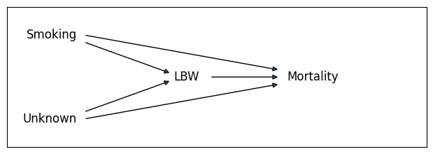
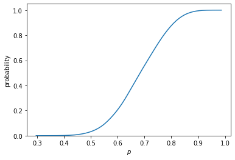
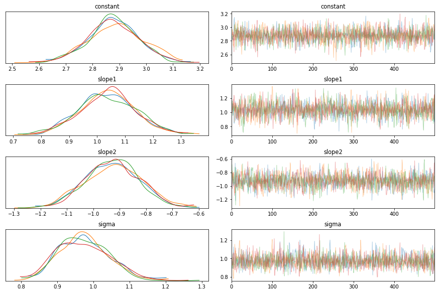
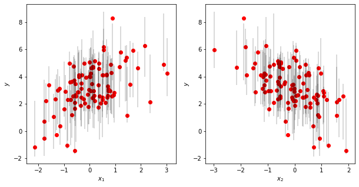
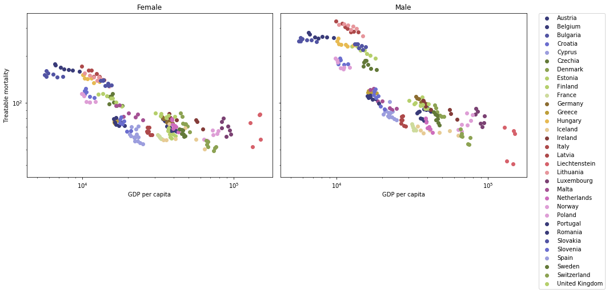
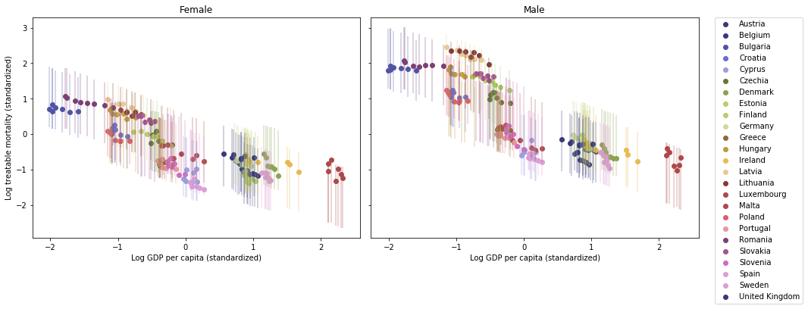
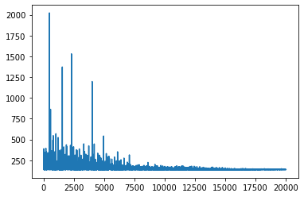
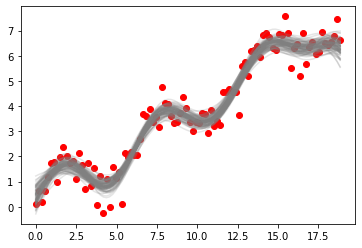
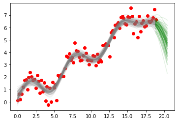

#+SETUPFILE: https://fniessen.github.io/org-html-themes/org/setup/html-theme-readtheorg.setup
#+TITLE: Lectures Datascience for Economics
#+AUTHOR: Jan Boone
#+DATE: August 2026
#+PROPERTY: header-args  :session lectures :async t  :results raw drawer
#+PANDOC_OPTIONS: template:~/.local/share/pandoc/templates/eisvogel
#+PANDOC_VARIABLES: titlepage=true
#+PANDOC_OPTIONS: resource-path:.:figures
#+PANDOC_OPTIONS: highlight-style:tango
#+PANDOC_OPTIONS: pdf-engine:xelatex
#+PANDOC_OPTIONS: include-in-header:header.tex
#+PANDOC_VARIABLES: titlepage=true

#+auto_tangle: nil

#+LANGUAGE: en
#+INFOJS_OPT: view:showall toc:t ltoc:t mouse:underline path:http://orgmode.org/org-info.js
#+LATEX_HEADER: \renewcommand{\floatpagefraction}{.8}
#+latex_header: \input{author.tex}
#+latex_header: \setcounter{tocdepth}{1}
#+latex_header: \hypersetup{urlcolor=blue}
#+latex_header: \usepackage{hyperref}
#+latex_engraved_theme: t
#+EXPORT_SELECT_TAGS: export
#+EXPORT_EXCLUDE_TAGS: noexport
#+OPTIONS: toc:nil timestamp:nil num:nil ':t \n:nil @:t ::t |:t ^:{} _:{} *:t TeX:t LaTeX:t
#+OPTIONS: H:6 html-style:nil

#+HTML_HEAD: <link rel="stylesheet" href="./css/Latex.css">
#+HTML_HEAD: <link rel="stylesheet" href="https://latex.now.sh/prism/prism.css">
#+HTML_HEAD: 

#+HTML_HEAD: 

#+HTML_HEAD: <meta name="viewport" content="width=device-width, initial-scale=1.0" />
#+HTML_HEAD: 

#+BEGIN_EXPORT html
<main>
#+END_EXPORT

* Preamble
:PROPERTIES:
:UNNUMBERED: t
:END:

There are two versions of this document:
- the interactive [[https://janboone.github.io/Datascience-for-economics-lectures/][html version]] which contains the interactive marimo apps
- and the static [[https://janboone.github.io/Datascience-for-economics-lectures/index.pdf][pdf version]] which does not contain interactive apps but shows links to these apps

The html version uses the [[https://github.com/fniessen/org-html-themes][ReadTheOrg]] theme and the pdf version the [[https://github.com/Wandmalfarbe/pandoc-latex-template][Eisvogel latex template]].

* Marimo

In the lectures we use [[https://marimo.io/][marimo notebooks]]. If you follow these lectures as a Tilburg University student, marimo is available at [[https://jupyterlab.uvt.nl/][jupyterlab server.]]

Information on how to install marimo on your own computer can be found [[https://docs.marimo.io/getting_started/installation/][here]]. You can also use [[https://molab.marimo.io/notebooks][molab]].

#+BEGIN_EXPORT latex
\newpage
#+END_EXPORT

* Introduction
:PROPERTIES:
:UNNUMBERED: t
:END:

The goal of these lectures is to build intuition for statistical and machine-learning concepts through simulation. Rather than deriving results analytically, we generate data ourselves, repeat an experiment thousands of times, and read the answer directly from the resulting distribution. This approach — sometimes called *statistical hacking* — serves two purposes: you always know exactly where your data comes from, and you sharpen your Python skills along the way.

Each lecture starts from a concrete economic or statistical question, introduces the Python tools needed to answer it through simulation, and then explains the code in detail. Interactive marimo apps let you experiment with the key parameters and see the effects immediately.

The lectures build on each other. We begin with foundational ideas in statistics (distributions of estimators, bootstrapping, OLS) and move toward machine-learning techniques such as regularisation, neural networks, and treatment-effect estimation.

#+BEGIN_EXPORT html

<strong>How to work with these lectures</strong>
<ul>
<li>Read the economic and statistical explanation to understand the intuition.</li>
<li>With the app try to understand the statistical/datascience concepts.</li>
<li>Experiment with the parameters in the interactive apps to predict/see how the results change.</li>
<li>Before looking at the code, try to figure out yourself how the app can be programmed in Python.</li>
<li>Open your own <code>marimo</code> notebook and type Python code yourself rather than copying (all of) it.</li>
<li>Use the review questions to check whether you understand both the intuition and the implementation.</li>
<li>If you get stuck, try debugging yourself first, then consult documentation, classmates, or an LLM.</li>
</ul>

#+END_EXPORT

#+CAPTION: Roadmap of the course: linking statistical concepts and Python tools
#+NAME: tab:course-roadmap
#+BEGIN_EXPORT html

<table style="border-collapse:collapse; width:100%;">
<thead>
<tr style="background:#1f3c88;color:white;">
<th style="padding:8px;border:1px solid #ddd;">Lecture</th>
<th style="padding:8px;border:1px solid #ddd;">Topic</th>
<th style="padding:8px;border:1px solid #ddd;">Statistics / Econometrics</th>
<th style="padding:8px;border:1px solid #ddd;">Python</th>
</tr>
</thead>
<tbody>
<tr><td style="padding:8px;border:1px solid #ddd;">1</td><td style="padding:8px;border:1px solid #ddd;">Distributions and bootstrapping</td><td style="padding:8px;border:1px solid #ddd;">Sampling distributions, CLT, hypothesis testing, OLS</td><td style="padding:8px;border:1px solid #ddd;">numpy simulations, matplotlib, scipy.optimize</td></tr>
</tbody>
</table>

#+END_EXPORT

--------------

#+BEGIN_EXPORT latex
\newpage
\tableofcontents
\newpage
#+END_EXPORT

* Lecture 1: Statistical Hacking — Distributions and Bootstrapping
:PROPERTIES:
:HTML_CONTAINER_CLASS: section
:END:

*Skills you learn in this lecture:* simulating sampling distributions, visualising histograms, implementing bootstrapping and OLS from scratch using Python and numpy.

** Learning Objectives

After completing this lecture you should be able to:
- explain why simulating a distribution is a useful alternative to analytical statistical theory
- reproduce the Central Limit Theorem in Python by simulating sample means
- describe what the sampling distribution of an OLS slope looks like and what determines its spread
- implement a bootstrap permutation test to compare two group means without distributional assumptions
- define the loss function for OLS in Python and minimise it numerically
- explain the difference between ridge and lasso penalisation and implement both as modifications to the OLS loss

** Introduction

In your statistics and econometrics courses you have seen analytical results: the sample mean follows an approximately normal distribution by the Central Limit Theorem; the OLS slope has a t-distribution under certain assumptions. These results are elegant but limited. Modern machine-learning models are so complex that no such closed-form distributions exist for their estimated parameters. So how do you assess uncertainty?

The answer is *simulation*. You write the statistical problem in Python, run it thousands of times, and read the distribution from the resulting histogram. This lecture introduces this way of thinking through three closely linked ideas:

1. *Distributions of estimators* — how much does the sample mean or OLS slope vary from sample to sample?
2. *Bootstrapping* — how can you test a hypothesis when you have only one sample and no knowledge of the underlying model?
3. *OLS from scratch* — how does the optimisation problem behind OLS work, and how do ridge and lasso extend it?

Because you generate all the data yourself, you always know the true answer and can check whether the simulation recovers it. That is what makes this approach so useful for building intuition.

The statistical results in this lecture are probably (hopefully) not new to you. What we want to show to you is the new way (simulation or "hacking") in which to understand these results. Later on in the lectures there are topics where we do not have analytical results; then simulation is the only option to gain intuition.

If you like this approach to statistics, you can read a [[https://greenteapress.com/wp/think-stats-2e/][free book]] [cite:@downey-2014-think-stats] or watch YouTube lectures from [[https://www.youtube.com/watch?v=VR52vSbHBAk][Allen Downey]] and [[https://www.youtube.com/watch?v=Iq9DzN6mvYA][Jake VanderPlas]].

** Apps

This lecture has two interactive apps. The first shows how the sampling distribution of the mean and the OLS slope change as you adjust the sample size and noise level. The second demonstrates bootstrap hypothesis testing: you control the effect size and watch whether the test detects it.

*** Distribution of an estimator
:PROPERTIES:
:HTML_CONTAINER_CLASS: section
:END:

In your statistics classes you have probably done hypothesis testing on a sample mean. Then there was "something" with a normal distribution and "another thing" with $\sqrt{n}$ where $n$ was the sample size. Depending on the math content of your course, you have seen these results proved (or not). Here we will explain what these results are and what the intuition is by programming/simulating them. To illustrate, we calculate the mean of $n$ draws out of a uniform distribution; then we do this, say, 10,000 times. Thus we have 10,000 means and we can show the histogram of these means. What does this histogram look like; put differently, what is the distribution of these means? What is the standard deviation of these 10,000 means?

The clear advantage of an analytic proof is that it shows that the result is (always) true. Simulations cannot prove anything. But simulations can help your intuition and sometimes more than a formal proof. Because we actually simulate the concepts, you can literally look at them. For many students the distribution of a mean is a rather abstract concept. We plot this distribution with simulations making it more concrete. The standard error is then the standard deviation of this distribution. Similarly, the distribution of a slope in an OLS regression may sound vague, but when we simulated the different samples and estimate the slope 10,000 times we can plot these 10,000 slopes.

The app below has two parts. In the first part you choose a sample size $n$ and a number of simulations $N$. Each simulation draws a sample of size $n$ from the uniform distribution on $[0,1]$ and records the sample mean. The histogram of the $N$ means shows the sampling distribution of the estimator (the mean); the red curve is the theoretical normal distribution from the Central Limit Theorem. When are these two distributions close and when do they seem different?

In the second part you choose a true slope $\beta_1$, a noise level $\sigma$, and sample size dimensions; i.e. the sample size $n$ of the data and the number of repetitions $N$ of our simulation. The app then runs $N$ OLS regressions and plots both the histogram of $N$ estimated slopes and a fan of 50 fitted regression lines. This illustrates that uncertainty about the slope translates directly into uncertainty about where the regression line lies — and that the uncertainty is largest far from the mean of $x$.

#+BEGIN_EXPORT latex
\url{https://janboone.github.io/datascience-marimo/lecture1\_distributions.html}
#+END_EXPORT

#+BEGIN_EXPORT html

  <a href="https://janboone.github.io/datascience-marimo/lecture1_distributions.html"
     target="_blank"
     style="background:#1f3c88;color:white;padding:12px 24px;border-radius:6px;text-decoration:none;font-weight:bold;font-size:1em;">
    ▶ Open app: Distribution of an Estimator
  </a>

#+END_EXPORT

*** Bootstrap hypothesis test
:PROPERTIES:
:HTML_CONTAINER_CLASS: section
:END:

Above we assume that we know the relevant theoretical (underlying) distributions and draw samples from it. But what if you have a real world dataset and no information on the distribution from which this data is drawn? How can the $n$ sample with $N$ repetitions work then? We illustrate this with data from two groups $A$ and $B$ and we want to test whether the population means of the two groups are the same. That is, the null hypothesis is: $\mu_A = \mu_B$.

Suppose we observe data from two groups $A$ and $B$ and want to know whether their (population) means are the same. In the app, group $B$ is generated as $B = A \times \delta$ where $\delta \leq 1$, so a smaller $\delta$ means a larger difference between the means of the $A$ and $B$ groups. When $\delta = 1$ there is no difference; the null hypothesis is true.

The left panel shows the raw samples and their means. The right panel shows the bootstrap null distribution: the distribution of mean differences you would see if both groups were actually drawn from the same population. The observed difference is marked in red; the shaded tails are the fraction that exceed it in magnitude — that fraction is the p-value.

Drag $\delta$ from $0.80$ toward $1.00$ to watch the p-value rise above $0.05$ as the effect becomes too small to detect with the given sample size.

#+BEGIN_EXPORT latex
\url{https://janboone.github.io/datascience-marimo/lecture1\_bootstrap.html}
#+END_EXPORT

#+BEGIN_EXPORT html

  <a href="https://janboone.github.io/datascience-marimo/lecture1_bootstrap.html"
     target="_blank"
     style="background:#1f3c88;color:white;padding:12px 24px;border-radius:6px;text-decoration:none;font-weight:bold;font-size:1em;">
    ▶ Open app: Bootstrap Hypothesis Test
  </a>

#+END_EXPORT

** Python Code Explanation

In this section we explain the Python code for the apps above. Open a =marimo= notebook alongside this document and type the code yourself; do not just copy and paste. Getting errors and fixing them is the fastest way to learn.

We focus here on modelling the statistical intuitions not on the interactive elements in the =marimo= notebooks.

*** Simulating sampling distributions

**** Import libraries and set parameters

We use =numpy= for numerical computation and =matplotlib= for plotting. 

#+begin_src python
import numpy as np
import matplotlib.pyplot as plt

sample_size = 10        # n observations per sample
N_simulations = 10_000   # N repetitions
#+end_src

**** Generate the data

The key idea: instead of drawing one sample, we draw =N_simulations= samples at once by creating a 2D array (matrix). Each row is one sample (of $n$ draws); each column is one observation within that sample.

#+begin_src python
samples = np.random.uniform(0, 1, (N_simulations, sample_size))
means = samples.mean(axis=1)
#+end_src

~np.random.uniform(low, high, size)~ draws uniformly distributed random numbers. The argument ~(N_simulations, sample_size)~ gives a matrix with =N_simulations= rows and =sample_size= columns.

~.mean(axis=1)~ takes the mean /across columns/ (axis 1), so we get one mean per row; one per simulation. Compare this to ~.mean(axis=0)~ which would average across rows.

**** Plot the histogram

Setting ~density=True~ normalizes the histogram so that the total area equals 1, which makes it comparable to a probability density function. The ~alpha~ parameter controls transparency (0 = invisible, 1 = opaque).

For a sample drawn from Uniform[0,1], the population mean is $\mu = 0.5$ and the population variance is $\sigma^2 = 1/12$. The standard error of the sample mean is therefore $\text{SE} = 1/\sqrt{12n}$. By the Central Limit Theorem, the sampling distribution of the mean is approximately $\mathcal{N}(0.5,\, \text{SE}^2)$ for large $n$.

#+begin_src python :results graphics file output :file ./figures/sampling_distribution_mean.png
fig, ax = plt.subplots(figsize=(8, 4))
ax.hist(means, bins=60, density=True, alpha=0.6, color="steelblue", label="Simulated means")
ax.set_xlabel("Sample mean")
ax.set_ylabel("Density")
ax.set_title(f"Sampling distribution of the mean (n={sample_size})")
se = 1.0 / np.sqrt(12 * sample_size)
x = np.linspace(0.2, 0.8, 300)
pdf = (1.0 / (se * np.sqrt(2 * np.pi))) * np.exp(-0.5 * ((x - 0.5) / se) ** 2)
ax.plot(x, pdf, "r-", lw=2, label=f"Theoretical N(0.5, {se:.4f}²)")
ax.legend()
#+end_src

#+RESULTS:
[[file:./figures/sampling_distribution_mean.png]]

We compute the normal PDF manually using the formula $f(x) = \frac{1}{\sigma\sqrt{2\pi}} e^{-\frac{(x-\mu)^2}{2\sigma^2}}$. Overlaying it on the histogram checks whether the Normal approximation is good for the chosen ~sample_size~.

-----

*** Distribution of the OLS slope

To simulate the distribution of an OLS slope, we need to generate $n$ draws of (x, y) pairs, fit a regression to this sample, record the slope, and repeat this $N$ times.

**** Generate data with broadcasting

#+begin_src python
N_simulations = 1000
n_sample_size = 20
true_slope = 0.5
true_intercept = 1.0
noise = 0.5

x = np.random.normal(0, 1, (N_simulations, n_sample_size))
eps = np.random.normal(0, noise, (N_simulations, n_sample_size))
y = true_intercept + true_slope * x + eps
#+end_src

Here ~true_slope * x~ multiplies every element of the matrix ~x~ by the scalar ~true_slope~. This is called *broadcasting*: =numpy= automatically extends scalar operations to match the shape of the array. In a later lecture we come back to broadcasting in =numpy= because it is very powerful feature.

**** Compute OLS slops

The OLS slope formula for [[https://en.wikipedia.org/wiki/Ordinary_least_squares#Simple_linear_regression_model][a simple regression]] is $\hat\beta_1 = \frac{\sum(x_i - \bar x)(y_i - \bar y)}{\sum(x_i - \bar x)^2}$. We can compute this for all simulations at once:

#+begin_src python
x_c = x - x.mean(axis=1, keepdims=True)
y_c = y - y.mean(axis=1, keepdims=True)

slopes_hat = (x_c * y_c).sum(axis=1) / (x_c ** 2).sum(axis=1)
#+end_src

The argument ~keepdims=True~ ensures the mean has shape ~(N_simulations, 1)~ instead of ~(N_simulations,)~, so that subtracting it from the ~(N_simulations, sample_size)~ matrix ~x~ broadcasts correctly.

We plot the distribution of estimated slopes (histogram) and the theoretical distribution. If you do not know the theoretical distribution of OLS slopes; do not worry: we use simulations in these lectures, not theoretical results. If you do know the distribution of OLS slopes: why do we plot a normal distribution and not a Student $t$ distribution?

#+begin_src python :results graphics file output :file ./figures/sampling_distribution_OLS_slopes.png
# Histogram of estimated slopes
plt.hist(slopes_hat, bins=50, density=True, alpha=0.65, color="coral",
             label="Estimated slopes $\hat \\beta_1$")
plt.axvline(true_slope, color="k", lw=2, linestyle="--",
                label=f"True slope = {true_slope:.1f}")
x_hist_range = np.linspace(slopes_hat.min() - 0.2, slopes_hat.max() + 0.2, 300)
slope_se = noise / np.sqrt(n_sample_size)
normal_slope_pdf = (
    (1.0 / (slope_se * np.sqrt(2 * np.pi)))
    * np.exp(-0.5 * ((x_hist_range - true_slope) / slope_se) ** 2)
)

plt.plot(x_hist_range, normal_slope_pdf, "b-", lw=2,
             label=f"Theoretical N({true_slope:.1f}, {slope_se:.3f}²)")

plt.xlabel("Estimated slope $\hat \\beta_1$")
plt.ylabel("Density")
plt.title("Distribution of OLS slope estimator")
plt.legend(fontsize=8)
plt.tight_layout()
#+end_src

#+RESULTS:
[[file:./figures/sampling_distribution_OLS_slopes.png]]

-----

*** Bootstrapping

**** Generate two groups

We generate the $A$ sample from a normal distribution. The $B$ sample is $\delta \in \langle 0,1]$ from the $A$ sample. Hence we know that $\mu_B \leq \mu_A$ (with probability 1.0). Note that we generate these $A$ and $B$ samples once. Above we generated these samples $N$ times; but here we generate the repetitions in a different way.

#+begin_src python :results output
sample_size = 50
delta = 0.95         # B = A * delta; delta < 1 means B is lower than A
A = np.random.normal(10, 1, sample_size)
B = A * delta
observed_difference = A.mean() - B.mean()
print(f"The observed difference equals {observed_difference:.2f}")
#+end_src

#+RESULTS:
:results:
The observed difference equals 0.51
:end:

**** Combine the samples

Under the null hypothesis ($H_0$: both groups come from the same distribution); in other words, the group labels are arbitrary. We combine the two samples:

#+begin_src python
AB = np.concatenate([A, B])
#+end_src

**** Run the permutation test

We randomly relabel the combined sample =N_boot= times and record the difference in means each time. Using ~np.random.choice~ we generate a matrix with labels for the permutation. To see what this function does, check out ~np.random.choice(5,size=(15,10),replace=True)~. Also try ~replace=False~ and see what happens.

For each of the $N$ repetitions (which are in rows, ~axis = 0~), we calculate the difference in means between the labelled $A$ and labelled $B$ samples.

#+begin_src python
N_boot = 10000
rng = np.random.default_rng()

perm_indices = np.random.choice(sample_size,size=(N_boot,2*sample_size),replace=True)

boot_diff = (AB[perm_indices[:, :sample_size]].mean(axis=1)
             - AB[perm_indices[:, sample_size:]].mean(axis=1))
#+end_src

~AB[perm_indices[:, :sample_size]]~ uses *fancy indexing*: for each of the =N_boot= rows we select =sample_size= elements of =AB= according to the permuted indices. In a later lecture we come back to fancy indexing.

**** Compute the p-value

#+begin_src python :results output
p_value = np.mean((boot_diff) >= (observed_difference))
print(f"p-value: {p_value:.4f}")
#+end_src

#+RESULTS:
:results:
p-value: 0.0063
:end:

~(boot_diff) >= (observed_difference)~ produces a boolean array; taking its mean gives the fraction of bootstrap differences that are at least as extreme as the observed one. That fraction is the (one-sided) p-value.

-----

*** OLS from scratch: the optimization approach

The final topic of this lecture (with statistical concepts you have probably seen before) is OLS. Above we use the analytical expression for the slope of a simple regression (i.e. only one independent variable): $\hat\beta_1 = \frac{\sum(x_i - \bar x)(y_i - \bar y)}{\sum(x_i - \bar x)^2}$. The same result can be obtained by minimizing the mean squared error loss function directly. This is useful because the loss function can later be extended with penalty terms to give ridge or lasso.

**** Generate data

#+begin_src python
from scipy import optimize

sample_size = 500
slope1 = -3.0
slope2 = 2.0
constant = 1.0
noise = 1.5
x1 = np.random.normal(0, 1, sample_size)
x2 = np.random.normal(0, 1, sample_size)
y = constant + slope1 * x1 + slope2 * x2 + noise * np.random.normal(0, 1, sample_size)
#+end_src

**** Define the OLS loss

The OLS estimator minimizes the mean squared error:

$$
L(w) = \frac{1}{n} \sum_{i=1}^n \bigl(w_0 + w_1 x_{1i} + w_2 x_{2i} - y_i\bigr)^2
$$

#+begin_src python
def loss_ols(w):
    predictions = w[0] + w[1] * x1 + w[2] * x2
    return np.mean((predictions - y) ** 2)
#+end_src

**** Minimize the loss

#+begin_src python :results output
result = optimize.minimize(loss_ols, x0=[0.0, 0.0, 0.0])
print("Estimated coefficients:", result.x)
#+end_src

#+RESULTS:
:results:
Estimated coefficients: [ 1.00394757 -2.96011743  2.05995201]
:end:

~optimize.minimize~ starts from the initial guess ~x0~ and finds the values of ~w~ that minimize ~loss_ols~. You should recover values close to ~constant=1~, ~slope1=-3~, and ~slope2=2~.

**** Ridge and lasso penalties

Ridge and lasso add a penalty on the coefficients to the loss function. This discourages the model from assigning large coefficients to variables that have little predictive power; a problem that becomes serious when you have many variables.

/Ridge/ uses a squared penalty:

#+begin_src python
lam = 1.0

def loss_ridge(w):
    predictions = w[0] + w[1] * x1 + w[2] * x2
    mse = np.mean((predictions - y) ** 2)
    penalty = lam * np.sum(w[1:] ** 2)   # do not penalise the intercept
    return mse + penalty
#+end_src

/Lasso/ uses an absolute-value penalty:

#+begin_src python
def loss_lasso(w):
    predictions = w[0] + w[1] * x1 + w[2] * x2
    mse = np.mean((predictions - y) ** 2)
    penalty = lam * np.sum(np.abs(w[1:]))
    return mse + penalty
#+end_src

The key difference: lasso can shrink coefficients exactly to zero (performing variable selection), while ridge only shrinks them toward zero. Experiment with different values of ~lam~ to see the effect. We will come back to ridge and lasso regression in the next lecture.

** Summary

In this lecture we introduced statistical simulation as a practical complement to analytical theory. We illustrated the Central Limit Theorem by plotting sampling distributions of the mean, and showed that OLS slope estimates also have a distribution that widens with noise and narrows with sample size.

We then implemented bootstrap hypothesis testing: by repeatedly reshuffling a combined sample under the null hypothesis, we obtained a p-value without any distributional assumption. Finally, we implemented OLS as a numerical optimization problem and extended it to ridge and lasso by adding penalty terms to the loss function.

#+BEGIN_EXPORT html

<strong>Key statistical takeaway</strong> 
When theory gives no closed-form answer -- which is the norm in machine learning -- simulation fills the gap. Generating your own data and running an experiment thousands of times is a reliable way to build intuition about uncertainty, bias, and the effects of model choices.

#+END_EXPORT

#+BEGIN_EXPORT html

<strong>Key Python takeaway</strong> 
Vectorised <code>numpy</code> operations replace explicit Python loops and are orders of magnitude faster. The idioms introduced here -- 2D random arrays, <code>axis</code> reductions, broadcasting, and fancy indexing -- reappear throughout the rest of the course.

#+END_EXPORT

*Looking ahead:* In the next lecture we consider the issue of variable selection and causal interpretation of coefficients.

** Review Questions

Test your understanding. For each question, write the code in your own =marimo= notebook.

-----

**** TODO review questions:
- plot std of mean(x) against $\sigma/\sqrt(n)$
- test signif. of slope with bootstrapping; how can we bootstrap under null hypoth. that slope equals 0
- plot the separate ols lines from the first app

*** Question 1: Distribution of the sample standard deviation

Above we looked at the distribution of the sample /mean/. The sample /standard deviation/ $s$ also has a distribution.

a. Using the same setup as in section [[*Simulating sampling distributions][Simulating sampling distributions]], simulate the distribution of $s$ across =N_simulations= samples. Plot its histogram.
b. What is the probability that $s < 0.28$? Compute this from the simulated distribution.
c. How does the shape of the distribution of $s$ change as you increase =sample_size=? Is it symmetric?

*** Hint
#+BEGIN_EXPORT html

<strong>click here</strong>

#+END_EXPORT
- Replace ~means = samples.mean(axis=1)~ with ~stds = samples.std(axis=1, ddof=1)~. The argument ~ddof=1~ gives the unbiased estimator.
- ~np.mean(stds < 0.28)~ gives the fraction of simulated standard deviations below 0.28.
#+BEGIN_EXPORT html

#+END_EXPORT

-----

*** Question 2: OLS with correlated predictors

In the data-generating process above, ~x1~ and ~x2~ are independent. Now generate correlated predictors:

#+begin_src python
x1 = np.random.normal(0, 1, sample_size)
x2 = 0.8 * x1 + np.sqrt(1 - 0.8**2) * np.random.normal(0, 1, sample_size)
y = constant + slope1 * x1 + 3 * np.random.normal(0, 1, sample_size)
#+end_src

a. Minimise the OLS loss with this correlated ~x2~. How do the estimated coefficients change?
b. Simulate the distribution of the estimated slope on ~x1~ for 1000 repetitions. How does correlation between ~x1~ and ~x2~ affect the spread of this distribution?

-----

*** Question 3: Ridge regression and variable selection

Use the setup from [[*OLS from scratch: the optimisation approach][OLS from scratch: the optimisation approach]] but now generate five predictors, of which only two have a non-zero true coefficient:

#+begin_src python
n = 200
X = np.random.normal(0, 1, (n, 5))   # five predictors
true_w = np.array([1.0, -3.0, 0.0, 0.0, 0.0])
y = X @ true_w + np.random.normal(0, 1, n)
#+end_src

a. Minimise the OLS loss. Do the estimated coefficients for the irrelevant predictors come out exactly zero?
b. Minimise the ridge loss with $\lambda = 1$. How does the result differ?
c. Minimise the lasso loss with $\lambda = 0.1$. Are any coefficients exactly zero?

*** Hint
#+BEGIN_EXPORT html

<strong>click here</strong>

#+END_EXPORT
- The loss function now takes a vector ~w~ of length 5 and computes ~X @ w~ for the predictions.
- For lasso the gradient of ~|w|~ is undefined at zero, so ~scipy.optimize.minimize~ may not converge cleanly. Try the method ~'L-BFGS-B'~ which handles bounds and subgradients better.
#+BEGIN_EXPORT html

#+END_EXPORT

-----

*** Question 4: One-sided vs two-sided bootstrap test

The bootstrap test we implemented is *two-sided*: we ask whether $|D_\text{boot}| \geq |D_\text{obs}|$. In some situations we have a directional hypothesis — for instance, we expect $A > B$.

a. Adapt the p-value computation to compute a *one-sided* p-value that tests whether the mean of $A$ is specifically /larger/ than the mean of $B$.
b. For a fixed $\delta = 0.95$ and $n = 50$, run the test 200 times and record the one-sided p-value each time. What fraction of tests reject at the 5% level? Is this what you expect?

-----

*** Question 5: Bootstrap confidence interval

Instead of a hypothesis test, you can also use the bootstrap to construct a confidence interval for the difference in means.

a. From the 10,000 bootstrap differences you computed, extract the 2.5th and 97.5th percentiles. This gives a 95% bootstrap confidence interval for the difference.
b. Does this interval contain zero when $\delta = 1$? What about when $\delta = 0.90$?

*** Hint
#+BEGIN_EXPORT html

<strong>click here</strong>

#+END_EXPORT
- ~np.percentile(boot_diff, [2.5, 97.5])~ gives the two endpoints of the interval.
- This is the *percentile* bootstrap CI. It is conceptually simple but there are more accurate variants (BCa, studentised) that you can explore if interested.
#+BEGIN_EXPORT html

#+END_EXPORT

-----------
#+BEGIN_EXPORT latex
\newpage
#+END_EXPORT

* Lecture 2: Variable selection and causality
:PROPERTIES:
:HTML_CONTAINER_CLASS: section
:END:

*Skills you learn in this lecture:* recognising the multiple testing problem, reading and reasoning with directed acyclic graphs (DAGs), and simulating fork, pipe, and collider structures in Python to see how controlling for variables changes OLS estimates.

** Learning Objectives

After completing this lecture you should be able to:
- explain the multiple testing problem and why significance is not a valid criterion for selecting variables
- define a directed acyclic graph (DAG) and use it to describe a causal structure
- distinguish fork, pipe, and collider structures and state which variables should (not) be controlled for in each case
- simulate fork, pipe, and collider data in Python using numpy
- compute OLS coefficients for simple and multiple regressions from scratch and interpret how they change when a control variable is added or removed

** Introduction

In your statistics and econometrics courses you have learned that OLS measures correlations. A regression coefficient tells you how $Y$ changes when $X$ changes /on average in the data/, but it does not say whether there is a causal relationship. In economics, causal questions matter enormously: if you advise the government to adopt policy $X$ because it will raise $Y$, you need to be sure that $X$ actually /causes/ $Y$, not just that the two are correlated.

Two common but mistaken shortcuts that researchers use when they move from correlations to causal claims are the following.

First, some people select control variables based on statistical significance: add a variable, check whether it is significant, keep it if yes. The xkcd cartoon in Figure ref:fig:significance_xkcd illustrates the absurdity of this approach. If you test 20 unrelated variables at the 5% level, you expect one to appear significant purely by chance. The first app in this lecture lets you explore this /multiple testing problem/ directly.

#+caption: Significance cannot be used for variable selection (in case you need [[https://www.explainxkcd.com/wiki/index.php/882:_Significant][an explanation]]).
#+attr_latex: scale=0.3
#+name: fig:significance_xkcd
[[https://imgs.xkcd.com/comics/significant.png]]

Second, and more subtly, even if you have the right variable in mind as a control, adding it to a regression can either fix a problem or make it dramatically worse -- depending on the causal structure. A third variable $Z$ can play three fundamentally different roles:

- the *fork* — $Z$ causes both $X$ and $Y$; failing to control for $Z$ creates a spurious correlation between $X$ and $Y$
  - a simple example is the correlation between the consumption of ice cream and the number of people drowned in a day; can you guess what $Z$ is here?
- the *pipe* — $Z$ mediates the causal effect of $X$ on $Y$; controlling for $Z$ blocks the causal path you are trying to measure
  - an economic example: you want to know the effect of education on income; should you control for (un)employment?
- the *collider* — both $X$ and $Y$ cause $Z$; controlling for $Z$ induces a spurious correlation between $X$ and $Y$ where none existed
  - 
  - below we analyze two more examples; one with simulated and one with real data.

Each of these three structures is represented by a directed acyclic graph (DAG): a diagram with variable names as nodes and arrows showing the direction of causation. The second app lets you switch between the three DAG types and see how the OLS coefficient of $X$ changes when you add $Z$ to the regression.

** Apps

This lecture has two interactive apps. The first demonstrates the multiple testing problem. The second shows the fork, pipe, and collider structures and lets you observe how adding a control variable $Z$ to the regression changes the estimated effect of $X$ on $Y$.

*** Significance and variable selection
:PROPERTIES:
:HTML_CONTAINER_CLASS: section
:END:

All $k$ variables in this app are generated independently of $Y$ — none has a true effect. Nevertheless, some will appear significant at the chosen $\alpha$ level just by chance. The histogram shows the distribution of t-statistics across all $k$ regressions; the red lines mark the critical values. The bar chart on the right compares the expected number of false discoveries ($\alpha \times k$) with the number actually observed. Increase $k$ to 100 or 200 to see how many spurious findings accumulate.

#+BEGIN_EXPORT latex
\url{https://janboone.github.io/datascience-marimo/lecture2\_significance.html}
#+END_EXPORT

#+BEGIN_EXPORT html

  <a href="https://janboone.github.io/datascience-marimo/lecture2_significance.html"
     target="_blank"
     style="background:#1f3c88;color:white;padding:12px 24px;border-radius:6px;text-decoration:none;font-weight:bold;font-size:1em;">
    ▶ Open app: Significance and Variable Selection
  </a>

#+END_EXPORT

*** Fork, pipe, and collider
:PROPERTIES:
:HTML_CONTAINER_CLASS: section
:END:

Select a DAG type from the dropdown and watch the bar chart on the right. The two bars show the OLS coefficient of $X$ from a bivariate regression ($Y \sim X$) and from a multiple regression that also includes $Z$ ($Y \sim X + Z$). The t-statistics are shown in the chart title. The callout below the chart gives the interpretation: for the fork, controlling for $Z$ is the right thing to do; for the pipe and the collider, it is not.

Increase the effect strength $\gamma$ to make the bias more visible, or reduce the sample size to see how estimation uncertainty interacts with the bias.

#+BEGIN_EXPORT latex
\url{https://janboone.github.io/datascience-marimo/lecture2\_causality.html}
#+END_EXPORT

#+BEGIN_EXPORT html

  <a href="https://janboone.github.io/datascience-marimo/lecture2_causality.html"
     target="_blank"
     style="background:#1f3c88;color:white;padding:12px 24px;border-radius:6px;text-decoration:none;font-weight:bold;font-size:1em;">
    ▶ Open app: Fork, Pipe, and Collider
  </a>

#+END_EXPORT

** Python Code Explanation

In this section we explain the key ideas behind the two apps. Open a =marimo= notebook alongside this document and type the code yourself.

We focus on the statistical logic — how to simulate each causal structure and how to compute OLS coefficients from scratch. The interactive sliders and dropdown in the apps are added on top of exactly this code.

*** Multiple testing

**** Simulate many null variables

We generate $k$ variables that have no true effect on $Y$ and run /one/ multiple regression of $Y$ on all $k$ variables simultaneously. The design matrix $\mathbf{X}$ has shape $(n,\, k+1)$: a column of ones for the intercept and one column per variable.

#+begin_src python
import numpy as np

n, k = 100, 50         # sample size and number of candidate variables
Y = np.random.normal(0, 1, n)
X = np.random.normal(0, 1, (n, k))
#+end_src

**** Compute t-statistics for the multiple regression

OLS gives $\hat\beta = (\mathbf{X}^\top \mathbf{X})^{-1} \mathbf{X}^\top Y$ and the covariance matrix of $\hat\beta$ is $\hat\sigma^2 (\mathbf{X}^\top \mathbf{X})^{-1}$ where $\hat\sigma^2 = \text{RSS}/(n - k - 1)$.

#+begin_src python
Xmat = np.column_stack([np.ones(n), X])              # (n, k+1)
beta = np.linalg.solve(Xmat.T @ Xmat, Xmat.T @ Y)   # (k+1,)
resid = Y - Xmat @ beta
sigma2 = np.sum(resid ** 2) / (n - k - 1)           # df = n - k - 1
cov_beta = sigma2 * np.linalg.inv(Xmat.T @ Xmat)    # (k+1, k+1)
se = np.sqrt(np.diag(cov_beta))                      # (k+1,)
t_stats = beta[1:] / se[1:]                          # (k,); slopes only
#+end_src

The vector ~t_stats~ holds one t-statistic per variable, each testing $H_0: \beta_j = 0$. Under the null, each $t_j \sim t_{n-k-1}$; for $n = 100$ and $k = 50$ the critical value at 5\% is still well approximated by 1.96.

#+begin_src python
n_significant = np.sum(np.abs(t_stats) > 1.96)
print(f"{n_significant} out of {k} variables are 'significant' at 5%")
print(f"Expected: {0.05 * k:.1f}")
#+end_src

Every significant result here is a false discovery — by construction.

**** Distribution of false discoveries across repetitions

One run gives one draw from the distribution of false discoveries. To see the full distribution we repeat the simulation $N = 10{,}000$ times and record $n_{\text{sig}}$ for each draw.

#+begin_src python
N = 10_000
counts = np.empty(N, dtype=int)

for i in range(N):
    Yi    = np.random.normal(0, 1, n)
    Xi    = np.random.normal(0, 1, (n, k))
    Xmat_i  = np.column_stack([np.ones(n), Xi])
    beta_i  = np.linalg.solve(Xmat_i.T @ Xmat_i, Xmat_i.T @ Yi)
    resid_i = Yi - Xmat_i @ beta_i
    s2_i    = np.sum(resid_i ** 2) / (n - k - 1)
    se_i    = np.sqrt(np.diag(s2_i * np.linalg.inv(Xmat_i.T @ Xmat_i)))[1:]
    counts[i] = int(np.sum(np.abs(beta_i[1:] / se_i) > 1.96))
#+end_src

Because each t-test is approximately independent and rejects with probability $\alpha = 5\%$ under the null, the count $n_{\text{sig}}$ follows a $\text{Binomial}(k,\, \alpha)$ distribution with mean $k\alpha$ and variance $k\alpha(1-\alpha)$.

#+begin_src python
from math import comb
import matplotlib.pyplot as plt

alpha = 0.05
xs = np.arange(counts.max() + 2)

sim_probs   = np.array([(counts == x).mean() for x in xs])
binom_probs = np.array([comb(k, x) * alpha**x * (1 - alpha)**(k - x) for x in xs])

fig, ax = plt.subplots(figsize=(8, 4))
ax.bar(xs - 0.2, sim_probs,   width=0.35, alpha=0.75,
       color="steelblue", label=f"Simulated ({N:,} runs)")
ax.bar(xs + 0.2, binom_probs, width=0.35, alpha=0.75,
       color="coral",     label=f"Binomial({k}, {alpha})")
ax.set_xlabel(f"Number of 'significant' variables out of k = {k}")
ax.set_ylabel("Probability")
ax.set_title("Distribution of false discoveries — simulation vs. Binomial")
ax.legend()
plt.tight_layout()
plt.show()
#+end_src

-----

*** Simulating fork, pipe, and collider

For all three structures we need a helper function that computes OLS coefficients for a simple or multiple regression using numpy linear algebra. The design matrix $\mathbf{X}$ collects a column of ones (the intercept) and the predictor columns; $\hat\beta = (\mathbf{X}^\top \mathbf{X})^{-1} \mathbf{X}^\top Y$.

#+begin_src python
def ols(Y, *Xs):
    """Return OLS coefficient vector [intercept, beta_1, ...]."""
    Xmat = np.column_stack([np.ones(len(Y))] + list(Xs))
    return np.linalg.solve(Xmat.T @ Xmat, Xmat.T @ Y)
#+end_src

**** The fork

$Z$ causes both $X$ and $Y$; there is no direct effect from $X$ to $Y$.

#+begin_src python
n = 1000
gamma = 1.0
Z = np.random.normal(0, 1, n)
X = gamma * Z + np.random.normal(0, 1, n)    # Z causes X
Y = gamma * Z + np.random.normal(0, 1, n)    # Z causes Y (no X effect)

coef_without_z = ols(Y, X)          # Y ~ X: biased, coefficient of X != 0
coef_with_z    = ols(Y, X, Z)       # Y ~ X + Z: correct, coefficient of X ~ 0

print(f"Y ~ X:     coef of X = {coef_without_z[1]:.3f}")
print(f"Y ~ X + Z: coef of X = {coef_with_z[1]:.3f}")
#+end_src

The bivariate regression picks up the spurious correlation created by $Z$. Adding $Z$ removes it.

**** The pipe

$X$ causes $Z$ which causes $Y$; the causal effect of $X$ on $Y$ is fully mediated by $Z$.

#+begin_src python
X = np.random.normal(0, 1, n)
Z = gamma * X + np.random.normal(0, 1, n)    # X causes Z
Y = gamma * Z + np.random.normal(0, 1, n)    # Z causes Y

coef_without_z = ols(Y, X)     # correct: captures total causal effect gamma^2
coef_with_z    = ols(Y, X, Z)  # incorrect: Z is the mechanism, coefficient ~ 0

print(f"Y ~ X:     coef of X = {coef_without_z[1]:.3f}  (true total effect ~ {gamma**2:.2f})")
print(f"Y ~ X + Z: coef of X = {coef_with_z[1]:.3f}  (mechanism is blocked)")
#+end_src

An economic example: the effect of schooling on poverty is partly mediated through income. Controlling for income makes schooling look irrelevant — but the real effect exists; it works through income.

**** The collider

$X$ and $Y$ are independent. Both cause $Z$. Conditioning on $Z$ induces a spurious negative correlation between $X$ and $Y$.

#+begin_src python
X = np.random.normal(0, 1, n)
Y = np.random.normal(0, 1, n)               # truly independent of X
Z = gamma * X + gamma * Y + np.random.normal(0, 1, n)   # both cause Z

coef_without_z = ols(Y, X)     # correct: coefficient of X ~ 0
coef_with_z    = ols(Y, X, Z)  # wrong: coefficient of X is negative

print(f"Y ~ X:     coef of X = {coef_without_z[1]:.3f}  (correct, near zero)")
print(f"Y ~ X + Z: coef of X = {coef_with_z[1]:.3f}  (spurious negative!)")
#+end_src

The intuition: if we hold $Z = \gamma X + \gamma Y$ fixed, then a higher $X$ must be offset by a lower $Y$ to keep $Z$ constant. So within any slice of $Z$, $X$ and $Y$ are negatively correlated — a pure artefact of conditioning.

**** collider bias with simulated data

Many people have the intuition that adding a control variable to a
regression (especially when it turns out to be signficant) is a good
idea. However, this intuition is wrong if it is applied without
thinking. The pipe above is a first example where this reasoning is
incorrect. The collider is a second case.

We use here the education example by Richard McElreath to illustrate
this point (see
[[https://www.youtube.com/watch?v=l_7yIUqWBmE][Richard McElreath 's lecture 6]]).
Consider the educational achievements of three generations in one
family: the grandparent, the parent and the (grand)child. We are
interested in the effect of the grandparent's education on the
educational achievement of the grandchild.

Let's denote the child's educational achievement by \(Y\) (the variable
we are interested in) and the grandparent's education \(X\). We want to
understand the effect of \(X\) on \(Y\). Clearly there is the following
path: more educated grandparent leads to more educated parent (\(Z\))
which, in turn, leads to more educated grandchild. The thing we are
interested in is whether there is a direct effect from the grandparent
on the child, /controlling/ for the parent's education.

#+caption: collider
[[./figures/Collider.png]]

We know that the parent's education has a positive effect on the child's
achievement. A more educated parent will tend to stimulate their
children more, can help with homework etc. In the data that we generate
below, we assume that \(Z = X + ...\) and \(Y = Z + ...\). That is, we
assume that the parent's education feeds one-to-one into the child's
education.

Is it the case that on top of this effect there is a separate
grandparent effect? E.g. because the grandparent is babysitting and a
more educated grandparent reads Hamlet with the 5 year old grandchild.
That is fun and can boost the child's educational achievement.

Another important component of education is the neighborhood where the
child grows up. We denote this variable \(U\). In the code we assume
that the parent and child grow up in the same neighborhood (have the
same \(U\) effect). \(U\) is drawn from a standard normal distribution
and the effect on education is given through a multiplication by the
factor =alpha=.

In addition to this, we assume that there is a random component as well
which differs between parent and child.

#+caption: collider
[[./figures/Collider2.png]]

The code below, generates this data and a dataframe =df_collider= that
stores this data.

Look carefully at the code: is there a direct effect from the
grandparent to the grandchild's educational achievement?

We generate two dataframes: =df_collider= is the one that is observed
and used in the analysis by the researcher.

We will use =df_collider_2= to illustrate why one can get incorrect
results from analyzing =df_collider=. The problem is that the researcher
does not have access to =df_collider_2= but we can analyze
=df_colldier_2= for “educational purposes” to illustrate why problems
arise.

#+begin_src python
sample_size = 5000
alpha = 0.5
X = tf.random.normal([sample_size])
U = tf.random.normal([sample_size])
Z = X + alpha*U+0.4*tf.random.normal([sample_size])
Y = Z + alpha*U+0.4*tf.random.normal([sample_size])

df_collider = pd.DataFrame({'X':X, 'Y':Y, 'Z':Z})
df_collider_2 = pd.DataFrame({'X':X, 'Y':Y, 'Z':Z, 'U':U})
print(df_collider.head())
print(df_collider_2.head())
#+end_src

*Question* Find the (direct) effect of the grandparent (\(X\)) on the
grandchild's educational achievement (\(Y\)) conditional on the parent's
education (\(Z\)).

The effect of the grandparent's educational achievement (\(X\)) on the
child's achievement is negative and significant.

*Question* Where does this negative effect come from? How is this even
possible?

*Question* Find the direct effect of \(X\) on \(Y\). Which sign does
this effect have? What is the interpretation?

To understand the negative effect of \(X\) on \(Y\), let's think about
what it means to “control for parental education \(Z\)”.

To visualize what happens, we condition on \(Z\) by focusing on a narrow
band of \(Z\) observations. In other words, we condition on \(Z\) by
focusing on a subsample where the \(Z\) values are (almost) the same. We
do this by creating a column =selected= in our dataframe.

#+begin_src python
df_collider['selected'] = np.abs(df_collider.Z)<0.05
df_collider.head()
#+end_src

*Question* Plot \(X\) against \(Y\) for all the data (in blue) and for
the values of \(Z\) where \(|Z|<0.05\) (in orange).

*Exercise* Do the graph above again for 2 different ranges of \(Z\) in
the same figure.

*Question* Give the intuition why there is a negative correlation
between \(X\) and \(Y\) with the orange dots. [hint: what do you know
about orange dots with low \(X\) and about orange dots with high \(X\)?]

If you cannot answer this question yet, consider the following
interactive graph.

To better understand what is happening here, we are going to use
=df_collider_2=. In particular, in the combined figure below, we again
provide a scatter plot of =X= vs =Y=. Now the color indicates the level
of =Z= associated with the observation; darker colors indicate higher
values of =Z=. The size of the point (circle) indicates the level of =U=
(that the researcher cannot see in =df_collider=).

To better illustrate what is happening, we use an interactive plot made
with [[https://altair-viz.github.io/][altair]].

To condition on =Z= (as we do in a multiple regression), we can drag a
rectangle in the bottom histogram. That is, drag the rectangle so that
you “capture” a bar in the histogram. This selection of \(Z\) turns blue
and you can drag the selection up and down (conditioning on different
values of \(Z\)).

Move this selection up and down and see what happens. In particular: *
how does =Z= vary in the figure? E.g. where are the high values of =Z=?
What is the interpretation of this? * for a selection of =Z= in the
bottom histogram, what is the relation between =X= and =Y=? * for this
selection, how does =U= vary in the figure? That is, for a given
selection of \(Z\) what is the size of the circles? What is the
interpretation?

*Question* Give the intuition why there is a negative correlation
between =X= and =Y= for a selection of =Z=; that is, conditional on =Z=.

*Exercise* What is the risk of saying: I have run a regression and
controlled for all effects that I had variables for?

#+begin_src python
interval = alt.selection_interval(encodings=['y'])

fig = alt.Chart(df_collider_2).mark_point().encode(
  x='X',
  y='Y',
  color=alt.condition(interval, 'Z', alt.value('lightgreen')),
  size = 'U'
).properties(
    selection=interval

)

hist = alt.Chart(df_collider_2).mark_bar().encode(
    x='count()',
    y=alt.Y('Z',bin=True),
    color=alt.condition(interval, 'Z', alt.value('lightgrey'))
).properties(
    selection=interval

)

chart_collider = fig & hist

chart_collider.save('ChartCollider.html')
#+end_src

**** collider bias with real data

In this section we consider a collider example using real (not simulated) data. This example is based on [cite/text/c:@downey-2023-probab-overt-it]:
- [[denote:20240713T110907][probably overthinking low birthweight paradox]]
- https://allendowney.github.io/ProbablyOverthinkingIt/birthweight.html

The Low Birthweight Paradox was born in 1971, when Jacob Yerushalmy, a researcher at U.C. Berkeley, published “The relationship of parents’ cigarette smoking to outcome of pregnancy – implications as to the problem of inferring causation from observed associations”. As the title suggests, the paper is about the relationship between smoking during pregnancy, the weight of babies at birth, and mortality in the first month of life.

Based on data from about 13,000 babies born near San Francisco between 1960 and 1967, Yerushalmy reported that
- Babies of mothers who smoked were about 6% lighter at birth.
- Smokers were about twice as likely to have babies lighter than 2500 grams, which is considered “low birthweight”.
- Low-birthweight babies were much more likely to die within a month of birth: the mortality rate was 174 per 1000 for low-birthweight babies and 7.8 per 1000 for others.

These results were not surprising. At that time, it was well known that children of smokers were lighter at birth, and that low-birthweight babies were more likely to die.

We use 1991 data from https://www.cdc.gov/nchs/data_access/vitalstatsonline.htm
    
#+begin_src python :display plain
df = pd.read_csv('./data/lbw_data.csv')
subset = df.dropna(subset=["tobacco", "birthweight"])
df.head()
#+end_src

#+RESULTS:
:    Unnamed: 0  tobacco  birthweight   mort    lbw           bin
: 0           0      2.0       3505.0  False  False  (3500, 3750]
: 1           1      2.0       2940.0  False  False  (2750, 3000]
: 2           2      2.0       2693.0  False  False  (2500, 2750]
: 3           3      1.0       2778.0  False  False  (2750, 3000]
: 4           4      2.0       3175.0  False  False  (3000, 3250]

- with "tobacco" 1.0 means smoker; 2.0 non-smoker
- "birthweight" is in grams
- "mort" indicates whether or not baby died
- "lbw" low birth weight if weight is below 2500
- "bin" we will use below

On the university server we uploaded the zip file of this data:

#+begin_src python :display plain
from zipfile import ZipFile
zip_file = ZipFile('./data/lbw_data.csv.zip')
df = pd.read_csv(zip_file.open('lbw_data.csv'))
df.head()
#+end_src

#+begin_src python :display plain
subset.groupby("tobacco")["birthweight"].mean()
#+end_src

#+RESULTS:
: tobacco
: 1.0    3145.189278
: 2.0    3370.030102
: Name: birthweight, dtype: float64

Children of smokers (1.0) have lower birthweight than for non-smokers (2.0); mortality among 1000 babies

#+begin_src python :display plain
subset.groupby("tobacco")["mort"].mean()*1000
#+end_src

#+RESULTS:
: tobacco
: 1.0    11.874562
: 2.0     7.710689
: Name: mort, dtype: float64

Children of smokers (1.0) have higher mortality rate than for non-smokers (2.0)

#+begin_src python :results graphics file output :file ./figures/birthweights.png
sn.kdeplot(data=subset,x="birthweight", hue="tobacco",common_norm=False) 
plt.axvline(2500, color="gray", ls=":", alpha=0.5);
#+end_src

#+RESULTS:
[[file:./figures/birthweights.png]]

Can we find a bad effect of smoking on child mortality controlling for lbw?

#+begin_src python :display plain
mortality_lbw = subset.groupby(["tobacco","lbw"])["mort"].mean()*1000
mortality_lbw
#+end_src

#+RESULTS:
: tobacco  lbw  
: 1.0      False     5.651406
:          True     60.138756
: 2.0      False     3.146364
:          True     74.851271
: Name: mort, dtype: float64

- for low birth weight children, smoking mothers reduce mortality
- protective effect of smoking?

#+begin_src python :display plain
bins = np.arange(1000, 5000, 250)
table = pd.pivot_table(subset, index="bin", columns="tobacco", values="mort")
table *= 1000
table.index = bins[:-1] + np.diff(bins) / 2
table
#+end_src

#+RESULTS:
#+begin_example
tobacco         1.0         2.0
1125.0   102.376600  106.864725
1375.0    65.099458   72.467402
1625.0    43.963878   48.194837
1875.0    31.085935   32.530380
2125.0    22.160247   20.968439
2375.0    16.087278   13.399794
2625.0     9.483955    7.970344
2875.0     7.015749    4.987658
3125.0     5.610098    3.629459
3375.0     5.005695    2.534403
3625.0     3.994581    2.394741
3875.0     4.040855    1.983212
4125.0     3.064351    1.966262
4375.0     4.212744    2.005241
4625.0     5.084083    2.539889
#+end_example

#+begin_src python :results graphics file output :file ./figures/lbw_paradox.png
plt.plot(table.index,table[1.0]-table[2.0])
plt.xlabel("birth-weight (grams)")
plt.ylabel("difference in mortality rate per 1000")
plt.title("Difference infant mortality smoking vs non-smokin
                                mothers\n by birth weight");
#+end_src

#+RESULTS:
[[file:./figures/lbw_paradox.png]]

- babies of smoking mothers have
  - lower birthweight
  - higher mortality
- when controlling for low birthweight, babies of smoking mothers have lower mortality
  - protective effect of smoking?
  - LBW (low birth weight) paradox
  - if the baby has LBW, doctor is relieved to hear that the mother smokes
  - smoking mother is "better" than LBW caused by genetic defect
  - if we cannot control for other causes of LBW, LBW is a collider
  - we should *not* control for LBW
  - the idea that "invites" controlling for LBW is to see whether there is an additional effect of smoking on mortality (even among babies of normal weight)

- LBW is a collider; by controling for LBW we open the backdoor path:
  - LBW is collider because two arrows point into it: Smoking -> LBW <- Unknown
  - smoking -> LBW -> Unknown -> mortality
- with the DAG above: if we would like to know the effect of LBW on Mortality:
  - Smoking and Unkown are confounders
  - to understand the effect of LBW on mortality, we need to control for Smoking and Unknown

** Summary

This lecture introduced two practical pitfalls in variable selection and causal interpretation.

The multiple testing problem shows that significance alone is not a reliable guide to variable selection: if you test many variables, some will appear significant by chance, with an expected false-discovery rate of exactly $\alpha$.

The fork, pipe, and collider show that whether to control for a third variable $Z$ depends entirely on the causal structure. Controlling for a fork variable is correct. Controlling for a pipe mediator or a collider is incorrect — it either blocks a causal path or introduces a spurious correlation that was not there before. Reading off the DAG which variables to control for is therefore an important practical skill.

#+BEGIN_EXPORT html

<strong>Key statistical takeaway</strong> 
Significance of a coefficient does not mean the variable belongs in your model. Variable selection should be guided by your causal model (the DAG), not by p-values.

#+END_EXPORT

#+BEGIN_EXPORT html

<strong>Key Python takeaway</strong> 
<code>np.linalg.solve(X.T @ X, X.T @ y)</code> computes the OLS coefficient vector in one line for any number of predictors. The same matrix operations that worked for simple regression scale directly to multiple regression.

#+END_EXPORT

/Looking ahead:/ In the next lecture we move from correlation and causality to prediction, and look at how machine-learning models handle many predictors and the risk of overfitting.

** Review Questions

Test your understanding. For each question, write the code in your own =marimo= notebook.

-----

*** Question 1: False discovery rate

Repeat the multiple testing simulation but now generate $k$ variables where exactly half have a true slope of 0.5 (and half are null).

a. What fraction of the true-effect variables do you correctly detect (power)?
b. Among the "significant" results, what fraction are false discoveries?
c. How does the false-discovery fraction change as you increase $k$ while keeping the number of true signals fixed?

-----

*** Question 2: Fork with partial effect

In the fork simulation above, $X$ has no direct effect on $Y$. Now add a direct effect:

#+begin_src python
Y = 0.5 * X + gamma * Z + np.random.normal(0, 1, n)
#+end_src

a. What coefficient do you expect for $X$ in the regression $Y \sim X$ (without controlling for $Z$)?
b. What coefficient do you expect for $X$ in the regression $Y \sim X + Z$?
c. Run both regressions and check whether the simulated coefficients match your expectations.

-----

*** TODO Question 3: Costly data acquisition

Suppose you work at a ministry and you and your team need to figure out what the effect is of a policy $x$ on an outcome $y$. You can gather data on this relation between $x$ and $y$ but the problem is that the data acquisition is rather expensive. Hence, your colleagues suggest that you gather data sequentially (over time) until you find that the coefficient of $x$ (on $y$) is significant.

Hopefully, in your statistics/econometrics classes you learned that this is a very bad idea. If not, I tell you: this is a bad idea.

Use data simulation to convince your colleagues that collecting data in this way is a bad idea.

**** answer :noexport:

Here we show that a workflow where one gathers data up till the point where the effect is significant is a very bad idea!

First think what would convince your colleages:
- situation where we know that $x$ has no effect on $y$ but with this data gathering process we will find a significant effect for sure:

#+begin_src jupyter-python :file ./figures/pvalues.png
import statsmodels.api as sm
import numpy as np
import matplotlib.pyplot as plt
N = 1000
x = np.random.normal(0,1,size=N)
y = np.random.normal(0,1,size=N)
x = sm.add_constant(x)
p_values = []

for n in range(10,N):
   model = sm.OLS(y[:n], x[:n,:n]).fit()
   p_values.append(model.pvalues[1])
   
plt.scatter(range(10,N),p_values,label='regression outcome')
plt.plot([0,990],[0.05,0.05],label='5% p-value',c='r')
plt.xlabel('number of observations')
plt.ylabel('p-value')
plt.legend();

#+end_src

-----

*** Question 4: Treatment effects

One approach to estimating causal treatment effects is to use an instrument — a variable $W$ that affects the treatment $X$ but has no direct effect on the outcome $Y$ (it only affects $Y$ through $X$). This is the instrumental variables (IV) approach.

Consider the following data-generating process:

#+begin_src python
n = 2000
W = np.random.normal(0, 1, n)             # instrument
U = np.random.normal(0, 1, n)             # unobserved confounder
X = 0.8 * W + 0.6 * U + np.random.normal(0, 1, n)   # treatment
Y = 1.5 * X + 0.8 * U + np.random.normal(0, 1, n)   # outcome
#+end_src

The true causal effect of $X$ on $Y$ is 1.5. $U$ is an unobserved confounder (it affects both $X$ and $Y$), so OLS of $Y \sim X$ is biased.

a. Estimate the OLS coefficient of $X$ in $Y \sim X$. Is it close to 1.5?
b. The IV estimator is $\hat\beta_{IV} = \frac{\text{Cov}(W, Y)}{\text{Cov}(W, X)}$ (numerically: use ~np.cov~). Compute it and compare to the true effect.
c. Two-stage least squares (2SLS): in the first stage regress $X \sim W$ and save the fitted values $\hat X$; in the second stage regress $Y \sim \hat X$. Does this also recover the true effect?

*** Hint
#+BEGIN_EXPORT html

<strong>click here</strong>

#+END_EXPORT
- ~np.cov(W, Y)[0, 1]~ gives the sample covariance between $W$ and $Y$.
- For the first stage in 2SLS: use the ~ols~ function from the Python Code Explanation section. The fitted values are ~X_hat = b[0] + b[1] * W~.
- The 2SLS estimator equals the IV estimator when there is exactly one instrument; they differ with multiple instruments.
#+BEGIN_EXPORT html

#+END_EXPORT

-----------
#+BEGIN_EXPORT latex
\newpage
#+END_EXPORT
* Lecture 3: Tensors, broadcasting, indexing, matrix operations

In this lecture we consider a number of more technical aspects of datascience in Python:
- tensors
- broadcasting
- indexing
- matrix operations
- programming a regression in tensorflow: because we will use tensorflow for estimating neural networks, there is some advantage in understanding the tensorflow syntax a bit more.

In the past, when you worked with data, you would usually have
2-dimensional data: columns for the different variables and rows for the
different observations. That is, the data is represented as a matrix.

However, “big data” is not necessarily structured in such a neat way.
Data can have higher dimensions. We will start with data on images. An
image has two dimensions of itself. Hence a dataset with images has 3
dimensions: one dimension for the identifier of the image and then x-y
coordinates for the image itself.

If the dataset consists of movie-clips, we have an additional dimension:
time.

In economics, when we look at GDP, our observation would be GDP of the
UK in 2010, GDP of the UK in 2011, GDP of Belgium in 2010 etc. This can
be represented as a matrix.

But now suppose we believe the development of GDP is important. Our
observation would be GDP of the UK in 2010-2018. This gives 3
dimensional data. The observation is GDP in the period.

To deal with higher dimensional data, we need “tensors”. A tensor
generalizes a matrix to higher dimensions.

We will now have a technical interlude to explain what tensors are and
what you can do with them. We describe some functions that can be
applied to tensors. To motivate these functions, we will build our first
neural network. The point here is not so much to explain how neural
networks work but more to show you that the functions we consider are
going to be useful later on when we will try to understand neural
networks more deeply.

Machine learning packages tend to have a “backbone” that implements
tensors. E.g. Keras allows you to work with either
[[http://www.deeplearning.net/software/theano/][Theano]] or
[[https://www.tensorflow.org/][tensorflow]].

** Tensors
:PROPERTIES:
:CUSTOM_ID: tensors
:END:

- tensors are vectors/matrices that capture multidimensional data
- we tend to think in two dimensional tables ("excel") but some phenomena have higher dimensions than 2
- a set of images, say we want to separate images of cats and dogs
- one observation has two dimensions (x and y axis), say I have 50*50 "pixels"
- if I have 3000 observations, my data has dimensions 3000*50*50
- you cannot do this in excel...
- to deal with such data in python, we need tensors
- we introduce tensors in =numpy= and explain how you can work with them (e.g. add them together, multiply them)
- this is different than with matrices:
  - I can multiply an $n*m$ and $k*l$ matrix if and only if $m=k$
  - this is *not* true for multiplying tensors
- an important concept with tensors is: broadcasting
- with tensors you will use (the attribute) =.shape= a lot
- you will learn how to select observations from a tensor using slicing and indexing

As mentioned, in most of the empirical analyses that you have done, an
observation is a one dimensional vector. E.g. you have data on
inflation, unemployment, gdp growth for country-year combinations. Then
for the UK in 2000, our data consists of the one dimensional vector
=[inflation, unemployment, gdp growth]=. If you have 100 observations
like this, you can represent them in a matrix. Each row is an
observation and the columns will be
=[coutry, year, inflation, unemployment, gdp growth]=. Hence we have a
two dimensional dataset with 100 rows and 5 columns.

In big data, there are usually higher dimension observations. One of the
“classic” datasets in machine learning is
[[https://en.wikipedia.org/wiki/MNIST_database][the MNIST dataset.]]
This dataset consists of handwritten numbers and their corresponding
label (e.g. when the handwritten number is 5, the label for this image
=5=). We will see an example shortly. This called a classification
problem: based on a picture of the handwritten number, we need to
classify the pricture as being either 0, 1, ..., 9.

The point is that a handwritten number is a two dimensional observation.
For each x-y comination, we get the grey-scale of this point/pixel. To
illustrate this, consider the 5th image from the training dataset
(python starts numbering at 0); we plot the handwritten image (which is
2 dimensional) and print its label.

This data is already split in a train and test set. The idea is that we
train our model on the train data and then use the test data (which the
model has never seen before) to evaluate the fit of the model. We will
elaborate on this below.

#+begin_src python
(train_images, train_labels), (test_images, test_labels) = datasets.mnist.load_data()
#+end_src

#+begin_src python
plt.imshow(train_images[4],cmap=plt.cm.binary)
plt.show()
print(train_labels[4])
#+end_src

If you want to “see” what the data look like, uncomment the next cell
and evaluate it.

#+begin_src python
#train_images[4]
#+end_src

Indeed, the handwritten number is 9, which equals its label.

What are the dimensions for this dataset. Let's use =shape= to find out.
Friendly warning, when you go into machine learning, you will be using
=shape= a lot!

#+begin_src python
train_images.shape
#+end_src

That is, we have 60,000 images in the train-set and each image is of the
form 28 by 28 (pixels).

As an illustration, the dimensions of the first image in the dataset
=train_images=.

#+begin_src python
train_images[0].shape
#+end_src

** Tensors in numpy
:PROPERTIES:
:CUSTOM_ID: tensors-in-numpy
:END:
As mentioned, well known machine learning backends are theano and
tensorflow. For reasons that we do not worry about here, these are not
immediately straightforward to work with (but we have used some
tensorflow already above). We can play around with dimensions in “good
old” numpy as well. Properties that we can use in numpy, like
broadcasting, can be used in theano and tensorflow as well.

As numpy is “more direct” to work with, we will practice this with
numpy.

*Remark* Although you are always encouraged to play around with code to
see what happens, this is especially the case with tensors. To
familiarize yourself with tensors, change the code that we use below;
e.g. create a 10 dimensional vector out of the data. You can check for
yourself whether the code generates what you expect it to generate. If
not, and you cannot figure out what happens, ask us!

First, we create the vector =x= with 100 random numbers.

#+begin_src python
x = np.random.normal(0,1,size=100)
#+end_src

*Question* Use =shape= to find the shape of the vector =x=.

As you can see, =x= has 100 elements in one dimension and no other
dimension. Put differently, =x= is one-dimensional as a tensor.

This we can verify using =ndim=:

#+begin_src python
x.ndim
#+end_src

*Do not panic:* The following sentence will be a bit confusing when you
first read it, but you will get used to it later. If you would plot the
vector =x= it would be a /vector/ in a 100-dimensional space. Hence it
is a 100 dimensional vector, but a 1 dimensional tensor.

To understand this better, let's consider a two dimensional (2D) tensor.
This is what we usually call a matrix:

#+begin_src python
x2 = x.reshape(25,4)
print(x2.ndim)
print(x2.shape)
#+end_src

By evaluating =x2= we see that this indeed “looks like” a matrix.

In terms of python, we can see the two dimensions as follows: * each row
has four elements (columns) separated by comma's (=,=) in between square
brackets, like =[1,2,3,4]=; * then between square brackets, we have 25
of such rows; again rows separated by comma's.

#+begin_src python
x2
#+end_src

Note how the =reshape= method turns the 100 elements of the
1-dimensional vector =x=into a matrix with 25 “rows” and 4 “columns”.
This matrix is 2-dimensional.

*Question* Create a 3-dimensional vector =x3= out of =x= with shape 4 by
5 by 5. Check the dimensions and shape of =x3=.

One way to think about =x3= is as four \(5*5\) images. The numpy
representation of this is as follows:

#+begin_src python
x3
#+end_src

With =np.newaxis= we can add a dimension to a vector without adding or
re-arranging data. This works as follows:

#+begin_src python
x4 = x3[:,:,:,np.newaxis]
print(x4.ndim)
print(x4.shape)
#+end_src

Now if you evaluate =x4=, it looks a lot like =x3=. But if you look
carefully there is an additional pair of square brackets =[]=.

You may wonder why it is useful to add a =newaxis= to a tensor.
Actually, one good reason for this is broadcasting.

#+begin_src jupyter-python
A = np.arange(24).reshape(2,3,4)
A.shape
#+end_src

#+RESULTS:
| 2 | 3 | 4 |

#+begin_src jupyter-python
print(A[0,:,:])
print('\n')
print(A[1,:,:])
#+end_src

#+RESULTS:
: [[ 0  1  2  3]
:  [ 4  5  6  7]
:  [ 8  9 10 11]]
: 
: 
: [[12 13 14 15]
:  [16 17 18 19]
:  [20 21 22 23]]

#+begin_src jupyter-python
A[0,1,:]
#+end_src

#+RESULTS:
: array([4, 5, 6, 7])

Recall matrix multiplication: we multiply a (2,3) matrix and (3,1) vector and the result is a (2,1) vector:

#+begin_src jupyter-python
B = np.random.normal(0,1,size=(2,3))
C = np.random.normal(0,1,size=(3,1))
B @ C
#+end_src

#+RESULTS:
: array([[ 4.52124598],
:        [-2.5195251 ]])

But multiplying *tensors* B and C gives an error:

#+begin_src jupyter-python
B*C
#+end_src

Construct a three dimensional tensor

#+begin_src jupyter-python
tensor_3d = np.arange(8).reshape(2,2,2)
tensor_3d
#+end_src

#+RESULTS:
: array([[[0, 1],
:         [2, 3]],
:
:        [[4, 5],
:         [6, 7]]])

***** question:
- What is the shape of =tensor_3d=?
- What does a 3-D vector look like?

***** answer

#+begin_src jupyter-python
print(np.ndim(tensor_3d))
print(np.shape(tensor_3d))
#+end_src

#+RESULTS:
: 3
: (2, 2, 2)

- A 3D vector is e.g. $b = (1,2,3)$
- is not the same as a 3D tensor!

***** question: which of the following tensors can be added and why?

#+begin_src jupyter-python
x = np.arange(24).reshape(2,12)
y = np.arange(36).reshape(3,1,12)
z = np.arange(12).reshape(2,3,2)
#+end_src

#+RESULTS:

#+begin_src jupyter-python
# x + y
# x + z
# y + z
# x + y + z
#+end_src

#+RESULTS:

***** question: add dimensions to $x,y,z$ so that they can be added.

***** answer

#+begin_src jupyter-python
print((x+y).shape)
print((x+z[:,:,:,None]).shape)
print((y+z[:,:,:,None]).shape)
print((x+y+z[:,:,:,None]).shape)
#+end_src

#+RESULTS:
: (3, 2, 12)
: (2, 3, 2, 12)
: (2, 3, 2, 12)
: (2, 3, 2, 12)

***** question: use selections from the following tensor $x$ to get the arrays:

- =[0,1,2]=
- =[6,8]=
- =[4,10]=
- =[11,10,9]=
- =[7,8,9,10,11]=
- =[4,5,6,7,8,9]=

#+begin_src jupyter-python
x = np.arange(12).reshape(2,2,3)
#+end_src

#+RESULTS:

***** answer

#+begin_src jupyter-python
print(x[0,0,:])
print(x[1,0,::2])
print(x[:,1,1])
print(x[1,1,::-1])
print(x[x>6])
print(x[(x>3)&(x<10)])
#+end_src

#+RESULTS:
: [0 1 2]
: [6 8]
: [ 4 10]
: [11 10  9]
: [ 7  8  9 10 11]
: [4 5 6 7 8 9]

** Broadcasting
:PROPERTIES:
:CUSTOM_ID: broadcasting
:END:

When multiplying tensors, the dimensions need to be same or satisfy the broadcasting rules:
- start "from the right"
- either the dimensions are the same
- or one of the dimensions is equal to 1

#+begin_src jupyter-python
print(A * B[:,:,np.newaxis])
print('\n')
print((B[:,:,np.newaxis]).shape)
#+end_src

Broadcasting is one of the things in python that are rather complicated
to understand at first, but which is extremely useful and powerful once
you “get it”. Let's start with an example.

Suppose you have estimated a fixed effect model. In your data there are
i = 0,1,...,9 individuals and t = 0,1,2 periods. The vector =I= consists
of 10 individual fixed effects and the vector =T= has 3 time fixed
effects. Hence, our prediction for indiv. =i= in time period =t=
(ignoring other explanatory variables) is \(y_{it}=I_i+T_t\).

How can we calculate the vector =y=? When you first think of this, you
may have ideas for a “double loop”: one loop over \(i\) and one over
\(T\). In fact no loops are necessary at all, making the code “very
readable”.

We will define the vectors \(I\) and \(T\) in such an (artificial) way
that you can immediately verify whether we get the sum of the effects
right.

*Question* What do the vectors \(I\) and \(T\) look like? Can they be
added in this way?

#+begin_src python
I = np.arange(0,100,10)
T = np.arange(0,3)
#+end_src

Because of the simplistic numbers that we have chosen, it is easy to see
that e.g. \(y_{91} = 91\) with \(i=9\) and \(t=1\).

We will use the “broadcasting trick” and check whether our trick works.
Then we explain broadcasting.

#+begin_src python
y = I[:,np.newaxis]+T[np.newaxis,:]
#+end_src

#+begin_src python
y
#+end_src

This seems to have worked!

To understand what happens here, evaluate =I[:,np.newaxis]= and
=T[np.newaxis,:]= separately.

In words, =I= is a column vector: only one column and 10 rows and =T= is
a row vector: 3 columns and only 1 row.

*Question* Check the shape of these vectors to see whether this
description is correct.

Adding these two vectors together using broadcasting leads to an element
by element addition of the vectors.

In fact, we have used a simple form of broadcasting before in our python
classes. See, for instance,

#+begin_src python
T + 1
#+end_src

This is simple since 1 has no dimension.

Read
[[https://docs.scipy.org/doc/numpy/user/theory.broadcasting.html#array-broadcasting-in-numpy][this article on broadcasting]]
and
[[https://docs.scipy.org/doc/numpy/user/basics.broadcasting.html][this one]]
to learn more about it.

To see whether two tensors can be added, we start looking at the end. In
particular, as the latter article states, when “operating on two arrays,
NumPy compares their shapes element-wise. It starts with the trailing
dimensions, and works its way forward. Two dimensions are compatible
when

1. they are equal, or
2. one of them is 1”

Let's consider a number of examples.

#+begin_src python
x = np.random.normal(0,1,size=100)
y = np.random.normal(0,1,size=100)
#+end_src

*Question* Which of the following can be added? First, think about it.
Then check by running the code in a cell.

- =x+y=
- =x.reshape(10,10)+y=
- =x.reshape(10,10)+y.reshape(4,5,5)=
- =x.reshape(10,10)+y.reshape(10,10,1)=
- =x.reshape(10,10)+y.reshape(1,10,10)=
- =x.reshape(10,10)+y.reshape(5,10,2)=
- =x.reshape(10,10)+y.reshape(100,1,1)=

** Slicing and (fancy) indexing
:PROPERTIES:
:CUSTOM_ID: slicing-and-fancy-indexing
:END:

Slicing and indexing:

#+begin_src jupyter-python
A[:,:2,:2]
#+end_src

#+RESULTS:
: array([[[ 0,  1],
:         [ 4,  5]],
: 
:        [[12, 13],
:         [16, 17]]])

selecting entries with booleans:

#+begin_src jupyter-python
A[A>5]
#+end_src

Sometimes you want to have a subset from your data; e.g. to divide your
data in a train and test set.

In python, subsets are created using slicing.

To see how slicing works, let's create an “easy” matrix to work with.

*Question* create a matrix =x= of the form:

#+begin_example
array([[  1,   2,   3,   4,   5,   6,   7,   8,   9,  10],
       [ 11,  12,  13,  14,  15,  16,  17,  18,  19,  20],
       [ 21,  22,  23,  24,  25,  26,  27,  28,  29,  30],
       [ 31,  32,  33,  34,  35,  36,  37,  38,  39,  40],
       [ 41,  42,  43,  44,  45,  46,  47,  48,  49,  50],
       [ 51,  52,  53,  54,  55,  56,  57,  58,  59,  60],
       [ 61,  62,  63,  64,  65,  66,  67,  68,  69,  70],
       [ 71,  72,  73,  74,  75,  76,  77,  78,  79,  80],
       [ 81,  82,  83,  84,  85,  86,  87,  88,  89,  90],
       [ 91,  92,  93,  94,  95,  96,  97,  98,  99, 100]])
#+end_example

We start with single elements, to make sure we understand indexing of an
array.

*Question* Use indexing on =x= to get: * =55= * =1= * =100= (and do this
in two different ways)

Now we want a series of elements. For this we use slicing notation. To
get the first row, we do

#+begin_src python
x[0,:]
#+end_src

That is, we take the first element in the first dimension (a row) and
then all elements (=:=) in the other dimension (columns).

*Question* Give the fifth column.

#+begin_src python
To get the second half of the first row:
#+end_src

#+begin_src python
x[0,5:]
#+end_src

To get every other element from this part of the row:

#+begin_src python
x[0,5::2]
#+end_src

To get the top left 2*2 matrix:

#+begin_src python
x[:2,:2]
#+end_src

Finally, to get the diagonal:

#+begin_src python
x[range(10),range(10)]
#+end_src

*Question* What does the following slicing operation do?

#+begin_src python
x[1::2,1::2]
#+end_src

YOUR ANSWER HERE

*Question* Use slicing to get the following: *
=[81, 82, 83, 84, 85, 86, 87, 88, 89, 90]= *
=[ 3, 13, 23, 33, 43, 53, 63, 73, 83, 93]= *

#+begin_example
[[56 57]
 [66 67]]
#+end_example

- 

#+begin_example
[[23 25 27]
 [43 45 47]
 [63 65 67]]
#+end_example

- the first row in reverse order: =[10  9  8  7  6  5  4  3  2  1]=

We can also use a condition to select elements from a tensor. That is,
we create a boolean mask (with =True= and =False=) and then only the
=True= elements are selected. This is called fancy indexing.

Let's start simple.

#+begin_src python
test = np.arange(5)
mask = test > 2
test[mask]
#+end_src

#+begin_src python
mask
#+end_src

There is no need to define the =mask= separetely, the following works as
well:

#+begin_src python
test[test>2]
#+end_src

*Question* Select from =x= the values between 50 and 60.

[hint: use =&= as =and=]

#+begin_src python
# YOUR CODE HERE
raise NotImplementedError()
#+end_src

When two tensors \(x,y\) have the same dimensions, we can select from
\(x\) based on a condition for \(y\).

To illustrate this, we create three vectors =x,y,z=.

#+begin_src python
x = np.random.normal(size=10)
y = np.random.normal(size=10)
z = np.random.normal(size=10)
#+end_src

*Question* Plot =x= against =y= and color points with \(z>0.5\) orange.

selecting data using masks:

#+begin_src jupyter-python
range_x = np.arange(0,2*np.pi,0.01)
range_y = np.sin(range_x)
#+end_src

#+RESULTS:

Plot =sin(x)=, where positive values for =y= are blue and negative ones are red.

#+begin_src jupyter-python :file ./figures/sin_two_colors.png
y_positive = range_y > 0
plt.plot(range_x,range_y,c='r')
plt.plot(range_x[y_positive],range_y[y_positive],c='b');
#+end_src

** Matrix notation

To make sure that we are all on the same page in terms of matrices:
- a matrix $A$ has $m$ rows and $n$ columns; $B$ is $n \times k$
- we will look at the 4 operators: add, subtract, multiply and divide

#+begin_src jupyter-python
A = np.array([[1,2],[3,4]])
B = np.array([[10,11],[12,13]])
b = np.array([2,3]).reshape(2,1)
c = np.array([2,3]).reshape(1,2)

#+end_src

#+RESULTS:

To add matrices, they have to be of the same shape:

#+begin_src jupyter-python
A + B
#+end_src

#+RESULTS:
: array([[11, 13],
:        [15, 17]])

With matrices the addition $A+b$ is not well-defined.

To subtract matrices:

#+begin_src jupyter-python
A - B
#+end_src

#+RESULTS:
: array([[-9, -9],
:        [-9, -9]])

Matrix multiplication $A*B$ we must have $(n \times m) * (m \times k)$ yields a $n \times k$ matrix:

#+begin_src jupyter-python
print(np.dot(A,b))
print(A @ b)
print(np.dot(A,c))
#+end_src

#+RESULTS:
:RESULTS:
: [[ 8]
:  [18]]
: [[ 8]
:  [18]]
: [[ 2  6]
:  [ 6 12]]
# [goto error]
: 
: ValueErrorTraceback (most recent call last)
: <ipython-input-27-7abcc6636c83> in <module>
:       2 print(A @ b)
:       3 print(A*c)
: ----> 4 print(np.dot(A,c))
: 
: <__array_function__ internals> in dot(*args, **kwargs)
: 
: ValueError: shapes (2,2) and (1,2) not aligned: 2 (dim 1) != 1 (dim 0)
:END:

#+begin_src jupyter-python
A @ B
#+end_src

#+RESULTS:
: array([[34, 37],
:        [78, 85]])

outer product: (2 by 1) * (1 by 2) gives 2 by 2 matrix

#+begin_src jupyter-python
b @ c
#+end_src

#+RESULTS:
: array([[4, 6],
:        [6, 9]])

inner product:

#+begin_src jupyter-python
c @ b
#+end_src

#+RESULTS:
: array([[13]])

use matrix transform to calculate inner product of a vector with itself:

#+begin_src jupyter-python
print(b.T)
print(b.T @ b)
#+end_src

#+RESULTS:
: [[2 3]]
: [[13]]

#+begin_src jupyter-python
print(A)
print(A.T)
#+end_src

#+RESULTS:
: [[1 2]
:  [3 4]]
: [[1 3]
:  [2 4]]

#+begin_src jupyter-python
C = np.arange(6).reshape(2,3)
print(C)
print(C.T)
#+end_src

#+RESULTS:
: [[0 1 2]
:  [3 4 5]]
: [[0 3]
:  [1 4]
:  [2 5]]

#+begin_src jupyter-python
d = np.arange(3).reshape(3,1)
C @ d
#+end_src

#+RESULTS:
: array([[ 5],
:        [14]])

**** ridge using matrix notation

#+begin_src jupyter-python
def loss_ridge(b,λ):
    y_pred = X @ b
    return (y-y_pred).T @ (y-y_pred)/len(y) + λ * b.T @ b

nobs = 1000
X = np.random.normal(0,1,size=(nobs, 20))
beta = np.zeros(20)
e = np.random.normal(0,1,size= nobs)
y = np.dot(X, beta) + e

optimize.minimize(lambda b: loss_ridge(b,10),[0]*X.shape[1]).x

#+end_src

#+RESULTS:
: array([-5.68804441e-03,  1.95296940e-03,  3.20648264e-03,  1.53175163e-03,
:         7.73268151e-04, -9.30610786e-04, -8.21372579e-05, -1.87389845e-03,
:        -1.13605827e-03,  1.85988677e-03, -1.43368991e-03,  1.01479310e-03,
:        -5.28211218e-04, -1.15846173e-03,  3.30601316e-03,  3.09943379e-03,
:         1.74189778e-03,  1.33378708e-03, -3.99225614e-03, -3.81307088e-03])

** Tensorflow regression
:PROPERTIES:
:CUSTOM_ID: intermezzo-tensorflow-regression
:END:
Before we do classification in tensorflow, let's quickly look at a
simple regression example. In this way you can get used to the notation
and syntax of tensorflow, while looking at something (regression) that
you already fully understand (we hope...).

This example is copied from
[[https://www.youtube.com/watch?v=E0-mp5UlWzo][this SciPy 2019 Tutorial]]
starting at 14:30.

A minimal example of linear regression in TensorFlow 2.0, written from
scratch without using any built-in layers, optimizers, or loss
functions. We'll create a few points on a scatter plot, then find the
best fit line using the equation =y = m * x + b=.

We create our own dataset. The function =make_noisy_data= has default
values for its parameters. Hence, we can call it without parameters. But
we can also specify a different value, like \(m = 2.0\). It is a good
exercise to play around with these parameter values.

#+begin_src python
def make_noisy_data(m=0.1, b=0.3, n=100):
    x = tf.random.uniform(shape=(n,))
    noise = tf.random.normal(shape=(len(x),), stddev=0.01)
    y = m * x + b + noise
    return x, y

x_train, y_train = make_noisy_data()

#+end_src

*Question* Plot the training data.

#+begin_src python
# YOUR CODE HERE
raise NotImplementedError()
#+end_src

Next we define the tensorflow variables =m,b= and give them a starting
value. Tensorflow now knows that =m,b= are variables that will be varied
(trained) later on.

#+begin_src python
m = tf.Variable(0.)
b = tf.Variable(0.)
#+end_src

We can look at the variables, but they are not “easy to look at” as they
contain more information than just the value. If we are only interested
in the value, we can use the =numpy()= method on the variable.

#+begin_src python
print(m)
print(m.numpy())
#+end_src

We define a function that predicts =y= for given =x=. Note that tf
“knows” that =m,b= are variables because of the way we defined these
variables above. Hence, they are not explicitly mentioned in the
function definition as variables.

#+begin_src python
def predict(x):
    y = m * x + b
    return y
#+end_src

#+begin_src python
def squared_error(y_pred, y_true):
    return tf.reduce_mean(tf.square(y_pred - y_true)) 
#+end_src

Our error measure is sum of squared differences between =y_pred= and
=y_true=.

To see what =reduce_mean= does, consider the following example. If the
tensor =vector= has more than 1 dimension, you can specify the axis
along which the reduction needs to take place.

#+begin_src python
vector = tf.constant([[1., 2., 3., 4.]])
print(tf.reduce_mean(vector).numpy())
#+end_src

*Question* Before we train the model, i.e. with our starting values for
=m,b=, calculate the =squared error= that we have.

#+begin_src python
# YOUR CODE HERE
raise NotImplementedError()
#+end_src

Machine learning is all about reducing the loss (incorrect predictions).
Most algorithms calculate the derivative of the loss function w.r.t. the
parameters of the model. Then change the parameters in such a way that
the loss is indeed reduced. We program a very simple gradient descent
algorithm.

We use gradient descent to gradually improve our guess for =m= and =b=.
At each step, we'll nudge them a little bit in the right direction to
reduce the loss.

#+begin_src python
learning_rate = 0.05
steps = 200

for i in range(steps):
  
    with tf.GradientTape() as tape:
        predictions = predict(x_train)
        loss = squared_error(predictions, y_train)
    
    gradients = tape.gradient(loss, [m, b])
  
    m.assign_sub(gradients[0] * learning_rate)
    b.assign_sub(gradients[1] * learning_rate)
  
    if i % 20 == 0:    
        print("Step %d, Loss %f" % (i, loss.numpy()))
#+end_src

Two things in the code above are new: =GradientTape= and =assign_sub=.
We will discuss these briefly.

More information on GradientTape can be found
[[https://www.tensorflow.org/versions/r2.0/api_docs/python/tf/GradientTape][here]]
where you select API: r2.0 (beta), to get the right version.

As a simple example to get an idea of what it does, we work with the
function \(z^2\). =gradient= calculates the derivative (it does so
analytically) and fills in the value, in this case 3.0. Hence, the
derivative equals \(2*z = 6.0\) at \(z=3.0\).

#+begin_src python
z = tf.Variable(3.0)
def my_function():
    return z**2

with tf.GradientTape() as tape:
    value = my_function()
tape.gradient(value, [z])

#+end_src

*Question* Define the function \(z_1^2+z_2^2-4z_1 z_2\) and calculate
its derivatives w.r.t. \(z_1,z_2\) in the point
\(z_1 = 1.0, z_2 = -2.0\).

#+begin_src python
# YOUR CODE HERE
raise NotImplementedError()
#+end_src

=assign_sub= subtracts the value from the variable:

#+begin_src python
z = tf.Variable(3.0)
z.assign_sub(1.0)
#+end_src

As you know from the Taylor expansion of \(f(x)\) around \(x=a\), we can
write:

\[
f(x) = f(a) + f'(a)(x-a)
\]

Hence, if you try to minimize the function \(f\), you should “walk” in
the direction where \(f\) is falling in \(x\). The size of your step is
determined by =learning_rate=. Big steps imply that you walk fast in the
right direction, but you may jump over the minimum. With a small step
size you are less likely to jump over the minimum, but it may take
longer to get there.

If \(f'(x) >0\) and we want to minimize \(f\), we should reduce \(x\) to
get closer to the minimum. Hence, our algorithm would do:
\(x_1 = x_0 - f'(a)*\varepsilon\) where \(\varepsilon > 0\) is the
learning rate.

This is exactly what the code
=m.assign_sub(gradients[0] * learning_rate)= does.

Note that there are some issues here with local and global minima that
we will not worry about.

Back to our regression problem, the values for the parameters that we
have found are:

#+begin_src python
print ("m: %f, b: %f" % (m.numpy(), b.numpy()))
#+end_src

*Question* Plot the regression line together with the data in one
figure.

#+begin_src python
# YOUR CODE HERE
raise NotImplementedError()
#+end_src

* Lexture 4: Overfitting and underfitting
:PROPERTIES:
:CUSTOM_ID: lecture-overfitting-and-underfitting
:END:
Adding more explanatory variables to a regression cannot make the fit
worse. This is easy to see: if it would become worse, you would set the
coefficient on the added variables to 0. That would give the same fit as
before.

A bit more formally, OLS solves the following minimization problem: \[
\min_{\beta} \sum_{i=1}^N (y_i - \hat y_i(\beta))^2
\] where the prediction \(\hat y_i\) is a function of the parameter
values \(\beta\) that we choose. Having a larger vector \(\beta\) (more
explanatory variables) cannot increase this objective function

There are two problems when one does machine learning (or any other form
of statistical analysis): * underfitting and * overfitting.

Underfitting is the situation where a variable is important to explain
\(y\) but you do not include it in the regression. As most people have a
tendency to include as many variables as possible, this is usually not a
problem. Unless, of course, you do not have data on an important
variable, but then you cannot really solve this problem.

Overfitting is the situation where you include variables in your
regression that are actually not relevant. The reason why this happens
is that including these variables improves the fit of the model (see
above and an example below). But the problem is that you are picking up
correlations that are particular to the sample; not a (general) feature
of the data generating process.

There are a number of ways to deal with this. One is the lasso and ridge
regressions we discussed above. Another is the use of an information
criterion like
[[https://en.wikipedia.org/wiki/Akaike_information_criterion][AIC]] and
its generalizations. The idea of AIC is to include a penalty in the
expression for the fit for the number of parameters.

But if you have lots of data (which is the case if you work with “big
data”), there is a simple way to deal with this: split your data into a
train and test set. You estimate the model with the train set (you
“train the model”). And then check the fit with the test set. If you
pick up particular correlations in the train set, your predictions in
the test set become worse.

Let's first look at an example. We generate data with a quadratic
relation between \(x\) and \(y\). Then we generate more variables:
\(x^3, x^4, ..., x^9\).

Including all these extra variables in training the model, improves the
fit. The sum of squared residuals decreases with the number of
explanatory variables in the train set. However, this is not true in the
test set.

First, we generate the data:

#+begin_src python
N_observations = 30
train_size = 15
x = tf.random.normal([N_observations],seed=26)
y = x+2*x**2+2*tf.random.normal([N_observations],seed=50)
df = pd.DataFrame({'y':y,'x':x})
df['constant'] = 1
df['x2'] = df.x**2
df['x3'] = df.x**3
df['x4'] = df.x**4
df['x5'] = df.x**5
df['x6'] = df.x**6
df['x7'] = df.x**7
df['x8'] = df.x**8
df['x9'] = df.x**9
df_train = df[:train_size]
df_test = df[train_size:]
#+end_src

We split the dataset (dataframe) into a train and test set (using
slicing).

Then we estimate a series of regressions, starting with \(y\) explained
by a constant and variable \(x\) and adding a term \(x^n\) for
\(n=2,...,9\). Hence, we estimate 9 regressions.

#+begin_src python
regression = 'y ~ x'
vector_results = [smf.ols(regression, data=df_train).fit()]
for column in df.columns[3:]:
    regression = regression+' + '+column
    print(regression)
    vector_results.append(smf.ols(regression, data=df_train).fit())
#+end_src

When we plot mean squared error, =mse= (we will calculate this ourselves
below), we see --as claimed above-- that the fit improves with each
variable \(x^n\) that we add to the regression. Hence, this gives the
impression that adding all 9 terms is a good idea.

However, we generated the data ourselves and we know that there are no
terms \(x^9\) in the data generating process.

#+begin_src python
plt.plot([tf.keras.losses.mse(df_train['y'],model.predict(df_train)).numpy() for model in vector_results])
#+end_src

Next we use the 9 models that we estimated above to predict the outcomes
in the test set. For each model we plot the mean sqaured error in the
test set (dots).

In the first graph we also plot the means squared error of the train set
(blue line) with the code:
=np.sum((df_train['y']-model.predict(df_train))**2)/len(df_train['y'])=

#+begin_src python
    
plt.plot([np.sum((df_train['y']-model.predict(df_train))**2)/len(df_train['y']) for model in vector_results])
plt.scatter(range(9),[tf.keras.losses.mse(df_test['y'],model.predict(df_test)).numpy() for model in vector_results])
#+end_src

The fit of the final model is so bad, that we cannot see the pattern in
the 8 other models. Hence, for the next plot we delete the 9th model.

#+begin_src python
plt.scatter(range(8),[tf.keras.losses.mse(df_test['y'],model.predict(df_test)).numpy() for model in vector_results[:8]])
#+end_src

As you can see, the fit does not monotonically improve with the size of
the model. This due to the model picking up patterns that are present in
the train sample but which do not generalize to the test sample.

To understand why this happens, let's plot the train and test data
points together with the prediction of the final model.

#+begin_src python
range_x = np.arange(min(x),max(x),0.1)
df_plot = pd.DataFrame({'x':range_x})
df_plot['constant'] = 1
df_plot['x2'] = df_plot.x**2
df_plot['x3'] = df_plot.x**3
df_plot['x4'] = df_plot.x**4
df_plot['x5'] = df_plot.x**5
df_plot['x6'] = df_plot.x**6
df_plot['x7'] = df_plot.x**7
df_plot['x8'] = df_plot.x**8
df_plot['x9'] = df_plot.x**9
plt.scatter(df_train['x'],df_train['y'],label='train data')
plt.plot(range_x,vector_results[-1].predict(df_plot),label='prediction')
plt.scatter(df_test['x'],df_test['y'],label='test data')
plt.legend()
#+end_src

Since the prediction is “way off” for low values of \(x\), let's zoom in
on the prediction (use a more narrow =range_x=).

Now it becomes clearer what the estimation in the train set is trying to
achieve. But it is also clear that this does not generalize to the test
data (orange points).

This is exactly what overfitting does.

#+begin_src python
range_x = np.arange(-1.25,1.7,0.1)
df_plot = pd.DataFrame({'x':range_x})
df_plot['constant'] = 1
df_plot['x2'] = df_plot.x**2
df_plot['x3'] = df_plot.x**3
df_plot['x4'] = df_plot.x**4
df_plot['x5'] = df_plot.x**5
df_plot['x6'] = df_plot.x**6
df_plot['x7'] = df_plot.x**7
df_plot['x8'] = df_plot.x**8
df_plot['x9'] = df_plot.x**9
plt.scatter(df_train['x'],df_train['y'],label='train data')
plt.plot(range_x,vector_results[-1].predict(df_plot),label='prediction')
plt.scatter(df_test['x'],df_test['y'],label='test data')
plt.legend()
#+end_src

*Question* Make the plots of data and prediction for models 5, 6 and 7.
Adjust =range_x= such that you can see “what is going on”.

Using a train and test set helps to alleviate over- and underfitting
problems. But the test set should only be used once. If you repeatedly
use the train and test set to see which model is best, you make the same
mistake as above but “on a higher level”: you may find patterns in the
train set that generalize only to the test set but not to the data
generating process.

So how can you select your best model if you cannot use the test set for
this? The answer is: we split the dataset in three parts: a train,
validate and test set. That is, we use the train set to fit the model.
Then we repeatedly use the validation set to see what the best model is.
Then our final model, we test only once on the test set.

This splitting of the data into three different (sub)sets is the royal
road to testing the predictions of your model. Below --for ease of
exposition-- we will not always to this. We tend to illustrate problems
using a train and test set. We are not trying to optimize a given model
by finetuning each parameter. For such finetuning, three subsets of data
are recommended.

Suppose you have a train and test set and your trained model does really
well on the test set. How do you know that this is not by chance,
e.g. due to the way you have split the data into the train and test set?
One way to check is to do the analyses for a number of ways in which you
can split the data into train and test sets and for each these cases
consider the loss on the test set. If this is rather constant across the
different ways in which you split the data, you do not need to worry. If
this vary wildly between data partitions, something “odd” may be going
on.

One way of generating these different data partititions is k-fold
cross-validation. See the
[[https://en.wikipedia.org/wiki/Cross-validation_(statistics)][wikipedia page on cross-validation]]
for details.

- overfitting: you pick up structure that is particular to the sample but does not generalize to the population
- underfitting: the sample contains relevant information about the population but your model is too simple to pick this up

#+begin_src jupyter-python
N_observations = 30
train_size = 15
x = np.random.normal(0,1,size=N_observations)
y = x**2 + np.random.normal(0,1,size=N_observations)
x_train = x[:train_size]
x_test = x[train_size:]
y_train = y[:train_size]
y_test = y[train_size:]

#+end_src

#+RESULTS:

#+begin_src jupyter-python :file ./figures/test_train_example.png
plt.scatter(x_train,y_train,label='train')
plt.scatter(x_test,y_test,label='test')
plt.legend();
#+end_src

#+RESULTS:
[[file:./figures/test_train_example.png]]

#+begin_src jupyter-python
z = np.polyfit(x_train, y_train, 2)
p = np.poly1d(z)
range_x = np.arange(np.min(x),np.max(x),0.05)
#+end_src

#+RESULTS:

#+begin_src jupyter-python :file ./figures/fitted_polynomial.png
plt.scatter(x_train,y_train,label='train')
plt.scatter(x_test,y_test,label='test')
plt.plot(range_x,p(range_x))
plt.legend();
#+end_src

#+RESULTS:
[[file:./figures/fitted_polynomial.png]]

- overfitting

#+begin_src jupyter-python :file ./figures/overfit_polynomial.png
z1 = np.polyfit(x_train, y_train, 4)
p1 = np.poly1d(z1)
plt.scatter(x_train,y_train,label='train')
plt.scatter(x_test,y_test,label='test')
plt.plot(range_x,p1(range_x))
plt.legend();
#+end_src

#+RESULTS:
[[file:./figures/overfit_polynomial.png]]

- underfitting

#+begin_src jupyter-python :file ./figures/underfit_polynomial.png
z0 = np.polyfit(x_train, y_train, 0)
p0 = np.poly1d(z0)
plt.scatter(x_train,y_train,label='train')
plt.scatter(x_test,y_test,label='test')
plt.plot(range_x,p0(range_x))
plt.legend();
#+end_src

#+RESULTS:
[[file:./figures/underfit_polynomial.png]]

* Lecture 5: Neural network
:PROPERTIES:
:CUSTOM_ID: lecture-neural-network
:END:

To get a first sense of how a neural network works, we look at two
simple python programs that implement these algorithms. For this, we use
the website from the book
[[http://homepages.ecs.vuw.ac.nz/~marslast/MLbook.html][machine learning: an algorithmic perspective]].

Below you find the code for the files
[[http://homepages.ecs.vuw.ac.nz/~marslast/Code/Ch3/pcn_logic_eg.py][pcn_logic_eg.py]]
and
[[http://homepages.ecs.vuw.ac.nz/~marslast/Code/Ch4/mlp.py][mlp.py]];
which we adapted for python 3 by adjusting the print statements (should
be =print()= in python 3).

By looking at the underlying code we get an idea how neural networks
work. Then we create a neural network using tensorflow 2.0.

The tensorflow syntax is very similar to [[https://keras.io/][Keras]].
There is a
[[https://www.datacamp.com/courses/deep-learning-in-python][datacamp course]]
on deep learning with Keras and
[[https://www.datacamp.com/courses/introduction-to-tensorflow-in-python][a course on tensorflow 2.0]].

- define the relu and softmax functions and plot these functions

#+begin_src jupyter-python :file ./figures/relu_softmax.png
def relu(x):
    return np.clip(x,0,np.inf)
def softmax(x):
    return [np.exp(x[i])/np.sum(np.exp(x)) for i in range(len(x))]

range_x = np.arange(10)-5
fig, ax = plt.subplots(1,2,figsize=(12,5))
ax[0].plot(range_x,relu(range_x))
ax[1].plot(range_x,softmax(range_x),'ro')
ax[0].set_title('relu')
ax[1].set_title('softmax');
#+end_src

#+RESULTS:
[[file:./figures/relu_softmax.png]]

#+begin_src jupyter-python
np.sum(softmax(range_x))
#+end_src

#+RESULTS:
: 1.0

*** why relu?

#+begin_src jupyter-python :file ./figures/relu_approximation.png
import numpy as np
import matplotlib.pyplot as plt

# ----------------------------
# Target: cubic polynomial
# ----------------------------
def f(x):
    return x**3 + x**2 - x - 1

def relu(z):
    return np.maximum(0.0, z)

# ----------------------------
# Build design matrix for fixed knots and slopes
# Model: y_hat = c0 + sum_{j=1..k} a_j * relu(s_j * (x - t_j))
# ----------------------------
def design_matrix(x, knots, slopes):
    Phi = [np.ones_like(x)]
    for t, s in zip(knots, slopes):
        Phi.append(relu(s * (x - t)))
    return np.column_stack(Phi)

def fit_amplitudes(x, y, knots, slopes):
    Phi = design_matrix(x, knots, slopes)
    beta, *_ = np.linalg.lstsq(Phi, y, rcond=None)
    yhat = Phi @ beta
    mse = np.mean((y - yhat) ** 2)
    return beta, yhat, mse

# ----------------------------
# Stagewise: add one knot at a time, search slope for the new knot
# ----------------------------
def stagewise_fixed_knots_opt_slopes(x, y, knots, slope_grid):
    chosen_slopes = []
    history = []

    for k in range(1, len(knots) + 1):
        t_new = knots[k - 1]

        best = None
        for s_new in slope_grid:
            trial_slopes = chosen_slopes + [s_new]
            beta, yhat, mse = fit_amplitudes(x, y, knots[:k], trial_slopes)

            if (best is None) or (mse < best["mse"]):
                best = {"s_new": s_new, "beta": beta, "yhat": yhat, "mse": mse}

        chosen_slopes.append(best["s_new"])
        history.append({
            "k": k,
            "knots": knots[:k].copy(),
            "slopes": chosen_slopes.copy(),
            "beta": best["beta"],
            "yhat": best["yhat"],
            "mse": best["mse"],
        })

    return history

# ----------------------------
# Demo + plotting (2x3 subfigures)
# ----------------------------
# data
x_min, x_max = -2.0, 1.5
x = np.linspace(x_min, x_max, 500)
y = f(x)

# fixed knots (6)
knots = np.linspace(x_min, x_max, 6)

# small slope grid (keep it simple; widen if needed)
slope_grid = np.array([-8, -4, -2, -1, -0.5, 0.5, 1, 2, 4, 8], dtype=float)

hist = stagewise_fixed_knots_opt_slopes(x, y, knots, slope_grid)

# plot progression: 6 panels via subfigures(2,3)
fig = plt.figure(figsize=(12, 7), constrained_layout=True)
subfigs = fig.subfigures(2, 3)

for i, stage in enumerate(hist):
    r, c = divmod(i, 3)
    sf = subfigs[r, c]
    ax = sf.subplots(1, 1)

    ax.plot(x, y, label="target")
    ax.plot(x, stage["yhat"], label="ReLU approx")

    # show knots used so far
    for t in stage["knots"]:
        ax.axvline(t, linewidth=0.8, alpha=0.3)

    ax.set_title(f"Stage {stage['k']} (MSE={stage['mse']:.2e})")
    ax.set_xlim(x_min, x_max)

    if i == 0:
        ax.legend(loc="best")

#+end_src

#+RESULTS:
[[file:./figures/relu_approximation.png]]

** Perceptron
:PROPERTIES:
:CUSTOM_ID: perceptron
:END:
Next we copy from Chapter 3 of Machine Learning: An Algorithmic
Perspective, the “perceptron”. The code is in the next cell. Try to
understand the python code.

The main part of the algorithm is in the function (method, actually, but
do not worry about this) =pcntrain=; the line

=self.weights -= eta*np.dot(np.transpose(inputs),self.activations-targets)=

determines how the weights in the network are updated. This optimization
step is discussed in
[[https://campus.datacamp.com/courses/deep-learning-in-python/optimizing-a-neural-network-with-backward-propagation?ex=1][this chapter of the datacamp course.]]

#+begin_src python
# Code from Chapter 3 of Machine Learning: An Algorithmic Perspective (2nd Edition)
# by Stephen Marsland (http://stephenmonika.net)

# You are free to use, change, or redistribute the code in any way you wish for
# non-commercial purposes, but please maintain the name of the original author.
# This code comes with no warranty of any kind.

# Stephen Marsland, 2008, 2014

class pcn:
    """ A basic Perceptron (the same pcn.py except with the weights printed
    and it does not reorder the inputs)"""
    
    def __init__(self,inputs,targets):
        """ Constructor """
        # Set up network size
        if np.ndim(inputs)>1:
            self.nIn = np.shape(inputs)[1]
        else: 
            self.nIn = 1
    
        if np.ndim(targets)>1:
            self.nOut = np.shape(targets)[1]
        else:
            self.nOut = 1

        self.nData = np.shape(inputs)[0]
    
        # Initialise network
        self.weights = np.random.rand(self.nIn+1,self.nOut)*0.1-0.05

    def pcntrain(self,inputs,targets,eta,nIterations):
        """ Train the thing """ 
        # Add the inputs that match the bias node
        inputs = np.concatenate((inputs,-np.ones((self.nData,1))),axis=1)
    
        # Training
        change = range(self.nData)

        for n in range(nIterations):
            
            self.activations = self.pcnfwd(inputs);
            self.weights -= eta*np.dot(np.transpose(inputs),self.activations-targets)
            print("Iteration: ", n)
            print(self.weights)
            
            activations = self.pcnfwd(inputs)
            print("Final outputs are:")
            print(activations)
        #return self.weights

    def pcnfwd(self,inputs):
        """ Run the network forward """

        # Compute activations
        activations =  np.dot(inputs,self.weights)

        # Threshold the activations
        return np.where(activations>0,1,0)

    def confmat(self,inputs,targets):
        """Confusion matrix"""

        # Add the inputs that match the bias node
        inputs = np.concatenate((inputs,-np.ones((self.nData,1))),axis=1)
        outputs = np.dot(inputs,self.weights)
    
        nClasses = np.shape(targets)[1]

        if nClasses==1:
            nClasses = 2
            outputs = np.where(outputs>0,1,0)
        else:
            # 1-of-N encoding
            outputs = np.argmax(outputs,1)
            targets = np.argmax(targets,1)

        cm = np.zeros((nClasses,nClasses))
        for i in range(nClasses):
            for j in range(nClasses):
                cm[i,j] = np.sum(np.where(outputs==i,1,0)*np.where(targets==j,1,0))

        print(cm)
        print(np.trace(cm)/np.sum(cm))

#+end_src

Below you see 4 data points with a target value (0 or 1) for each data
point. We need to predict the target value. We plot this with a red
color for target 0 and blue for target 1.

Predicting the target here means finding a straight line such that all
red points are on one side of the line and the blue points on the other
side of the line. Since this example is very simple, you can draw the
line yourself (I hope...). This simplicity helps us to understand what
the algorithm does.

We define a tensor with 4 =inputs= and 4 =targets=. The first element of
=inputs= (which has two coordinates) corresponds to the first element in
=targets=.

To refer to the points in the figure, we use “standard” terminology
\(x\) and \(y\).

#+begin_src python
inputs = np.array([[0,0],[0,1],[1,0],[1,1]])
targets = np.array([[0],[1],[1],[1]])
colors = []
for i in range(len(targets)):
    colors.append(['red','blue'][targets[i][0]])
plt.scatter(inputs[:,0],inputs[:,1],color=colors)
plt.xlabel('$x$')
plt.ylabel('$y$')
plt.show()
#+end_src

Now we use the =pcn= class and instantiate it with the =inputs= and
=targets= above. We call =p= an instance of the class =pcn=. In this
course we will not dwell on the object oriented aspects of python, so do
not worry if you do not fully understand this. However, as you will see
below, when we use tensorflow, we have a similar structure: we create an
instance of a tensorflow class =model=.

The function definition is
=pcntrain(self,inputs,targets,eta,nIterations)=. Do not worry about the
=self= part. We call the function as =pcntrain(inputs,targets,0.25,6)=.
Hence, the first two arguments of the function are our =inputs= and
=targets= tensors.

The result is that =p= is now associated with our tensors =inputs= and
=targets=. Now we can use the function (“method”) =pcntrain= to train
the network. After each iteration, the algorithm prints some
information. Looking at =pcntrain= above, we can see that the
information that is printed is:

#+begin_example
print("Iteration: ", n)
print(self.weights)
print("Final outputs are:")
print(activations)
#+end_example

So first we see the number of the iteration (and python starts counting
at 0). Then we see three numbers that correspond to the weights. The
weights determine the line in the figure above. In particular, if we
write the weights tensor as \(w = (w_0,w_1,w_2)\), then a line in the
figure is given by \(w_0 x + w_1 y =w_2\). Equivalently, we can write
this as:

\begin{equation}
y = (w_2-w_0 x)/w_1
\end{equation}

Next, we see the final outputs (targets): this is the “prediction” of
the algorithm for the vector =targets=. Recall that =targets= is of the
form [0,1,1,1]. Hence, after the first iteration, we incorrectly label
the first point as 1 while it should be 0. Hence, the algorithm
continues and generates different (and ultimately better) predictions.

#+begin_src python
p = pcn(inputs,targets)
p.pcntrain(inputs,targets,0.25,6)
#+end_src

The final weights \(w\) are now equal to:

#+begin_src python
p.weights
#+end_src

We can now plot the line \(y=(w_2-w_0 x)/w_1\). Indeed, as you can see,
the line separates the red point (below the line) from the blue points
(above the line). If we give the algorithm a point above the line, it
will predict “blue”, if we give it a point below the line it will
predict “red”.

Because we only have 4 points here, this is arbitrary for points close
to the line: we can shift the line, still separate the points, but get
different predictions for points close to the line.

#+begin_src python
x0 = 0
x1 = 1
y0 = (p.weights[2]-p.weights[0]*x0)/p.weights[1]
y1 = (p.weights[2]-p.weights[0]*x1)/p.weights[1]
plt.scatter(inputs[:,0],inputs[:,1],color=colors)
plt.plot([x0,x1],[y0,y1],'k') #we only need to give two points to plot a line
plt.xlabel('$x$')
plt.xlabel('$y$')
plt.show()
#+end_src

We can see from the graph and check with the function =pcnfwd= below
what the predicted labels will be for the points (0.5,0.5) and
(0.5,-0.5). The =-1= is needed for the “constant” \(w_2\).

#+begin_src python
p.pcnfwd([[0.5,0.5,-1],[0.5,-0.5,-1]])
#+end_src

To get a “graphical” intuition what a neural network does, see this
[[https://playground.tensorflow.org][website]] and play around with the
dataset that you want to use, the number of hidden layers, number of
neurons per hidden layer and the features that you want to use.

E.g. choose the dataset where the orange points “circle” the blue
points. Use only 1 hidden layer (linear model) and 2 neurons in this
layer. Then you cannot perfectly seperate the points. Play around with
the options to see how you can separate the points.

**** simple example 

From the python code for a neural network:

#+begin_src jupyter-python
self.weights -= eta*np.dot(np.transpose(inputs),self.activations-targets)
#+end_src

In equation format, the weights are updated as: $w = w - \eta (prediction - target) x$

Let's look at a simple example to understand why this the correct updating rule. We have 4 observations with two labels (=targets=): red and blue in the figure.

We want to find a line such that all points above the line are blue; the one point below the line is red.

#+begin_src jupyter-python :file ./neural_network.png
inputs = np.array([[0,0],[0,1],[1,0],[1,1]])
targets = np.array([[0],[1],[1],[1]])
colors = []
for i in range(len(targets)):
    colors.append(['red','blue'][targets[i][0]])
plt.scatter(inputs[:,0],inputs[:,1],color=colors)
plt.plot([0,1],[0.8,0.2],c='k')
plt.plot([0,1],[0.8,-0.2],'--',c='k')

plt.xlabel('$x$')
plt.ylabel('$y$')
plt.show()
#+end_src

#+RESULTS:

Line of the form $w_0 x + w_1 y - w_2 = 0$ or $y = -w_0/w_1 x + w_2/w_1$.

The solid line mis-classifies one point. To get this classification right, the line needs to become steeper for the point with $x=1$ and $y=0$.

To make the line steeper, $w_0$ needs to increase:

\begin{equation}
\label{eq:1}
w_0 = w_0 - \eta (0-1) * 1 = w_0 + \eta
\end{equation}

If we give the model a new point, it will predict "blue" if the point is above the line and "red" if it is below.

** Multi-layer perceptron
:PROPERTIES:
:CUSTOM_ID: multi-layer-perceptron
:END:
With more than one layer, we get into deep learning. This is what “deep”
in deep learning refers to: more than one layer.

We use
[[http://homepages.ecs.vuw.ac.nz/~marslast/Code/Ch4/mlp.py][this mlp code]]
from Chapter 4 of Machine Learning: An Algorithmic Perspective.

#+begin_src python

# Code from Chapter 4 of Machine Learning: An Algorithmic Perspective (2nd Edition)
# by Stephen Marsland (http://stephenmonika.net)

# You are free to use, change, or redistribute the code in any way you wish for
# non-commercial purposes, but please maintain the name of the original author.
# This code comes with no warranty of any kind.

# Stephen Marsland, 2008, 2014

import numpy as np

class mlp:
    """ A Multi-Layer Perceptron"""
    
    def __init__(self,inputs,targets,nhidden,beta=1,momentum=0.9,outtype='logistic'):
        """ Constructor """
        # Set up network size
        self.nin = np.shape(inputs)[1]
        self.nout = np.shape(targets)[1]
        self.ndata = np.shape(inputs)[0]
        self.nhidden = nhidden

        self.beta = beta
        self.momentum = momentum
        self.outtype = outtype
    
        # Initialise network
        self.weights1 = (np.random.rand(self.nin+1,self.nhidden)-0.5)*2/np.sqrt(self.nin)
        self.weights2 = (np.random.rand(self.nhidden+1,self.nout)-0.5)*2/np.sqrt(self.nhidden)

    def earlystopping(self,inputs,targets,valid,validtargets,eta,niterations=100):
    
        valid = np.concatenate((valid,-np.ones((np.shape(valid)[0],1))),axis=1)
        
        old_val_error1 = 100002
        old_val_error2 = 100001
        new_val_error = 100000
        
        count = 0
        while (((old_val_error1 - new_val_error) > 0.001) or ((old_val_error2 - old_val_error1)>0.001)):
            count+=1
            print(count)
            self.mlptrain(inputs,targets,eta,niterations)
            old_val_error2 = old_val_error1
            old_val_error1 = new_val_error
            validout = self.mlpfwd(valid)
            new_val_error = 0.5*np.sum((validtargets-validout)**2)
            
        print("Stopped", new_val_error,old_val_error1, old_val_error2)
        return new_val_error
        
    def mlptrain(self,inputs,targets,eta,niterations):
        """ Train the thing """    
        # Add the inputs that match the bias node
        inputs = np.concatenate((inputs,-np.ones((self.ndata,1))),axis=1)
        change = range(self.ndata)
    
        updatew1 = np.zeros((np.shape(self.weights1)))
        updatew2 = np.zeros((np.shape(self.weights2)))
            
        for n in range(niterations):
    
            self.outputs = self.mlpfwd(inputs)

            error = 0.5*np.sum((self.outputs-targets)**2)
            if (np.mod(n,100)==0):
                print("Iteration: ",n, " Error: ",error)

            # Different types of output neurons
            if self.outtype == 'linear':
                deltao = (self.outputs-targets)/self.ndata
            elif self.outtype == 'logistic':
                deltao = self.beta*(self.outputs-targets)*self.outputs*(1.0-self.outputs)
            elif self.outtype == 'softmax':
                deltao = (self.outputs-targets)*(self.outputs*(-self.outputs)+self.outputs)/self.ndata 
            else:
                print("error")
            
            deltah = self.hidden*self.beta*(1.0-self.hidden)*(np.dot(deltao,np.transpose(self.weights2)))
                      
            updatew1 = eta*(np.dot(np.transpose(inputs),deltah[:,:-1])) + self.momentum*updatew1
            updatew2 = eta*(np.dot(np.transpose(self.hidden),deltao)) + self.momentum*updatew2
            self.weights1 -= updatew1
            self.weights2 -= updatew2
                
            # Randomise order of inputs (not necessary for matrix-based calculation)
            #np.random.shuffle(change)
            #inputs = inputs[change,:]
            #targets = targets[change,:]
            
    def mlpfwd(self,inputs):
        """ Run the network forward """

        self.hidden = np.dot(inputs,self.weights1);
        self.hidden = 1.0/(1.0+np.exp(-self.beta*self.hidden))
        self.hidden = np.concatenate((self.hidden,-np.ones((np.shape(inputs)[0],1))),axis=1)

        outputs = np.dot(self.hidden,self.weights2);

        # Different types of output neurons
        if self.outtype == 'linear':
            return outputs
        elif self.outtype == 'logistic':
            return 1.0/(1.0+np.exp(-self.beta*outputs))
        elif self.outtype == 'softmax':
            normalisers = np.sum(np.exp(outputs),axis=1)*np.ones((1,np.shape(outputs)[0]))
            return np.transpose(np.transpose(np.exp(outputs))/normalisers)
        else:
            print("error")

    def confmat(self,inputs,targets):
        """Confusion matrix"""

        # Add the inputs that match the bias node
        inputs = np.concatenate((inputs,-np.ones((np.shape(inputs)[0],1))),axis=1)
        outputs = self.mlpfwd(inputs)
        
        nclasses = np.shape(targets)[1]

        if nclasses==1:
            nclasses = 2
            outputs = np.where(outputs>0.5,1,0)
        else:
            # 1-of-N encoding
            outputs = np.argmax(outputs,1)
            targets = np.argmax(targets,1)

        cm = np.zeros((nclasses,nclasses))
        for i in range(nclasses):
            for j in range(nclasses):
                cm[i,j] = np.sum(np.where(outputs==i,1,0)*np.where(targets==j,1,0))

        print("Confusion matrix is:")
        print(cm)
        print("Percentage Correct: ",np.trace(cm)/np.sum(cm)*100)
#+end_src

This code is more elaborate than the perceptron above. We will go over
some of the concepts below.

Below we use the famous
[[http://archive.ics.uci.edu/ml/datasets/Iris][iris dataset]].
Admittedly, flowers are not directly linked to economics, but this is
one of the classic datasets in classification. You cannot claim to have
done “datascience” without having looked at the iris dataset.

We will first download it from the website, just to learn the relevant
steps here. We will work with it in numpy. In fact, the data is so
famous that it is included in the tensorflow library, but later you may
want to analyze data that is not included in any library. Hence, we need
to learn the download steps as well.

When you look at the downloaded data (in an editor), you will notice
that it actually includes the names as strings. For us it is easier to
work with numerical labels 0,1,2. Hence, we use the function
=preprocessIris=. This function takes two arguments: the input file with
the data that we downloaded and the output file where the target-labels
are replaced by 0,1,2.

If you run this notebook for the first time, un-comment the line
=preprocessIris('iris.data','iris_proc.data')= (that is, remove the
hashtag “#” at the beginning of the line), where =iris.data= is the name
of the file that you downloaded and =iris_proc.data= is the name of the
file with labels 0,1,2. Once the file =iris_proc.data= is created, there
is no need to run this python command again.

#+begin_src python
# Code from Chapter 4 of Machine Learning: An Algorithmic Perspective (2nd Edition)
# by Stephen Marsland (http://stephenmonika.net)

# You are free to use, change, or redistribute the code in any way you wish for
# non-commercial purposes, but please maintain the name of the original author.
# This code comes with no warranty of any kind.

# Stephen Marsland, 2008, 2014

# The iris classification example

def preprocessIris(infile,outfile):

    stext1 = 'Iris-setosa'
    stext2 = 'Iris-versicolor'
    stext3 = 'Iris-virginica'
    rtext1 = '0'
    rtext2 = '1'
    rtext3 = '2'

    fid = open(infile,"r")
    oid = open(outfile,"w")

    for s in fid:
        if s.find(stext1)>-1:
            oid.write(s.replace(stext1, rtext1))
        elif s.find(stext2)>-1:
            oid.write(s.replace(stext2, rtext2))
        elif s.find(stext3)>-1:
            oid.write(s.replace(stext3, rtext3))
    fid.close()
    oid.close()

## Preprocessor to remove the test (only needed once)
# preprocessIris('./data/iris.data','./data/iris_proc.data')

iris = np.loadtxt('./data/iris_proc.data',delimiter=',')

# we normalize the data (the features, not the labels):
iris[:,:4] = iris[:,:4]-iris[:,:4].mean(axis=0)
imax = np.concatenate((iris.max(axis=0)*np.ones((1,5)),np.abs(iris.min(axis=0)*np.ones((1,5)))),axis=0).max(axis=0)
iris[:,:4] = iris[:,:4]/imax[:4]
print(iris[0:5,:])

# instead of using labels 0,1,2; we use labels like [1,0,0], [0,1,0], [0,0,1]; this is called one-hot encoding
# algorithm that you use determines what the labels should look like
# one-hot encoding is often used when analyzing text-data
target = np.zeros((np.shape(iris)[0],3));
indices = np.where(iris[:,4]==0) 
target[indices,0] = 1
indices = np.where(iris[:,4]==1)
target[indices,1] = 1
indices = np.where(iris[:,4]==2)
target[indices,2] = 1

# Randomly order the data
order = np.arange(np.shape(iris)[0])
np.random.shuffle(order)
iris = iris[order,:]
target = target[order,:]

# Split into training, validation, and test sets
train = iris[::2,0:4]
traint = target[::2]
valid = iris[1::4,0:4]
validt = target[1::4]
test = iris[3::4,0:4]
testt = target[3::4]
#+end_src

Uncomment and evaluate the following cell if you want to get an idea
what the data look like.

#+begin_src python
#print(iris)
#print(train.max(axis=0), train.min(axis=0))
#+end_src

*Exercise* Plot the data with one feature on the horizontal axis and
another feature on the vertical axis. Then color the observation based
on the label.

#+begin_src python
# YOUR CODE HERE
raise NotImplementedError()
#+end_src

Next we train the network:

#+begin_src python
# Train the network
#import mlp
net = mlp(train,traint,5,outtype='logistic')
net.earlystopping(train,traint,valid,validt,0.1)
net.confmat(test,testt)
#+end_src

As the choice of train, evaluate and test data is random, the results
can differ here.

The idea of the confusion matrix is as follows: * the rows are the true
labels, the columns are the predicted labels; * if all non-diagonal
entries equal 0, the model gives a perfect prediction; * if the element
on the 3 rd row and 1st column is positive: some observations that
actually have the 3rd label are incorrectly predicted to have the 1st
label.

When there are a lot of labels, looking at the confusion matrix is no
longer helpful. A number of summary measures have been defined for such
cases, like accuracy, sensitivity, precision etc.

*** neural network graphical illustration

[[file:figures/ANN-with-4-inputs-2-hidden-layers-with-5-neurons-and-3-outputs-Weights-of-connections.png][neural network figure]]

* Neural network with tensorflow

*** using history to check for over/under fitting

- return to neural network with the handwritten digits data set
- use =history= method to fine tune the number of epochs to avoid under/over-fitting

#+begin_src jupyter-python
(train_images, train_labels), (test_images, test_labels) =\
              keras.datasets.mnist.load_data()

model = keras.Sequential([
    keras.layers.Flatten(input_shape=(28, 28)),
    keras.layers.Dense(128, activation='relu'),
    keras.layers.Dense(10, activation='softmax')
])

model.compile(optimizer='adam',
              loss='sparse_categorical_crossentropy',
              metrics=['accuracy'])

history = model.fit(train_images,
                    train_labels,
                    epochs=60,
                    batch_size=512,
                    validation_data=(test_images, test_labels))

#+end_src

#+begin_src jupyter-python :file ./figures/history_loss.png
loss = history.history['loss'][1:]
val_loss = history.history['val_loss'][1:]

epochs = range(1, len(loss)+1)

plt.plot(epochs, loss, 'bo', label='Training loss')
plt.plot(epochs, val_loss, 'b', label='Validation loss')
plt.title('Training and validation loss')
plt.xlabel('Epochs')
plt.ylabel('Loss')
plt.legend()
plt.show()
#+end_src

#+RESULTS:
[[file:./figures/history_loss.png]]

**** TODO experiment with architecture: number of nodes and layers; e.g. try to over- or under-fit

*** example neural network: confusion matrix

**** do this with marimo in molab
- download the data from the jupyterlab server
- rename the file iris.csv
- go to [https://molab.marimo.io/notebooks](https://molab.marimo.io/notebooks)
- sign in (e.g. with your github account)
- click the button "Generate with AI"
- upload the dataset iris.csv and use a prompt like: "Attached is the well known iris data set. Present two plots to illustrate how we want to separate the different iris-es. Split the data into train and test set. Estimate a neural network with tensorflow and show the history so that we can tune the number of epochs. Finally present a confusion matrix to judge how well the fit is."
- https://molab.marimo.io/notebooks/nb_8cFqKF4gmDTrk2QAJ5B888
- get some intuition in the playground: https://playground.tensorflow.org/

  

**** my own code

We import some data:

#+begin_src jupyter-python :display plain
import requests
url = 'https://archive.ics.uci.edu/ml/machine-learning-databases/iris/iris.data'
r = requests.get(url, allow_redirects=True)
filename = "./data/iris.csv"
open(filename, 'wb').write(r.content)

df = pd.read_csv(filename, header=None, names=['sepal_length','sepal_width',\
                                         'petal_length','petal_width','species'])
df.head()
#+end_src

#+RESULTS:
:    sepal_length  sepal_width  petal_length  petal_width      species
: 0           5.1          3.5           1.4          0.2  Iris-setosa
: 1           4.9          3.0           1.4          0.2  Iris-setosa
: 2           4.7          3.2           1.3          0.2  Iris-setosa
: 3           4.6          3.1           1.5          0.2  Iris-setosa
: 4           5.0          3.6           1.4          0.2  Iris-setosa

#+begin_src jupyter-python
df.shape
#+end_src

#+RESULTS:
| 150 | 5 |

#+begin_src jupyter-python
df.dtypes
#+end_src

#+RESULTS:
: sepal_length    float64
: sepal_width     float64
: petal_length    float64
: petal_width     float64
: species          object
: dtype: object

#+begin_src jupyter-python
df.species.unique()
#+end_src

#+RESULTS:
: array(['Iris-setosa', 'Iris-versicolor', 'Iris-virginica'], dtype=object)

#+begin_src jupyter-python :display plain
df["species"].replace({"Iris-setosa":0,"Iris-virginica":1,\
                       "Iris-versicolor":2},inplace=True)
df.tail()
#+end_src

#+RESULTS:
:      sepal_length  sepal_width  petal_length  petal_width  species
: 145           6.7          3.0           5.2          2.3        1
: 146           6.3          2.5           5.0          1.9        1
: 147           6.5          3.0           5.2          2.0        1
: 148           6.2          3.4           5.4          2.3        1
: 149           5.9          3.0           5.1          1.8        1

#+begin_src jupyter-python :file ./figures/iris_scatter1.png
plt.scatter(df['sepal_width'],df['petal_width'],c=df.species);
#+end_src

#+RESULTS:
[[file:./figures/iris_scatter1.png]]

#+begin_src jupyter-python :file ./figures/iris_scatter2.png
plt.scatter(df['sepal_length'],df['petal_length'],c=df.species);
#+end_src

#+RESULTS:
[[file:./figures/iris_scatter2.png]]

- Neural networks do not only use linear functions to separate the data
- [[https://playground.tensorflow.org/]]

Before estimating a neural network, it is a good idea to standardize the features. No need to standardize the labels.

#+begin_src jupyter-python
X = np.zeros([150,4])
i = 0
for col in df.columns[0:4]:
    x = df[col].values
    X[:,i] = (x-x.mean())/x.std()
    i += 1

y = df['species'].values

#+end_src

#+RESULTS:

- Ignoring for now splitting the data into test and train set

#+begin_src jupyter-python
model = keras.Sequential([
    keras.layers.Dense(20, input_dim = 4, activation='relu'), # input layer
    keras.layers.Dense(10, activation = 'relu'),              # hidden
    keras.layers.Dense(3, activation = 'softmax')             # output
    ])

model.compile(optimizer='adam',
              loss='sparse_categorical_crossentropy',
              metrics=['accuracy'])
#+end_src

#+begin_src jupyter-python
model.fit(X,y,epochs=10)
#+end_src

#+begin_src jupyter-python
y_pred = model.predict(X)
matrix = tf.math.confusion_matrix(y, y_pred.argmax(axis=1))
matrix
#+end_src

: array([[49,  0,  1],
:        [ 0, 36, 14],
:        [ 0,  3, 47]], dtype=int32)>

#+begin_src jupyter-python
tf.math.confusion_matrix?
#+end_src

#+begin_src jupyter-python
print(y[-5:])
print(y_pred[-5:,:])
#+end_src

#+RESULTS:
: [1 1 1 1 1]
: [[0.2511072  0.4573962  0.29149663]
:  [0.20105977 0.41601598 0.38292417]
:  [0.25209847 0.42889777 0.31900376]
:  [0.15608561 0.36678582 0.47712857]
:  [0.21452223 0.41034913 0.37512863]]

* Economic Neural Networks

#+PROPERTY: header-args  :session lecture :kernel tf_env :async yes

** Nonlinear Phillips curve

We estimate a **nonlinear Phillips curve** for European countries using a small neural network:
- Target: monthly **HICP inflation (YoY)**.
- Features: **unemployment rate** and **lags** of unemployment and inflation.
- Data: **Eurostat** (HICP: =prc_hicp_manr=; Unemployment: =une_rt_m=)
  - next week we see how we can download data from Eurostat

The goal is to show an *economic* application of neural nets: letting the network learn curvature/state-dependence in the Phillips relationship, rather than a fixed linear slope.

#+begin_src jupyter-python :display plain
import pandas as pd
df = pd.read_csv('./data/data_phillips_curve.csv')
df.head()
#+end_src

#+RESULTS:
#+begin_example
   Unnamed: 0 geo        date  hicp_yoy     urate  hicp_yoy_lag1  \
0           3  AT  1997-05-01       1.3  5.266667            1.2   
1           4  AT  1997-06-01       1.0  5.266667            1.3   
2           5  AT  1997-07-01       0.9  5.300000            1.0   
3           6  AT  1997-08-01       1.3  5.266667            0.9   
4           7  AT  1997-09-01       1.2  5.300000            1.3   

   hicp_yoy_lag2  hicp_yoy_lag3  urate_lag1  urate_lag2  urate_lag3  
0            1.2            1.4    5.266667    5.300000    5.266667  
1            1.2            1.2    5.266667    5.266667    5.300000  
2            1.3            1.2    5.266667    5.266667    5.266667  
3            1.0            1.3    5.300000    5.266667    5.266667  
4            0.9            1.0    5.266667    5.300000    5.266667  
#+end_example

- =urate= denotes unemployment rate
- =hicp_yoy= Harmonised Index of Consumer Prices (HICP) inflation is a standardized way to measure inflation across the EU; year-over-year (YoY)

#+BEGIN_SRC jupyter-python
# Choose features & target
X_cols = ["urate", "urate_lag1", "urate_lag2", "urate_lag3",
          "hicp_yoy_lag1", "hicp_yoy_lag2", "hicp_yoy_lag3"]
y_col  = "hicp_yoy"

# Time split (e.g., train up to end-2018; validate out-of-sample afterward)
df["date"] = [pd.Timestamp(d) for d in df["date"].values]
cutoff_date = pd.Timestamp("2019-01-01")
train = df[df["date"] < cutoff_date].copy()
valid = df[df["date"] >= cutoff_date].copy()

# Standardize features by train stats
mu, sd = train[X_cols].mean(0), train[X_cols].std(0).replace(0, 1.0)
train_X, valid_X = (train[X_cols] - mu) / sd, (valid[X_cols] - mu) / sd
train_y, valid_y = train[y_col].values.astype("float32"),\
                   valid[y_col].values.astype("float32")

train_X = train_X.values.astype("float32")
valid_X = valid_X.values.astype("float32")

train.shape, valid.shape, train_X.shape, train_y.shape
#+END_SRC

#+RESULTS:
| 8376 | 11 |
| 2797 | 11 |
| 8376 |  7 |
| 8376 |    |

We use a compact MLP with =tanh= (hyperbole tangent function) activations (instead of relu). Students can change widths, epochs, etc.
#+BEGIN_SRC jupyter-python
import tensorflow as tf
from tensorflow import keras
from tensorflow.keras import layers

tf.random.set_seed(0)

model = keras.Sequential([
    layers.Input(shape=(len(X_cols),)),
    layers.Dense(32, activation="tanh"),
    layers.Dense(16, activation="tanh"),
    layers.Dense(1)
])

model.compile(optimizer=keras.optimizers.Adam(1e-3), loss="mse",\
              metrics=["mae"])

history = model.fit(
    train_X, train_y,
    validation_data=(valid_X, valid_y),
    epochs=60,
    batch_size=256,
    verbose=1
)

hist = pd.DataFrame(history.history)
#hist.tail()
#+END_SRC

#+BEGIN_SRC jupyter-python :file ./figures/learning_curves_Philips_curve.png
import matplotlib.pyplot as plt

plt.figure()
plt.plot(hist["loss"], label="train MSE")
plt.plot(hist["val_loss"], label="valid MSE")
plt.xlabel("epoch"); plt.ylabel("loss")
plt.legend()
plt.title("Learning curves (MSE)")
plt.show()
#+END_SRC

#+RESULTS:
[[file:./figures/learning_curves_Philips_curve.png]]

#+BEGIN_SRC jupyter-python 
from sklearn.metrics import mean_absolute_error, mean_squared_error

pred_valid = model.predict(valid_X, verbose=0).squeeze()
mae = mean_absolute_error(valid_y, pred_valid)
mse = mean_squared_error(valid_y, pred_valid)

print(f"Validation MAE: {mae:.3f} | MSE: {mse:.3f}")

# plt.figure()
# plt.scatter(valid_y, pred_valid, s=10)
# plt.xlabel("Actual inflation (YoY)")
# plt.ylabel("Predicted inflation (YoY)")
# plt.title("Predicted vs Actual (validation)");
#+END_SRC

#+RESULTS:
: Validation MAE: 1.046 | MSE: 21.818

#+BEGIN_SRC jupyter-python :file ./figures/accuracy_Philips_curve.png

# plot a few countries as time series
countries_to_plot = valid["geo"].unique()[:3]
n = len(countries_to_plot)

fig, axes = plt.subplots(1, n, figsize=(5*n, 4), sharey=True)
if n == 1:  # when there's only one country
    axes = [axes]

for ax, g in zip(axes, countries_to_plot):
    mask = (valid["geo"] == g).values
    sub = valid.loc[mask]
    yhat = pred_valid[mask]  # align predictions with the same rows

    ax.plot(sub["date"], sub["hicp_yoy"], label="Actual")
    ax.plot(sub["date"], yhat, label="Predicted")
    ax.set_title(f"{g}: Actual vs Predicted")
    ax.set_xlabel("Date")
    ax.tick_params(axis="x", rotation=45)

axes[0].set_ylabel("YoY inflation")
axes[0].legend(loc="upper left")
plt.tight_layout()
#+END_SRC

#+RESULTS:
[[file:./figures/accuracy_Philips_curve.png]]

**** leave out the slope of the phillips curve :noexport:

Economic interpretation: the (local) Phillips slope \( \partial \hat\pi / \partial u \):
We compute the derivative of predicted inflation w.r.t. unemployment using autodiff at different unemployment levels (holding other features at their means). This traces a *nonlinear Phillips curve* slope.

#+BEGIN_SRC jupyter-python :file ./figures/derivative_phillips_curve.png
# Build a baseline feature vector at validation means
base = pd.Series(0.0, index=X_cols)
base.loc[X_cols] = valid[X_cols].mean(0)
# Standardize with train stats:
base_z = ((base - mu) / sd).values.astype("float32")

# Vary the contemporaneous urate around a grid, keep other features at baseline
u_values = np.linspace(valid["urate"].quantile(0.1),\
                     valid["urate"].quantile(0.9), 21)
slopes, preds = [], []

for u in u_values:
    x = base.copy()
    x["urate"] = u
    xz = ((x - mu) / sd).values.astype("float32")[None, :]
    x_tf = tf.convert_to_tensor(xz)

    with tf.GradientTape() as tape:
        tape.watch(x_tf)
        yhat = model(x_tf)  # shape (1,1)
    # gradient of output w.r.t. inputs (∂π/∂X); pick index 0 which is "urate"
    grad = tape.gradient(yhat, x_tf).numpy()[0, 0]
    slopes.append(grad)
    preds.append(yhat.numpy().item())

plt.figure(figsize=(10, 4))

# Left subplot: local slope
plt.subplot(1, 2, 1)
plt.plot(u_values, slopes)
plt.xlabel("Unemployment rate (level)")
plt.ylabel("Local slope  ∂π/∂u")
plt.title("Estimated Phillips curve slope (state-dependent)")

# Right subplot: predicted inflation vs unemployment
plt.subplot(1, 2, 2)
plt.plot(u_values, preds)
plt.xlabel("Unemployment rate (level)")
plt.ylabel("Predicted inflation (YoY)")
plt.title("Predicted inflation vs unemployment (holding lags at means)")

plt.tight_layout()
plt.show()
    
#+END_SRC

#+RESULTS:
[[file:./figures/derivative_phillips_curve.png]]

**Discussion:**
- **Fit**: Report MAE/MSE and visually compare predicted vs. actual inflation in the validation period. If the model underfits, try a slightly larger network or a few more epochs; if it overfits (training loss ↓, validation loss ↑), reduce capacity or add early stopping.
- **Economic signal**: The derivative \( \partial \hat\pi / \partial u \) shows how sensitive inflation is to unemployment at different levels of slack. A **negative slope** is consistent with a Phillips tradeoff; **state dependence** (slope more negative at high unemployment) suggests nonlinearities.
- **Country heterogeneity**: Add country fixed effects (one-hot dummies) to the features or estimate separate models by country. You can also replace unemployment with a broader slack measure (e.g., job vacancy rate where available).
- **Robustness**: Try using **core HICP** (exclude energy/food) by selecting the appropriate COICOP aggregate (e.g., without CP01 and CP03) or using Eurostat "ex energy" series if available.
- **Caveats**: This is reduced-form; identification is not causal. For causal claims, you need instruments or structural models. Still, the NN summarizes a flexible Phillips relationship that students can analyze and compare to OLS.

** Solving for equilibrium
- https://cournot-nn.streamlit.app/

*** Model
- Inverse demand: \(p(x_1,x_2) = 1 - x_1 - x_2\).
- Costs: \(C_i(x_i) = \tfrac{1}{2} c_i x_i^2\).
- Profits: \(\pi_i = p(x_1,x_2) x_i - \tfrac{1}{2} c_i x_i^2\).

*** Closed-form solution (for verification)
Solving
\[(2+c_1)x_1 + x_2 = 1,\qquad x_1 + (2+c_2)x_2 = 1\]
yields
\[
x_1^*(c_1,c_2)=\frac{1+c_2}{(2+c_1)(2+c_2)-1},\quad
x_2^*(c_1,c_2)=\frac{1+c_1}{(2+c_1)(2+c_2)-1}.
\]

*** Goal
Solve a Cournot duopoly by training a tiny neural network that maps cost parameters \((c_1,c_2)\) to outputs \((x_1,x_2)\) so that each firm’s **first-order condition (FOC)** holds:
\[\frac{\partial \pi_i}{\partial x_i} = 0.\]
We keep the code as simple and readable as possible (no decorators, default TF dtypes).

#+BEGIN_SRC jupyter-python
import tensorflow as tf

def price(x1, x2):
    return 1.0 - x1 - x2

def closed_form_x(c1, c2):
    denom = (2.0 + c1) * (2.0 + c2) - 1.0
    x1_star = (1.0 + c2) / denom
    x2_star = (1.0 + c1) / denom
    return x1_star, x2_star

c1_min, c1_max = 0.0, 3.0
c2_min, c2_max = 0.0, 3.0

def sample_costs(n):
    c1 = tf.random.uniform((n,1), c1_min, c1_max)
    c2 = tf.random.uniform((n,1), c2_min, c2_max)
    return tf.concat([c1, c2], axis=1)  # shape (n,2)

net = tf.keras.Sequential([
    tf.keras.layers.Dense(64, activation='tanh', input_shape=(2,)),
    tf.keras.layers.Dense(64, activation='tanh'),
    tf.keras.layers.Dense(2)  # raw outputs -> we'll make them nonnegative below
])

opt = tf.keras.optimizers.Adam(1e-3)

def train_step(cc):
    c1, c2 = cc[:,0], cc[:,1]
    with tf.GradientTape() as outer: 
        with tf.GradientTape(persistent=True) as inner:
            raw = net(cc, training=True)          
            x1 = tf.nn.softplus(raw[:, 0])
            x2 = tf.nn.softplus(raw[:, 1])

            inner.watch([x1, x2])                
            p  = price(x1, x2)
            C1 = 0.5 * c1 * tf.square(x1)
            C2 = 0.5 * c2 * tf.square(x2)
            pi1 = p * x1 - C1
            pi2 = p * x2 - C2

        r1 = inner.gradient(pi1, x1)
        r2 = inner.gradient(pi2, x2)
        del inner

        loss = tf.reduce_mean(tf.square(r1)) + tf.reduce_mean(tf.square(r2))
        loss += 1e-2 * tf.reduce_mean(tf.square(tf.nn.relu(-p))) # penalty term if p < 0

    grads = outer.gradient(loss, net.trainable_variables)
    opt.apply_gradients(zip(grads, net.trainable_variables))
    return loss, x1, x2

batch_size = 512
epochs = 1500

for it in range(1, epochs+1):
    cc = sample_costs(batch_size)
    L, x1_hat, x2_hat = train_step(cc)

    if it % 300 == 0:
        cc_test = sample_costs(256)
        c1t, c2t = cc_test[:, 0], cc_test[:, 1]
        raw_test = net(cc_test, training=False)
        x1_test = tf.nn.softplus(raw_test[:, 0])
        x2_test = tf.nn.softplus(raw_test[:, 1])
        x1_star, x2_star = closed_form_x(c1t, c2t)
        mae = tf.reduce_mean(tf.abs(x1_test - x1_star)) +\
            tf.reduce_mean(tf.abs(x2_test - x2_star))
        print(f"iter {it:4d} | loss {L.numpy():.3e} | test MAE {mae.numpy():.3e}")

c1_ex = tf.constant([[1.0]])
c2_ex = tf.constant([[1.5]])
raw_ex = net(tf.concat([c1_ex, c2_ex], axis=1), training=False)
x1_ex = tf.nn.softplus(raw_ex[:, 0])
x2_ex = tf.nn.softplus(raw_ex[:, 1])
p_ex = price(x1_ex, x2_ex)

x1_star_ex, x2_star_ex = closed_form_x(c1_ex, c2_ex)
p_star_ex = 1.0 - x1_star_ex - x2_star_ex

print("Example (c1=1.0, c2=1.5)")
print(f"  NN   -> x1={x1_ex.numpy().item():.4f}, x2={x2_ex.numpy().item():.4f},\
      p={p_ex.numpy().item():.4f}")
print(f"  exact-> x1={x1_star_ex.numpy().item():.4f},\
      x2={x2_star_ex.numpy().item():.4f}, p={p_star_ex.numpy().item():.4f}")
#+END_SRC

#+RESULTS:
: WARNING:absl:At this time, the v2.11+ optimizer `tf.keras.optimizers.Adam` runs slowly on M1/M2 Macs, please use the legacy Keras optimizer instead, located at `tf.keras.optimizers.legacy.Adam`.
: iter  300 | loss 1.158e-02 | test MAE 2.902e-02
: iter  600 | loss 5.130e-03 | test MAE 2.371e-02
: iter  900 | loss 2.939e-03 | test MAE 1.901e-02
: iter 1200 | loss 1.743e-03 | test MAE 1.569e-02
: iter 1500 | loss 1.101e-03 | test MAE 1.295e-02
: Example (c1=1.0, c2=1.5)
:   NN   -> x1=0.2569, x2=0.2039, p=0.5392
:   exact-> x1=0.2632, x2=0.2105, p=0.5263

Plot $x1,x2$  as a function of $c_1$ for $c_2 = 1.5$

#+begin_src jupyter-python :file ./figures/NN_solution_duopoly.png
range_c1 = np.arange(0,3.1,0.1)[:,None]
c2 = 1.5*np.ones_like(range_c1)

raw_ex = net(tf.concat([range_c1, c2], axis=1), training=False)
x1_ex = tf.nn.softplus(raw_ex[:, 0])
x2_ex = tf.nn.softplus(raw_ex[:, 1])
p_ex = price(x1_ex, x2_ex)
p_cf = price(closed_form_x(range_c1,c2)[0],closed_form_x(range_c1,c2)[1])
plt.plot(range_c1,p_ex.numpy(),label="neural network")
plt.plot(range_c1,p_cf,label="closed form")
plt.legend();

#+end_src

#+RESULTS:
[[file:./figures/NN_solution_duopoly.png]]

*Exercise*: change neural network specification to improve the fit between neural network prediction and closed form solution

**** Notes
- The key idea is purely economic: we take the **derivative of profit w.r.t. own output** with `GradientTape` and train the net so those derivatives are (on average) zero.
- `softplus` just ensures \(x_i \ge 0\) without if-statements.
- You can change demand/cost by editing the three one-liners: `price`, `C1`, `C2`.

* Getting Data from Python

#+begin_src jupyter-python

EU_countries = ['Belgium', 'Bulgaria', 'Czechia', 'Denmark',
'Germany (until 1990 former territory of the FRG)', 'Germany','Estonia',
'Ireland', 'Greece', 'Spain', 'France', 'Croatia', 'Italy',
'Cyprus', 'Latvia', 'Lithuania', 'Luxembourg', 'Hungary', 'Malta',
'Netherlands', 'Austria', 'Poland', 'Portugal', 'Romania',
'Slovenia', 'Slovakia', 'Finland', 'Sweden', 'United Kingdom',
'Iceland', 'Liechtenstein', 'Norway', 'Switzerland',
'Bosnia and Herzegovina']

#+end_src

#+RESULTS:

** Mortality

**** TODO first update eurostat package AND restart kernel and import packages again

#+begin_src jupyter-python
!pip install -U eurostat
#+end_src

The [[https://ec.europa.eu/eurostat/data/database?node_code=hlth_cd_apr][Eurostat website]] has a browser where you can look for data. Here we are looking for data on mortality. You can click on the link to the data browser to see the [[https://ec.europa.eu/eurostat/databrowser/view/hlth_cd_apr/default/table?lang=en][details of the variable]]. At the top-left of the screen you can see the name of the variable in the line "=online data code: hlth_cd_apr=". The name of this variable we use below in the =get_data_df= method.

So we call this method and collect the information in the dataframe =df=. Then we check what =df= looks like:

#+begin_src jupyter-python :display plain
import eurostat
df = eurostat.get_data_df('hlth_cd_apr')
df.head()
#+end_src

#+RESULTS:
#+begin_example
  freq mortalit sex    icd10 unit geo\TIME_PERIOD  2011  2012  2013  2014  \
0    A     PRVT   F  A00-A09   NR              AT   7.0  12.0   9.0   6.0   
1    A     PRVT   F  A00-A09   NR              BE  25.0  11.0  20.0  26.0   
2    A     PRVT   F  A00-A09   NR              BG   5.0   4.0  10.0  11.0   
3    A     PRVT   F  A00-A09   NR              CH  14.0  14.0   9.0   9.0   
4    A     PRVT   F  A00-A09   NR              CY   6.0   1.0   1.0   0.0   

   2015  2016  2017  2018  2019  2020  
0   5.0  15.0  10.0   8.0   6.0  13.0  
1  26.0  27.0  45.0  26.0  44.0  39.0  
2  13.0   7.0   4.0   3.0   4.0   5.0  
3   5.0  13.0  13.0  11.0  14.0  10.0  
4   0.0   0.0   2.0   2.0   3.0   3.0  
#+end_example

We would like to get our data into the following shape:

| country | year | sex | Preventable  mortality | Treatable  mortality |
|---------+------+-----+------------------------+----------------------|
| Austria | 2011 | F   |                  95.29 |                67.41 |
| Austria | 2011 | M   |                 248.50 |                96.86 |
| Austria | 2012 | F   |                  96.16 |                69.72 |
| Austria | 2012 | M   |                 252.28 |                91.45 |
| Austria | 2013 | F   |                  93.22 |                66.84 |

Hence we need to use pandas to get from our initial =df= to a dataframe like this table.

We have a number of columns with abbreviations in them and then we have data for the years 2011-2017. Use the website of the variable to figure out what the abbreviations mean. To illustrate, the column =mortalit= gives three measures of mortality:

#+begin_src jupyter-python
df.mortalit.unique()
#+end_src

#+RESULTS:
: array(['PRVT', 'TOTAL', 'TRT'], dtype=object)

We will be interested in preventable 'PRVT' and treatable 'TRT' mortality.

First, let's change the country column =geo\time= and use country names instead of abbreviations. We need to "escape" the '\' symbol to make sure pandas reads '\' literally (not as a symbol). That is why we have '\\' in the code below. We use the =eurostat_dictionary= to turn the country abbreviations into country names.

Note that to change the column name we use =.rename=; to change values in a row, we use =.replace=. The replacements are provided using a python dictionary: ={'old_name':'new_name'}=.

If you are wondering why we use =inplace=True=, just run the code block without this to see the difference.

#+begin_src jupyter-python :display plain
df.rename({'geo\\TIME_PERIOD':'geo'},inplace=True,axis=1)
df['country'] = df['geo'].replace(eurostat_dictionary)
df.head()
#+end_src

#+RESULTS:
#+begin_example
  freq mortalit sex    icd10 unit geo  2011  2012  2013  2014  2015  2016  \
0    A     PRVT   F  A00-A09   NR  AT   7.0  12.0   9.0   6.0   5.0  15.0   
1    A     PRVT   F  A00-A09   NR  BE  25.0  11.0  20.0  26.0  26.0  27.0   
2    A     PRVT   F  A00-A09   NR  BG   5.0   4.0  10.0  11.0  13.0   7.0   
3    A     PRVT   F  A00-A09   NR  CH  14.0  14.0   9.0   9.0   5.0  13.0   
4    A     PRVT   F  A00-A09   NR  CY   6.0   1.0   1.0   0.0   0.0   0.0   

   2017  2018  2019  2020      country  
0  10.0   8.0   6.0  13.0      Austria  
1  45.0  26.0  44.0  39.0      Belgium  
2   4.0   3.0   4.0   5.0     Bulgaria  
3  13.0  11.0  14.0  10.0  Switzerland  
4   2.0   2.0   3.0   3.0       Cyprus  
#+end_example

Now we will select the values that we are interested in: only EU countries, both males and females, both preventable and treatable mortality, unit of measurement rate 'RT' (not number 'NR') and all diseases (e.g. not the subset "[A00-A09] Intestinal infectious diseases").

For selection, we can use ==== or =.isin()=. With numbers we can also use smaller/greater than =<,>= etc.

After this selection, we can drop some columns to make the dataframe a bit easier to handle.

#+begin_src jupyter-python :display plain
df = df[df.country.isin(EU_countries) & (df.sex.isin(["M","F"]) )\
        & (df.mortalit.isin(["PRVT","TRT"]))\
        & (df.unit == "RT") & (df.icd10 == "TOTAL")]
df.drop(["unit","icd10","geo"],axis=1,inplace=True)
df.head()
#+end_src

#+RESULTS:
#+begin_example
     freq mortalit sex    2011    2012    2013    2014    2015    2016  \
6300    A     PRVT   F   95.29   96.16   93.22   93.95   97.52   96.39   
6301    A     PRVT   F  101.35   99.97  100.34   95.40   99.71   94.13   
6302    A     PRVT   F  119.32  126.17  119.29  129.04  128.32  120.14   
6303    A     PRVT   F   73.75   74.02   73.85   72.70   69.37   68.91   
6304    A     PRVT   F   57.31   49.38   47.75   54.65   55.67   49.98   

        2017    2018    2019    2020      country  
6300   92.94   93.14   94.81   99.09      Austria  
6301   93.42   92.83   92.39  113.63      Belgium  
6302  121.87  119.05  120.05  177.73     Bulgaria  
6303   68.45   71.15   67.12   72.59  Switzerland  
6304   46.69   50.87   49.03   54.90       Cyprus  
#+end_example

#+begin_src jupyter-python :display plain
df.columns
#+end_src

#+RESULTS:
: Index(['freq', 'mortalit', 'sex', '2011', '2012', '2013', '2014', '2015',
:        '2016', '2017', '2018', '2019', '2020', 'country'],
:       dtype='object')

Now we want to "move" the years into rows. Unfortunately, the column names are strings like '2020', not the integer 2020.

- Pandas' [[https://pandas.pydata.org/pandas-docs/stable/reference/api/pandas.melt.html][melt method]] helps us to get the years in a column =year=
- the mortality rates in a column =rate=
- columns 2011-2017 (=np.arange(2011,2018)= in the code) become row values in the column =year=
- this column =year= together with the identifier variables uniquely identifies a row
- values for PRVT and TRT are given in the column =rate=.

#+begin_src jupyter-python :display plain
df = pd.melt(df,id_vars=['country','sex','mortalit'],
                        value_vars= ["{}".format(year) for year in\
                                     np.arange(2011,2021)],
                        var_name='year',
                        value_name='rate')
df.head()
#+end_src

#+RESULTS:
:        country sex mortalit  year    rate
: 0      Austria   F     PRVT  2011   95.29
: 1      Belgium   F     PRVT  2011  101.35
: 2     Bulgaria   F     PRVT  2011  119.32
: 3  Switzerland   F     PRVT  2011   73.75
: 4       Cyprus   F     PRVT  2011   57.31

- we want to have two columns (i.e. two variables); one corresponds to PRVT, the other to TRT
- we use [[https://pandas.pydata.org/pandas-docs/stable/reference/api/pandas.DataFrame.unstack.html][unstack]]: put the identifying columns in an order such that the last column refers to =mortalit= which contains the two values PRVT and TRT
- these columns become the index of the dataframe
- unstack the dataframe on the last column of the index, which is the default value of =unstack()=
- pivots the column =mortalit= into two separate columns PRVT and TRT.

#+begin_src jupyter-python :display plain
df.set_index(['country','year','sex','mortalit'],inplace=True)
df = df.unstack()
df.head()
#+end_src

#+RESULTS:
:                     rate       
: mortalit            PRVT    TRT
: country year sex               
: Austria 2011 F     95.29  67.41
:              M    248.50  96.86
:         2012 F     96.16  69.72
:              M    252.28  91.45
:         2013 F     93.22  66.84

- reset the index  and rename the columns

#+begin_src jupyter-python :display plain
df.reset_index(inplace=True)
df.columns = [' '.join(col).strip() for col in df.columns.values]
df.rename({'rate PRVT':'Preventable mortality',\
           'rate TRT':'Treatable mortality'},\
          inplace=True,axis=1)
df.head()
#+end_src

#+RESULTS:
:    country  year sex  Preventable mortality  Treatable mortality
: 0  Austria  2011   F                  95.29                67.41
: 1  Austria  2011   M                 248.50                96.86
: 2  Austria  2012   F                  96.16                69.72
: 3  Austria  2012   M                 252.28                91.45
: 4  Austria  2013   F                  93.22                66.84

** GDP per capita

Go to this [[https://ec.europa.eu/eurostat/data/database?node_code=nama_10_pc][page]] to find the variable name for "Main GDP aggregates per capita":

#+begin_src jupyter-python :display plain
df_n = eurostat.get_data_df('nama_10_pc')
df_n.rename({'geo\\TIME_PERIOD':'geo'},inplace=True,axis=1)
df_n['country'] = df_n['geo'].replace(eurostat_dictionary)
df_n.drop(["{}".format(year) for year in np.arange(1975,2011)],axis=1,\
          inplace=True)
df_n.head()
#+end_src

#+RESULTS:
#+begin_example
  freq           unit na_item geo     2011     2012     2013     2014  \
0    A  CLV10_EUR_HAB    B1GQ  AL   3180.0   3230.0   3260.0   3330.0   
1    A  CLV10_EUR_HAB    B1GQ  AT  36300.0  36390.0  36180.0  36130.0   
2    A  CLV10_EUR_HAB    B1GQ  BE  33460.0  33490.0  33490.0  33870.0   
3    A  CLV10_EUR_HAB    B1GQ  BG   5320.0   5390.0   5390.0   5470.0   
4    A  CLV10_EUR_HAB    B1GQ  CH  58220.0  58290.0  58650.0  59300.0   

      2015     2016     2017     2018     2019     2020     2021     2022  \
0   3410.0   3530.0   3670.0   3830.0   3920.0   3810.0      NaN      NaN   
1  36140.0  36390.0  36980.0  37690.0  38070.0  35390.0  36740.0  38080.0   
2  34360.0  34620.0  35050.0  35510.0  36110.0  34060.0  36250.0  37040.0   
3   5700.0   5910.0   6120.0   6330.0   6630.0   6400.0   6950.0   7680.0   
4  59600.0  60170.0  60420.0  61690.0  61950.0  60190.0  62950.0  64030.0   

   2023      country  
0   NaN      Albania  
1   NaN      Austria  
2   NaN      Belgium  
3   NaN     Bulgaria  
4   NaN  Switzerland  
#+end_example

*** Question: make the following selections:
- from the column =country= select EU countries
- from =na_item= select 'B1GQ'
- from =unit= select 'CP_EUR_HAB'
- then drop the columns =unit, na_item, geo=

*** answer                                                     

#+begin_src jupyter-python :display plain
df_n = df_n[df_n.country.isin(EU_countries) & (df_n.na_item == 'B1GQ')\
            & (df_n.unit == "CP_EUR_HAB")]
df_n.drop(["unit","na_item","geo"],axis=1,inplace=True)
df_n.head()
#+end_src

#+RESULTS:
#+begin_example
     freq     2011     2012     2013     2014     2015     2016     2017  \
1521    A  36970.0  37820.0  38210.0  38990.0  39890.0  40920.0  42000.0   
1522    A  34060.0  34770.0  35210.0  35950.0  36960.0  37960.0  39130.0   
1523    A   5640.0   5780.0   5790.0   5960.0   6380.0   6840.0   7420.0   
1524    A  65190.0  66780.0  65730.0  66920.0  75530.0  74260.0  72860.0   
1525    A  23340.0  22570.0  20930.0  20510.0  21170.0  22330.0  23630.0   

         2018     2019     2020     2021     2022  2023      country  
1521  43590.0  44740.0  42720.0  45270.0  49400.0   NaN      Austria  
1522  40260.0  41660.0  39930.0  43840.0  47440.0   NaN      Belgium  
1523   8000.0   8820.0   8880.0  10330.0  13270.0   NaN     Bulgaria  
1524  72150.0  75150.0  75330.0  78990.0  88620.0   NaN  Switzerland  
1525  24910.0  26280.0  24760.0  27690.0  30430.0   NaN       Cyprus  
#+end_example

*** Question: move the years into rows

*** Answer

The melt statement is easier now. Together with =year=, a column is uniquely identified by =country= only. Since we only have one variable here (GDP), we do not need to =unstack=.

#+begin_src jupyter-python :display plain
df_n = pd.melt(df_n,id_vars=['country'],
                        value_vars=["{}".format(year) for\
                                    year in np.arange(2011,2021)],
                        var_name='year',\
                        value_name='GDP per capita')
df_n.head()
#+end_src

#+RESULTS:
:        country  year  GDP per capita
: 0      Austria  2011         36970.0
: 1      Belgium  2011         34060.0
: 2     Bulgaria  2011          5640.0
: 3  Switzerland  2011         65190.0
: 4       Cyprus  2011         23340.0

*** merge into dataframe

The final step is to [[https://pandas.pydata.org/pandas-docs/stable/reference/api/pandas.DataFrame.merge.html][merge]] the GDP data with the dataframe =df= on mortality.

#+begin_src jupyter-python :display plain
df=df.merge(df_n,how='left',left_on=['country','year'],\
            right_on=['country','year'])
df.head()
#+end_src

#+RESULTS:
#+begin_example
   country  year sex  Preventable mortality  Treatable mortality  \
0  Austria  2011   F                  95.29                67.41   
1  Austria  2011   M                 248.50                96.86   
2  Austria  2012   F                  96.16                69.72   
3  Austria  2012   M                 252.28                91.45   
4  Austria  2013   F                  93.22                66.84   

   GDP per capita  
0         36970.0  
1         36970.0  
2         37820.0  
3         37820.0  
4         38210.0  
#+end_example

** Body mass index

*** Question

- go to: https://ec.europa.eu/eurostat/databrowser/view/hlth_ehis_bm1i/default/table?lang=en
- create a dataframe =df_n= for this data
- make the following selections on the data:
  - ages 15-64
  - percentage of people who are obese
  - =quant_inc=: 'TOTAL'
  - both sexes
  - year 2014
- merge this data with the dataframe =df=

*** Answer

#+begin_src jupyter-python :display plain
df_n = eurostat.get_data_df('hlth_ehis_bm1i')
df_n.rename({'geo\\TIME_PERIOD':'geo'},inplace=True,axis=1)
df_n = df_n[(df_n.bmi=='BMI_GE30')&(df_n['quant_inc']=='TOTAL')\
            &(df_n.sex.isin(['F','M']))&(df_n.age=='Y15-64')]
df_n.drop(["quant_inc","age","unit","bmi","2019"],axis=1,inplace=True)

df_n = pd.melt(df_n,id_vars=['geo','sex'],
     value_vars=["2014"],
     var_name='year',value_name='high bmi')

df_n['country'] = df_n['geo'].replace(eurostat_dictionary)
df_n.drop(['geo','year'],inplace=True,axis=1)
df_n = df_n[df_n.country.isin(EU_countries)]
df_n['high bmi'] = df_n['high bmi'].astype(float)/100.0

df_n.head()
#+end_src

#+RESULTS:
:   sex  high bmi   country
: 0   F     0.113   Austria
: 1   F     0.129   Belgium
: 2   F     0.116  Bulgaria
: 3   F     0.097    Cyprus
: 4   F     0.160   Czechia

#+begin_src jupyter-python :display plain
df=df.merge(df_n,how='left',left_on=['country','sex'],\
            right_on=['country','sex'])
df.head()
#+end_src

#+RESULTS:
#+begin_example
   country  year sex  Preventable mortality  Treatable mortality  \
0  Austria  2011   F                  95.29                67.41   
1  Austria  2011   M                 248.50                96.86   
2  Austria  2012   F                  96.16                69.72   
3  Austria  2012   M                 252.28                91.45   
4  Austria  2013   F                  93.22                66.84   

   GDP per capita  high bmi  
0         36970.0     0.113  
1         36970.0     0.146  
2         37820.0     0.113  
3         37820.0     0.146  
4         38210.0     0.113  
#+end_example

** Altair

Because python is a programming language, we can also present the data in an interactive graph.

#+begin_src jupyter-python :display plain
df = pd.read_csv('./data/health_data.csv')
df.describe()
#+end_src

#+RESULTS:
#+begin_example
       Unnamed: 0       year_x  Preventable mortality  Treatable mortality  \
count  448.000000   448.000000             446.000000           446.000000   
mean   223.500000  2014.000000             191.783520           110.963924   
std    129.470717     2.002236             132.025295            61.740504   
min      0.000000  2011.000000              45.910000            40.780000   
25%    111.750000  2012.000000              95.860000            70.230000   
50%    223.500000  2014.000000             164.055000            85.905000   
75%    335.250000  2016.000000             227.407500           126.267500   
max    447.000000  2017.000000             660.160000           333.310000   

       GDP per capita  year_y         y_QU1         y_QU2         y_QU3  \
count      444.000000   378.0    378.000000    378.000000    378.000000   
mean     32714.054054  2015.0   9830.103704  16740.196296  23225.081481   
std      26022.327013     0.0   6158.301385  10423.913545  13547.040290   
min       5620.000000  2015.0   1491.500000   2997.500000   4072.100000   
25%      14710.000000  2015.0   4233.300000   7538.900000  10857.300000   
50%      24975.000000  2015.0   8959.400000  15529.200000  22675.800000   
75%      39890.000000  2015.0  15468.800000  24832.300000  33983.400000   
max     150490.000000  2015.0  25849.300000  47051.500000  58070.200000   

              y_QU4          y_QU5    high bmi     smoking  binge drinking  
count    378.000000     378.000000  420.000000  420.000000      392.000000  
mean   31198.437037   51021.855556    0.150500    0.074433        0.184446  
std    17724.428246   28761.101095    0.035153    0.058118        0.110150  
min     5854.400000    9909.200000    0.077000    0.000000        0.017000  
25%    14587.300000   26053.400000    0.129000    0.031750        0.105750  
50%    31432.100000   51597.000000    0.146500    0.056500        0.169000  
75%    45565.700000   72190.400000    0.175000    0.107750        0.256500  
max    76374.000000  131011.200000    0.267000    0.250000        0.573000  
#+end_example

You can open the file =gdp_mortality.html= in a web browser. You can add it to a website etc. You can use the slider to select a year, zoom in and out of the graph, hover over a point to see the country.

#+begin_src jupyter-python
df.rename({'year_x':'year'},inplace=True,axis=1)

select_year = alt.selection_single(
    name='Select', fields=['year'], init={'year': 2011},
    bind=alt.binding_range(min=2011, max=2017, step=1)
)

df['log gdp'] = np.log(df['GDP per capita'])
df['log mortality'] = np.log(df['Treatable mortality'])
df['Gender'] = df['sex'].replace({'F':'Female','M':'Male'})

figure = alt.Chart(df).mark_point(filled=True,size=50).encode(
    alt.X('log gdp',title='GDP per captita (in logs)',\
          scale=alt.Scale(domain=[9,12])),
    alt.Y('log mortality',title='Treatable mortality (in logs)',\
          scale=alt.Scale(domain=[4,6])),
    color='country',
    column='Gender',
    tooltip=['country']
).configure_axis(
    grid=False
).configure_view(
    strokeWidth=0
).add_selection(select_year).transform_filter(select_year).interactive()

figure.save('./figures/gdp_mortality.html')

#+end_src

* Bayesian statistics

Before we start to analyze this data, we do a brief recap of Bayesian statistics.

- you have a coin and you want to determine the probability $p$ that it turns up head
- experiment: you throw it once ($n=1$), twice ($n=2$), three times etc. all the way up to twenty times ($n=20$)
- count the number of heads ($y$)
- 6 of these experiments ($n=1,2,3,4,5,20$) and outcomes($y = 1,1,2,2,3,14$)
- after each experiment you calculate the posterior distribution for $p$

#+begin_src jupyter-python
y_values = [1,1,2,2,3,14]
n_values = [1,2,3,4,5,20]
posterior_list = []
for i in range(len(n_values)):
    with pm.Model() as binomial:
      p = pm.Uniform('p',0,1)
      y = pm.Binomial('y', p = p, observed = y_values[i], n = n_values[i])
      trace = pm.sample(tune=2000)
    print(i)
    posterior_list.append(trace.posterior.p.values.flatten())
#+end_src

#+begin_src jupyter-python
posterior_list.append(np.arange(0,1.0001,0.0001))
#+end_src

#+RESULTS:

We plot the posterior distributions:

#+begin_src jupyter-python :file ./figures/posterior_coins.png
fig, axs = plt.subplots(2,3,figsize=(12,6))

for i in range(2):
    for j in range(3):
        sn.kdeplot(posterior_list[3*i+j],ax = axs[i,j])
        sn.kdeplot(posterior_list[3*i+j-1],ax = axs[i,j],\
                   linestyle='--')
        plt.gcf().get_axes()[3*i+j].set_xlim(0,1)
        axs[i,j].set_title('n = {}, y = {}'.format(n_values[3*i+j],\
                                                   y_values[3*i+j]))
fig.tight_layout();
#+end_src

#+RESULTS:
[[file:./figures/posterior_coins.png]]

The advantage of a posterior distribution is that it tells you what you expect it to tell you. To illustrate this, consider the posterior at $n=20$ which we plot now as cdf (cumulative distribution function):

#+begin_src jupyter-python :file ./figures/posterior95interval.png
sn.kdeplot(posterior_list[-2],cumulative=True)
plt.ylabel('probability')
plt.xlabel('$p$');
#+end_src

#+RESULTS:

This curve shows that with 40% probability it is the case that $p \leq 0.65$ (approximately).

** Question: calculate the probability that $p>0.8$ after throwing the coin 20 times (with $y=14$).
[hint: use the variable =posterior_list=.]
** answer                                                    

#+begin_src jupyter-python
np.sum(posterior_list[-2]>0.8)/len(posterior_list[-2])
#+end_src

#+RESULTS:
: 0.1085

Let's consider last week's example of throwing a coin 20 times and seeing 14 times head. We want to know the posterior distribution of $p$, the probability of head, after seeing the data, where =data= equals $n=20, y =14$. As before our prior is uniform: $f(p)=1$ for $p \in [0,1]$.

\begin{equation}
\label{eq:4}
Prob(p|data) = \frac{P(p and data)}{P(data)} = \frac{Binom(y=14,n=20,p=p)f(p)}{\int_{0}^1 Binom(y=14,n=20,p=\pi)f(\pi)d\pi}
\end{equation}

We can program this as follows:

#+begin_src jupyter-python :file ./figures/coin_pisterior.png
range_p = np.linspace(0,1,50)
prior = np.ones_like(range_p)
likelihood = sc.stats.binom.pmf(14,20,range_p)
posterior = likelihood*prior/np.sum(likelihood*prior)
plt.plot(range_p,posterior);
#+end_src

#+RESULTS:
[[file:./figures/coin_pisterior.png]]

- Using a grid to calculate the posterior distribution becomes extremely slow in higher dimensions; i.e. when there are 4 parameters or more;
- Markov Chain Monte Carlo (MCMC) algorithms are far more efficient: https://chi-feng.github.io/mcmc-demo/
- we know that "eventually" they converge to the true posterior distribution

** Simulated data

To get an idea how Bayesian analysis works, we use our "old trick": generate data and then estimate a model on the generated data to see whether we can recover the true underlying parameters.

#+begin_src jupyter-python :display plain
def generating_data(a1 = 1, a2 = -1,b = 3, n=100):
    x1 =    np.random.normal(0,1,size=n)
    x2 =    np.random.normal(0,1,size=n)
    noise = np.random.normal(0,1,size=n)
    y = b + a1 * x1 + a2 * x2 + noise
    df = pd.DataFrame({'y':y, 'x1':x1, 'x2':x2})
    return df

df = generating_data()

#+end_src

#+RESULTS:

*** Specifying a model

The parameters of the model (=slope1,slope2,constant,sigma=) are themselves stochastic variables and we need to specify their prior distributions.

#+begin_src jupyter-python :display plain
with pm.Model() as model_simulated_data:
    constant = pm.Normal('constant', 0, 3)
    slope1 = pm.Normal('slope1', 0, 2)
    slope2 = pm.Normal('slope2', 0, 2)
    sigma = pm.HalfNormal('sigma', 1)
    obs = pm.Normal('obs', mu = slope1*df.x1 + slope2*df.x2 + constant,\
                    sigma = sigma, observed = df.y)

    trace = pm.sample()

with model_simulated_data:
    ppc_simulated_data = pm.sample_posterior_predictive(trace,\
                                                var_names=['obs'])

#+end_src

#+RESULTS:
: Auto-assigning NUTS sampler...
: Initializing NUTS using jitter+adapt_diag...
: Multiprocess sampling (4 chains in 4 jobs)
: NUTS: [sigma, slope2, slope1, constant]
: Sampling 4 chains, 0 divergences: 100%|██████████| 4000/4000 [00:00<00:00, 4934.06draws/s]
: 100%|██████████| 2000/2000 [00:02<00:00, 772.71it/s] 

We can visualize the model with its priors. This shows that =obs= has 100 observations and is normally distributed. In the model, =obs= is determined by the parameters =slope1, slope2, constant, sigma= and their prior distributions are provided as well.

#+begin_src jupyter-python :file ./figures/simulated_model_graph.png
# pm.model_to_graphviz(model_simulated_data)
#+end_src

*** Trace plot and posterior distribution

We plot the trace using =pm.plot_trace()= and discuss what we learn from it.

First, look at the distributions on the left. Each posterior distribution is --more or less-- centered around the values we chose when generating the data.

#+begin_src jupyter-python :file ./figures/trace_simulated_data.png
pm.plot_trace(trace)
#+end_src

#+RESULTS:

The trace plots on the right side are harder to interpret, but important in understanding whether the sampling process actually worked:
- the plot should be stationary; for example, not trending upwards or downwards
- there should be good mixing which translates into the condensed zig-zagging of the trace;
- the different chains cover the same regions

If you want to better understand how this algorithm works, you can watch [[https://www.youtube.com/watch?v=v-j0UmWf3Us][Richard McElreath's lecture on MCMC]].

To get some feel for how this works, I recommend that you play around with different parameter values to see how this is then picked up in the posterior distribution. Further, also change the number of observations ($n$) in the data to see the effect on the posterior.

*** Summarizing the posterior distribution

We can also summarize the posterior in a table.

#+begin_src jupyter-python :display plain
pm.summary(trace)
#+end_src

#+RESULTS:
#+begin_example
           mean     sd  hdi_3%  hdi_97%  mcse_mean  mcse_sd  ess_mean  ess_sd  \
constant  2.991  0.108   2.791    3.187      0.002    0.001    2875.0  2871.0   
slope1    0.832  0.102   0.643    1.014      0.002    0.001    3168.0  3135.0   
slope2   -1.005  0.103  -1.221   -0.831      0.002    0.002    2327.0  2300.0   
sigma     1.038  0.076   0.892    1.176      0.002    0.001    1989.0  1952.0   

          ess_bulk  ess_tail  r_hat  
constant    2875.0    1676.0    1.0  
slope1      3119.0    1678.0    1.0  
slope2      2329.0    1484.0    1.0  
sigma       2051.0    1517.0    1.0  
#+end_example

The important thing to observe here is that =r_hat= should be close to 1.0.

*** Model fit

To get an idea of the model fit, we use the posterior predictive distribution. This is the distribution of $y$ for each observation in our data.

We use the =numpy= function =percentile= to get the percentiles at 2.5% and 97.5%. In between these we have 95% probability mass.

The vertical lines are drawn by =matplotlib='s function =vlines=.

#+begin_src jupyter-python :file ./figures/fit_simulated_model.png
percentiles = np.percentile(ppc_simulated_data.posterior_predictive['obs'],[2.5,97.5],axis=[0,1]).T
fig, (ax1,ax2) = plt.subplots(1,2, figsize=(10, 5))
ax1.vlines(df.x1,percentiles[:,0],percentiles[:,1],alpha=0.2)
ax1.scatter(df.x1,df.y, color='r')
ax1.set(xlabel='$x_1$', ylabel='$y$');
ax2.vlines(df.x2,percentiles[:,0],percentiles[:,1],alpha=0.2)
ax2.scatter(df.x2,df.y, color='r')
ax2.set(xlabel='$x_2$', ylabel='$y$');
#+end_src

#+RESULTS:

The figure shows that for most observations, the observed values lie in the 95% prediction interval of the model predictions.

Now we will apply this Bayesian technique to real data. This gives us an opportunity to be more precise about how to choose priors for the parameters that we estimate.

* Bayesian analysis with real data

#+begin_src jupyter-python :display plain
df = pd.read_csv('./data/health_data.csv')
df.describe()
#+end_src

#+RESULTS:
#+begin_example
       Unnamed: 0       year_x  Preventable mortality  Treatable mortality  \
count  448.000000   448.000000             446.000000           446.000000   
mean   223.500000  2014.000000             191.783520           110.963924   
std    129.470717     2.002236             132.025295            61.740504   
min      0.000000  2011.000000              45.910000            40.780000   
25%    111.750000  2012.000000              95.860000            70.230000   
50%    223.500000  2014.000000             164.055000            85.905000   
75%    335.250000  2016.000000             227.407500           126.267500   
max    447.000000  2017.000000             660.160000           333.310000   

       GDP per capita  year_y         y_QU1         y_QU2         y_QU3  \
count      444.000000   378.0    378.000000    378.000000    378.000000   
mean     32714.054054  2015.0   9830.103704  16740.196296  23225.081481   
std      26022.327013     0.0   6158.301385  10423.913545  13547.040290   
min       5620.000000  2015.0   1491.500000   2997.500000   4072.100000   
25%      14710.000000  2015.0   4233.300000   7538.900000  10857.300000   
50%      24975.000000  2015.0   8959.400000  15529.200000  22675.800000   
75%      39890.000000  2015.0  15468.800000  24832.300000  33983.400000   
max     150490.000000  2015.0  25849.300000  47051.500000  58070.200000   

              y_QU4          y_QU5    high bmi     smoking  binge drinking  
count    378.000000     378.000000  420.000000  420.000000      392.000000  
mean   31198.437037   51021.855556    0.150500    0.074433        0.184446  
std    17724.428246   28761.101095    0.035153    0.058118        0.110150  
min     5854.400000    9909.200000    0.077000    0.000000        0.017000  
25%    14587.300000   26053.400000    0.129000    0.031750        0.105750  
50%    31432.100000   51597.000000    0.146500    0.056500        0.169000  
75%    45565.700000   72190.400000    0.175000    0.107750        0.256500  
max    76374.000000  131011.200000    0.267000    0.250000        0.573000  
#+end_example

As you can see, the counts for the different values differ. This implies that we have missing values for variables.

To get an idea of our data, let's plot mortality against GDP per capita.

#+begin_src jupyter-python :file ./figures/gdp_mortality_log_log_scale_by_sex.png
import matplotlib.colors as colors
import matplotlib as mpl
import matplotlib.cm as mplcm
import numpy as np
import statsmodels.api as sm

plt.style.use('seaborn-dark-palette')
NUM_COLORS = 24

cm = plt.get_cmap('tab20b')
cNorm  = colors.Normalize(vmin=0, vmax=NUM_COLORS-1)
scalarMap = mplcm.ScalarMappable(norm=cNorm, cmap=cm)

mpl.rcParams['axes.prop_cycle'] = mpl.cycler(color=([scalarMap.to_rgba(i) for\
                                                     i in range(NUM_COLORS)]))

fig, (ax1, ax2) = plt.subplots(1, 2, sharey=True, sharex=True,figsize=(13,5))

for country in df.country.unique():
    mask = (df.country == country)
    ax1.scatter(df[mask&(df.sex=='F')]['GDP per capita'],\
                df[mask&(df.sex=='F')]['Treatable mortality'], label = country)
    ax2.scatter(df[mask&(df.sex=='M')]['GDP per capita'],\
                df[mask&(df.sex=='M')]['Treatable mortality'], label = country)

ax1.set_yscale('log')
ax1.set_xscale('log')
ax1.set_xlabel('GDP per capita')
ax2.set_xlabel('GDP per capita')
ax1.set_ylabel('Treatable mortality')
ax1.set_title('Female')
ax2.set_title('Male')
plt.tight_layout()
plt.legend(bbox_to_anchor=(1.05, 1), loc='upper left', borderaxespad=0.);
#+end_src

#+RESULTS:

This figure suggests a linear relation between log GDP per capita and log treatable mortality as a reasonable approximation.

We measure income inequality in our data set as:
\begin{equation}
\label{eq:19}
\text{inequality} = \ln\left(\sum_{i=1}^5 \phi_i Y_i \right) - \sum_{i=1}^5 \phi_i \ln(Y_i)
\end{equation}
where the fraction of people in income category $i$ denoted $\phi_i = 0.2$ as we have data on income quintiles. The higher this expression, the more unequal the income distribution in a country is.

*** Question: add the variable =inequality= to the dataframe using the definition above.
[hint: use the quintiles =y_QU1,...,y_QU5= in the data with $\phi_i = 0.2$ for $i=1,...,5$.]

*** Answer inequality                                           

#+begin_src jupyter-python :display plain

income_quantiles = ['y_QU1','y_QU2','y_QU3','y_QU4','y_QU5']
Inequality = np.log(df[income_quantiles].mean(axis=1))-\
    (np.log(df[income_quantiles])).mean(axis=1)
df['inequality'] = Inequality
df.drop(income_quantiles,axis=1,inplace=True)
df.head()
#+end_src

#+RESULTS:
#+begin_example
   Unnamed: 0  country  year_x sex  Preventable mortality  \
0           0  Austria    2011   F                  95.29   
1           1  Austria    2011   M                 248.50   
2           2  Austria    2012   F                  96.16   
3           3  Austria    2012   M                 252.28   
4           4  Austria    2013   F                  93.22   

   Treatable mortality  GDP per capita  year_y  high bmi  smoking  \
0                67.41         36970.0  2015.0     0.113    0.083   
1                96.86         36970.0  2015.0     0.146    0.141   
2                69.72         37820.0  2015.0     0.113    0.083   
3                91.45         37820.0  2015.0     0.146    0.141   
4                66.84         38210.0  2015.0     0.113    0.083   

   binge drinking  inequality  
0           0.129    0.123411  
1           0.249    0.123411  
2           0.129    0.123411  
3           0.249    0.123411  
4           0.129    0.123411  
#+end_example

** Missing values (the wrong way)

We have missing values in the data. First, we will deal with these in a simple (but incorrect) way: simply delete rows from the dataframe that contain a missing value.

We use =dropna()= to drop all rows that have missing values. The describe statement shows that all variables have the same number of observations now.

#+begin_src jupyter-python :display plain
df_small = df.dropna()
#+end_src

#+RESULTS:

*** Standardizing variables

Just as with neural networks, we can help the algorithm by standardizing our variables:

#+begin_src jupyter-python
def standardize(x):
    return (x-x.mean())/x.std()
log_mortality = standardize(np.log(df_small['Treatable mortality']))
gdp = standardize(np.log(df_small['GDP per capita']))
inequality = standardize(df_small['inequality'])
high_bmi = standardize(df_small['high bmi'])
smoking = standardize(df_small['smoking'])
binge_drinking = standardize(df_small['binge drinking'])
gender = df_small['sex']=='F'
#+end_src

#+RESULTS:

Just to be sure: note the order in which we do this: for GDP and mortality, we first take the log and then we standardize. If you do not understand why we do it this way, try for yourself: first standardize and then take the log.

*** Question: Complete the specification of the model

We model =log_mortality= as being normally distributed with expectation $\mu$ as specified below and standard deviation $\sigma$. 

Since log mortality is standardized, we model the prior for the =constant= as being normally distributed with 0 mean and standard deviation equal to 1. We specify one $\sigma_{prior}$ for all =b_= coefficients. The priors for these coefficients are normally distributed with mean zero and standard deviation equal to $\sigma_{prior}$.

To avoid over-fitting, we specify a small value for $\sigma_{prior}$. This is sometimes called a "seat-belt prior". Low values for this standard deviation make sure that the model does not get "too excited" about the data. It is comparable to a (high) penalty term in a lasso or ridge regression. But here this is specified as a (conservative) prior. The more observations we have, the smaller the weight of this prior in the posterior. Hence, the model gets "more easily excited" if there are more data points, which is intuitive

#+begin_src jupyter-python

  with pm.Model() as normal:

      ## priors on coefficients
      constant = pm.Normal('constant', mu = 0.0, sigma = 1.0)
      σ_prior = 0.1

      ### complete the priors

      ## model
      μ = constant + b_female * gender + b_gdp*gdp +\
          b_inequality * inequality +  b_smoking * smoking +\
          b_high_bmi * high_bmi + b_binge_drinking * binge_drinking +\
          b_female_gdp * gdp * gender
      σ = pm.HalfNormal('σ', 1)

      mortality = pm.Normal('mortality', μ, σ, observed=log_mortality)
      trace_normal = pm.sample(2000, tune=1000)
          
#+end_src

*** Question: generate the posterior predictive distribution for the variable =mortality=. 
*** answer                                                    

#+begin_src jupyter-python
  with pm.Model() as normal:

      ## priors on coefficients
      constant = pm.Normal('constant', mu = 0.0, sigma = 1.0)
      σ_prior = 0.1

      b_gdp = pm.Normal('b_gdp', mu = 0, sigma = σ_prior)
      b_inequality = pm.Normal('b_inequality',mu=0,sigma=σ_prior)
      b_smoking= pm.Normal('b_smoking',mu = 0, sigma = σ_prior)
      b_high_bmi = pm.Normal('b_high_bmi',mu = 0, sigma = σ_prior)
      b_binge_drinking = pm.Normal('b_binge_drinking',mu = 0, sigma = σ_prior)
      b_female = pm.Normal('b_female',mu = 0, sigma = σ_prior)
      b_female_gdp = pm.Normal('b_female_gdp',mu = 0, sigma = σ_prior)

      ## model
      μ = constant + b_female * gender + b_gdp*gdp + b_inequality * inequality +\
          b_smoking * smoking + b_high_bmi * high_bmi +\
          b_binge_drinking * binge_drinking + b_female_gdp * gdp * gender
      σ = pm.HalfNormal('σ', 1)

      mortality = pm.Normal('mortality', μ, σ, observed=log_mortality)
      trace_normal = pm.sample(2000, tune=1000)
          
  with normal:
      ppc_normal = pm.sample_posterior_predictive(trace_normal,\
                                                  var_names=["mortality"])
#+end_src

#+RESULTS:
: Auto-assigning NUTS sampler...
: Initializing NUTS using jitter+adapt_diag...
: Multiprocess sampling (4 chains in 4 jobs)
: NUTS: [σ, b_female_gdp, b_female, b_binge_drinking, b_high_bmi, b_smoking, b_inequality, b_gdp, constant]
: Sampling 4 chains, 0 divergences: 100%|██████████| 12000/12000 [00:04<00:00, 2473.50draws/s]
: 100%|██████████| 8000/8000 [00:07<00:00, 1032.59it/s]

We can visualize the model.

#+begin_src jupyter-python :file ./figures/health_model_graph.png
# pm.model_to_graphviz(normal)
#+end_src

*** Question: summarize the posterior distribution in a table; check the values for =r_hat=.

*** answer                                  

#+begin_src jupyter-python :display plain
variables_health = ['b_female','b_gdp', 'b_female_gdp', 'b_inequality',\
                    'b_smoking', 'b_high_bmi', 'b_binge_drinking']
pm.summary(trace_normal.posterior,variables_health)
#+end_src

*** Check fit of the model

If you followed our naming suggestions above, you should be able to run the code below without errors to see the fit of the model. For most country/year/gender combinations the observation (dot) falls within the 95% prediction interval (vertical lines).

#+begin_src jupyter-python :file ./figures/check_fit_health_data.png
mask_female = (df_small.sex=='F')
mask_male = (df_small.sex=='M')
percentiles = np.percentile(ppc_normal.posterior_predictive.mortality,\
                            [2.5,97.5],axis=[0,1])

plt.style.use('seaborn-dark-palette')
NUM_COLORS = 24

cm = plt.get_cmap('tab20b') 
cNorm  = colors.Normalize(vmin=0, vmax=NUM_COLORS-1)
scalarMap = mplcm.ScalarMappable(norm=cNorm, cmap=cm)
mpl.rcParams['axes.prop_cycle'] = mpl.cycler(color=([scalarMap.to_rgba(i)\
                                                     for i in range(NUM_COLORS)]))
fig, (ax1, ax2) = plt.subplots(1, 2, sharey=True, sharex=True,figsize=(13,5))

for country in df_small.country.unique():
    mask = (df_small.country == country)
    ax1.vlines(gdp[mask_female&mask],percentiles[0,:][mask_female&mask],\
               percentiles[1,:][mask_female&mask],\
               color = next(ax1._get_lines.prop_cycler)['color'],alpha=0.3)
    ax1.scatter(gdp[mask&(df_small.sex=='F')],\
                log_mortality[mask&(df_small.sex=='F')], label = country)
    ax2.vlines(gdp[mask_male&mask],percentiles[0,:][mask_male&mask],\
               percentiles[1,:][mask_male&mask],\
               color = next(ax2._get_lines.prop_cycler)['color'],alpha=0.3)
    ax2.scatter(gdp[mask&(df_small.sex=='M')],\
                log_mortality[mask&(df_small.sex=='M')], label = country)
    
ax1.set_xlabel('Log GDP per capita (standardized)')
ax2.set_xlabel('Log GDP per capita (standardized)')
ax1.set_ylabel('Log treatable mortality (standardized)')
ax1.set_title('Female')
ax2.set_title('Male')
plt.tight_layout()
plt.legend(bbox_to_anchor=(1.05, 1), loc='upper left', borderaxespad=0.);

#+end_src

#+RESULTS:

** Missing data (the right way)

Above we deleted all rows that feature a missing value. This is one extreme and it is not optimal.

The other extreme is another common practice that is also not correct: interpolating the missing values.

The Bayesian way to deal with missing values is to model that they are drawn from a distribution. Since we work with standardized variables, we model that a missing value is drawn from a normal distribution with mean 0 and standard deviation equal to 1.

In order to use missing values in =pymc3=, we use so called masked =numpy= arrays (see https://numpy.org/doc/stable/reference/maskedarray.html).

Consider the following example.

#+begin_src jupyter-python
x = np.ma.array([1, 2, np.nan], mask=[0, 0, 1])
print("x in compressed/readable format: {}".format(x.compressed()))
print("x in raw format: ")
x
#+end_src

#+RESULTS:
:RESULTS:
: x in compressed/readable format: [1. 2.]
: x in raw format: 
: masked_array(data=[1.0, 2.0, --],
:              mask=[False, False,  True],
:        fill_value=1e+20)
:END:

The =mask= (=[False, False,  True]=) in the example above, indicates which values are missing (=True=) and which values are there (=False=). This additional information allows =pymc3= to figure out that there are missing values in the data which need to be treated differently.

Let's load the data.

#+begin_src jupyter-python :display plain
df = pd.read_csv('./data/health_data.csv')
df.dropna(subset=['Treatable mortality'],inplace=True)
income_quantiles = ['y_QU1','y_QU2','y_QU3','y_QU4','y_QU5']
df['inequality']= np.log(df[income_quantiles].mean(axis=1))-\
    (np.log(df[income_quantiles])).mean(axis=1)
df.drop(income_quantiles,axis=1,inplace=True)

def standardize(x):
    return (x-x.mean())/x.std()

log_mortality = standardize(np.log(df['Treatable mortality']))
gender = df['sex']=='F'
#+end_src

#+RESULTS:

We define a new function to standardize our variables which can handle missing values. This function can work with masked arrays (=ma=).

#+begin_src jupyter-python
def standardize_ma(x):
    x_ma = np.ma.masked_invalid(x)
    return (x_ma-x_ma.mean())/x_ma.std()

gdp = standardize_ma(np.log(df['GDP per capita']))
inequality = standardize_ma(df['inequality'])
high_bmi = standardize_ma(df['high bmi'])
smoking = standardize_ma(df['smoking'])
binge_drinking = standardize_ma(df['binge drinking'])
#+end_src

#+RESULTS:

The code for our model is as follows. Note that we use the =observed= keyword also for the explanatory variables with missing values.

#+begin_src jupyter-python
  with pm.Model() as normal_missing:

      ## priors on coefficients
      constant = pm.Normal('constant', mu = 0.0, sigma = 1.0)
      σ_prior = 0.1

      b_gdp = pm.Normal('b_gdp', mu = 0, sigma = σ_prior)
      b_inequality = pm.Normal('b_inequality',mu=0,sigma=σ_prior)
      b_smoking= pm.Normal('b_smoking',mu = 0, sigma = σ_prior)
      b_high_bmi = pm.Normal('b_high_bmi',mu = 0, sigma = σ_prior)
      b_binge_drinking = pm.Normal('b_binge_drinking',mu = 0, sigma = σ_prior)
      b_female = pm.Normal('b_female',mu = 0, sigma = σ_prior)
      b_female_gdp = pm.Normal('b_female_gdp',mu = 0, sigma = σ_prior)

      ## missing variables
      Gdp = pm.Normal('Gdp', mu = 0, sigma = 1.0, observed = gdp)
      Smoking = pm.Normal('Smoking', mu = 0, sigma = 1.0, observed = smoking)
      Binge_drinking = pm.Normal('Binge_drinking', mu = 0, sigma = 1.0,\
                                 observed = binge_drinking)
      High_bmi = pm.Normal('High_bmi', mu = 0, sigma = 1.0, observed = high_bmi)
      Inequality = pm.Normal('Inequality', mu = 0, sigma = 1.0,\
                             observed = inequality)

      ## model
      μ = constant + b_inequality * Inequality  +  b_smoking * Smoking +\
          b_high_bmi * High_bmi + b_binge_drinking * Binge_drinking +\
          b_gdp * Gdp + b_female_gdp * Gdp * gender+ b_female * gender
      σ = pm.HalfNormal('σ', 1)

      mortality = pm.Normal('mortality', μ, σ, observed=log_mortality)
      trace_normal_missing = pm.sample()

#+end_src

#+RESULTS:
: Auto-assigning NUTS sampler...
: Initializing NUTS using jitter+adapt_diag...
: Multiprocess sampling (4 chains in 4 jobs)
: NUTS: [σ, Inequality_missing, High_bmi_missing, Binge_drinking_missing, Smoking_missing, Gdp_missing, b_female_gdp, b_female, b_binge_drinking, b_high_bmi, b_smoking, b_inequality, b_gdp, constant]
: Sampling 4 chains, 0 divergences: 100%|██████████| 4000/4000 [00:06<00:00, 594.68draws/s]
: 100%|██████████| 2000/2000 [00:02<00:00, 686.56it/s]

*** Question: summarize the posterior distribution with a table

Complete the following code block. In the summary, we are interested in the coefficients =variables_health=.

#+begin_src jupyter-python :display plain
variables_health = ['b_female','b_gdp', 'b_female_gdp', 'b_inequality',\
                    'b_smoking', 'b_high_bmi', 'b_binge_drinking']
pm.summary(...,variables_health)
#+end_src

*** answer                                                     

Check the values for =r_hat=.

#+begin_src jupyter-python :display plain
variables_health = ['b_female','b_gdp', 'b_female_gdp', 'b_inequality',\
                    'b_smoking', 'b_high_bmi', 'b_binge_drinking']
pm.summary(trace_normal_missing.posterior,variables_health)
#+end_src

*** Question: provide the trace plots for =variables_health=.

Check that the trace plots satisfy the criteria discussed above.

*** answer                                                     

#+begin_src jupyter-python :file ./figures/trace_plot_health_missing.png
pm.plot_trace(trace_normal_missing,var_names=variables_health);
#+end_src

** how do the missing values work in the posterior?

#+begin_src jupyter-python :display plain
print(gdp.shape)
print(trace_normal_missing.posterior.Gdp.shape)
print(gdp[0])
print(trace_normal_missing.posterior.Gdp[0,:10,0].values)
#+end_src

#+RESULTS:
: (448,)
: (4, 1000, 448)
: 0.5323352480715294
: [0.53233525 0.53233525 0.53233525 0.53233525 0.53233525 0.53233525
:  0.53233525 0.53233525 0.53233525 0.53233525]

#+begin_src jupyter-python
np.where(gdp.isna())
#+end_src

#+RESULTS:
| array | ((238 239 240 241)) |

#+begin_src jupyter-python :display plain
print(gdp[238])
print(trace_normal_missing.posterior.Gdp[0,:10,238].values)
#+end_src

** Altair

#+begin_src jupyter-python :display plain
df = pd.read_csv('./data/health_data.csv')
df.describe()
#+end_src

You can open the file =gdp_mortality.html= in a web browser. You can add it to a website etc. You can use the slider to select a year, zoom in and out of the graph, hover over a point to see the country.

#+begin_src jupyter-python
df.rename({'year_x':'year'},inplace=True,axis=1)

select_year = alt.selection_single(
    name='Select', fields=['year'], init={'year': 2011},
    bind=alt.binding_range(min=2011, max=2017, step=1)
)

df['log gdp'] = np.log(df['GDP per capita'])
df['log mortality'] = np.log(df['Treatable mortality'])
df['Gender'] = df['sex'].replace({'F':'Female','M':'Male'})

figure = alt.Chart(df).mark_point(filled=True,size=50).encode(
    alt.X('log gdp',title='GDP per capita (in logs)',scale=alt.Scale(domain=[9,12])),
    alt.Y('log mortality',title='Treatable mortality (in logs)',scale=alt.Scale(domain=[4,6])),
    color='country',
    column='Gender',
    tooltip=['country']
).configure_axis(
    grid=False
).configure_view(
    strokeWidth=0
).add_selection(select_year).transform_filter(select_year).interactive()

figure.save('./figures/gdp_mortality.html')

#+end_src

** Gaussian Process

The idea of a Gaussian Process (GP) is that we draw from a multivariate normal distribution; that is, we do not draw one value but we draw a string of values (a vector) from the distribution. Hence, we need to specify the correlation between these different values; e.g. what is the correlation between the 1st and 5th value. This correlation is determined by the co-variance matrix of the multivariate distribution. The GP's kernel determines this co-variance matrix.

To illustrate the GP, let's create our own data.

#+begin_src jupyter-python :file scatter_GP_data.png
n = 100
x = np.linspace(0, 6*np.pi, n)
def time_series(x):
   return 0.4 * x + np.sin(x)
y = time_series(x) + np.random.normal(0, 0.5, n)
plt.scatter(x, y);
#+end_src

*** GP with exponentiated quadratic kernel

A kernel specifies the correlation between two elements in the series that we have. In a time series this boils down to the correlation between the observation at time $t$ and time $t'$.

The exact expression for the correlation between observations at $t$ and $t'$ is given by:
\begin{equation}
\label{eq:5b}
k(t,t') = e^{-\frac{(t-t')^{2}}{2\ell^{2}}}
\end{equation}
In the code block we specify our prior for $\ell$ (=ls=) as $h$. The kernel is written as =pm.gp.cov.ExpQuad()= where we specify that our input variable (time) =X= is one dimensional (as a tensor).

The $x$ variable needs to be turned into a column vector $X$.

Finally, the last statement in this code block looks different from what we saw above with =obs = pm.Normal('obs', mu, sigma, observed = y)=. This is due to the way GP's are implemented in =pymc3=.

#+begin_src jupyter-python
X = x.reshape(n,1)

with pm.Model() as timeseries_kernel:
    h = pm.Gamma('h', 3, 1.0)
    c = pm.gp.cov.ExpQuad(1, ls=h)
    gp = pm.gp.Marginal(cov_func=c)
    sigma = pm.HalfCauchy('sigma', 1.0)
    y_est = gp.marginal_likelihood('y_est', X=X, y=y, noise=sigma)
#+end_src

#+RESULTS:

Sampling from GP's with MCMC --as we did above-- is sometimes slow. Here we sample with ADVI. The [[https://arxiv.org/abs/1603.00788][idea of ADVI]] is to approximate the posterior distribution with a combination of well known distributions.

We check whether the fitting went well by plotting the so called "ELBO" (evidence lower bound) plot.

#+begin_src jupyter-python :file ./figures/elbo_timeseries_kernel.png
with timeseries_kernel:
    inference = pm.ADVI()
    approx = pm.fit(20000)

plt.plot(approx.hist);

#+end_src

#+RESULTS:
:RESULTS:
: Average Loss = 135.43: 100%|██████████| 20000/20000 [01:13<00:00, 270.59it/s]
: Finished [100%]: Average Loss = 135.43

:END:

Now we can generate samples from =approx= which we defined above as =approx = pm.fit()=.

We specify the range over which we want to predict =xp= and the number of samples that we want for the prediction, =n_samples=.

#+begin_src jupyter-python
trace = approx.sample(draws=5000)
#+end_src

#+RESULTS:

Note that [[https://numpy.org/doc/stable/reference/generated/numpy.c_.html][np_c]] is a quick way to add a dimension to an array.

#+begin_src jupyter-python
n_samples = 100
xp = np.c_[np.linspace(0, 6*np.pi, n_samples)]
print(np.linspace(0, 6*np.pi, n_samples).shape)
print(np.linspace(0, 6*np.pi, n_samples)[:,None].shape)

print(xp.shape)
#+end_src

#+RESULTS:
: (100,)
: (100, 1)
: (100, 1)

*Note* The code for jupyterlab.uvt.nl is different from the one below:
- =ppc = pm.sample_posterior_predictive(trace, var_names  = ['gpc'], samples  = n_samples)=
- =ppc_test = pm.sample_posterior_predictive(trace, var_names = ['gpc_test'], samples = n_samples)=

#+begin_src jupyter-python

with timeseries_kernel:
    gpc = gp.conditional('gpc', xp)
    ppc = pm.sample_posterior_predictive(trace,\
                         vars=[gpc], samples=n_samples)
#+end_src

#+RESULTS:
: 100%|██████████| 100/100 [00:06<00:00, 16.06it/s]

We can plot this in-sample prediction (in grey) together with our observations (red dots).

#+begin_src jupyter-python :file ./figures/in_sample_prediction_timeseries_kernel.png
plt.plot(xp, ppc['gpc'].T, c='grey', alpha=0.2)
plt.scatter(x, y, c='red');
#+end_src

#+RESULTS:

Finally, we can plot out-of-sample predictions. The interval =x_test= starts where the observations ended and plots a number of periods ahead.

#+begin_src jupyter-python :file ./figures/out_of_sample_prediction_time_series_kernel.png

n_samples = 100
x_test = np.c_[np.linspace(6*np.pi, 6.5*np.pi, n_samples)]

with timeseries_kernel:
    gpc_test = gp.conditional('gpc_test', x_test)
    ppc_test = pm.sample_posterior_predictive(trace,\
                          vars=[gpc_test], samples=n_samples)

plt.plot(xp, ppc['gpc'].T, c='grey', alpha=0.1)
plt.plot(x_test, ppc_test['gpc_test'].T, c='green', alpha=0.1)
plt.scatter(x, y, c='red');
#+end_src

#+RESULTS:
:RESULTS:
: 100%|██████████| 100/100 [00:03<00:00, 28.54it/s]

:END:

* Other Bayesian topics

** time series

#+begin_src jupyter-python :file scatter_GP_data.png
n = 100
x = np.linspace(0, 6*np.pi, n)
def time_series(x):
   return 0.4 * x + np.sin(x)
y = time_series(x) + np.random.normal(0, 0.5, n)
plt.scatter(x, y);
#+end_src

*** GP with periodic kernel

With a periodic kernel, the expression for this correlation uses something like $\sin(t-t')$. Hence, this correlation is high when $\sin$ equals 1. This gives the repetitive or cyclical part in the observations.

The exact expression for the correlation between observations at $t$ and $t'$ is given by:
\begin{equation}
\label{eq:5}
k(t,t') = e^{-\frac{ \sin^2(\pi |t-t' |\frac{1}{T})}{2\ell^{2}}}
\end{equation}

Then we add a cyclical and linear component to get =gp=.

#+begin_src jupyter-python
X = x.reshape(n,1)

with pm.Model() as timeseries_periodic:
    # Cyclical component
    ls = pm.Gamma('ls', 1.0, 0.5)
    period = pm.Gamma('period',7,1)
    cov = pm.gp.cov.Periodic(input_dim=1, period = period,\
                             ls=ls)
    gp1 = pm.gp.Marginal(cov_func=cov)
    # Linear trend.
    c = pm.Normal(name='c', mu=0, sigma=1)
    gp2 = pm.gp.Marginal(cov_func=pm.gp.cov.Linear(input_dim=1,\
                                                   c=c))
    # adding the two components
    gp = gp1 + gp2
    sigma = pm.HalfCauchy('sigma', 0.5)
    y_est = gp.marginal_likelihood('y_est', X=X, y=y,\
                                   noise=sigma)
#+end_src

#+RESULTS:

** neural network

- Bayesian neural networks are do-able now
- but require a bit of programming
- this will become easier in a year or two
- conceptually it is important to understand what information a neural network provides about uncertainty
- this is part of the "black box" feature of a neural network
- suppose we want to classify pictures with cats and dogs:
  - compare two pictures where one is classified as dog with 0.51 prob.; the other with 0.99 probability
  - when you run the neural network 1000 times, the latter features probabilities 0.01 and 0.99 each 500 times...

** confidence interval

To make clear what a confidence interval is in "standard" (frequentist) econometrics, we will simulate this interval for an example: we draw a sample $x_1,...,x_n$ from a normal distribution with (unknown) mean $\mu$ and (known) standard deviation $\sigma=1$. We calculate the sample mean $m = \sum x_i/n$ and the 95% confidence interval $[m - 2 \sigma_m, m + 2 \sigma_m]$ where $\sigma_m = \sigma/\sqrt(n)$ denotes the standard deviation of the sample mean $m$.

#+begin_src jupyter-python
def interval_95(X,σ):
    """X should be of the form: number of repetitions (in rows) times sample (in columns)"""
    mean = X.mean(axis=1) # for each row (repetition) take the mean across the sample
    σ_m = σ/np.sqrt(X.shape[1])
    return np.array([mean - 2 * σ_m, mean + 2 * σ_m])

μ = 100
σ = 10
repetions = 100_000
n_sample = 9
X = np.random.normal(μ,σ,size = (repetions,n_sample))

#+end_src

#+RESULTS:

*** Question: calculate in which percentage of cases $\mu$ lies in this 95% interval

Note that $\mu$ does not vary when we are doing these simulations; it stays fixed at $\mu=100$.

*** Answer: confidence interval                                  

#+begin_src jupyter-python
intervals = interval_95(X,σ)
test = (intervals[0] < μ) &(μ < intervals[1])
print(np.sum(test)/len(test))
#+end_src

#+RESULTS:
: 0.95449

There is no randomness with respect to $\mu$. But we do draw different samples and hence find different sample means. The different sample means generate different confidence intervals. We are calculating how often these (stochastic) confidence intervals actually contain $\mu$.

* Course takeaway: simulation as a bridge to machine learning

These lectures show that the gap between classical econometrics and modern machine learning is smaller than it appears. OLS, the workhorse of econometrics, is just a specific loss function minimised by a simple algorithm. Ridge and lasso are OLS with an extra line of code. Neural networks are deeper versions of the same idea.

By building everything from scratch using simulation and optimisation, you develop a type of understanding that no amount of reading about formulas can give. You see directly what the parameters do, how the estimates vary, and what happens when assumptions break down.

--------------------

#+BEGIN_EXPORT latex
\newpage
#+END_EXPORT

* Bibliography
#+cite_export: csl ./chicago-author-date.csl
#+bibliography:~/Nextcloud2/Literature/references.bib
#+print_bibliography:

#+BEGIN_EXPORT html
</main>
#+END_EXPORT
